  

    
  

  # 
Universidad Peruana de Ciencias Aplicadas

  ## 
Ingeniería de Software

  
Periodo: 202610

  
Arquitecturas De Software Emergentes

  
NRC: 16365

  
Docente: Enrique Alejandro Valdivia Verde

  ---
  
   
  
  ## 
Informe del Trabajo Final

  
  
Startup: EcoDrop

  
Producto: AquaSave

  
   
  
  
Integrantes:

  
<code>U202311220</code> - Gutierrez Condo, Maylhy Olinda

  
<code>U202311361</code> - Roca Tineo, Steven Mathew

  
<code>U202311334</code> - Rodríguez Rodríguez, Luis Piero

  
<code>U202123373</code> - Román Pajuelo, Luis Gustavo

  
<code>U20221C362</code> - Luyo Correa, Sandra Luyo

    
   
  
  
<i>Ciclo 202620</i>

 

# Registro de Versiones del Informe

| Versión | Fecha      | Autor                                                                                                                                                         | Descripción de modificación |
|---------|------------|---------------------------------------------------------------------------------------------------------------------------------------------------------------|-----------------------------|
| AV1     | 26/04/2026 | - Gutiérrez Condo, Maylhy Olinda - Roca Tineo, Steven Mathew - Rodríguez Rodríguez, Luis Piero - Román Pajuelo, Luis Gustavo - Luyo Correa, Sandra Luyo | En la primera entrega del informe de nuestro proyecto, hemos realizado los primeros capítulos del informe y definimos todas las entidades que emplearemos en AquaSave. |

# Project Report Collaboration Insights

# Contenido

# Tabla de contenidos

<a href="#student-outcome">Student Outcome</a>

<a href="#capítulo-i-introducción">Capítulo I: Introducción</a>
    <ul>
        <a href="#11-startup-profile">1.1. Startup Profile</a> 
        <ul>
            <a href="#111-descripción-de-la-startup">1.1.1. Descripción de la Startup</a> 
            <a href="#112-perfiles-de-integrantes-del-equipo">1.1.2. Perfiles de integrantes del equipo</a> 
        </ul>
        <a href="#12-solution-profile">1.2. Solution Profile</a> 
        <ul>
            <a href="#121-antecedentes-y-problemática">1.2.1. Antecedentes y problemática</a> 
            <a href="#122-lean-ux-process">1.2.2. Lean UX Process</a> 
            <ul>
                <a href="#1221-lean-ux-problem-statements">1.2.2.1. Lean UX Problem Statements</a> 
                <a href="#1222-lean-ux-assumptions">1.2.2.2. Lean UX Assumptions</a> 
                <a href="#1223-lean-ux-hypothesis-statements">1.2.2.3. Lean UX Hypothesis Statements</a> 
                <a href="#1224-lean-ux-canvas">1.2.2.4. Lean UX Canvas</a> 
            </ul>
        </ul>
        <a href="#13-segmentos-objetivo">1.3. Segmentos objetivo</a> 
    </ul>

<a href="#capítulo-ii-requirements-elicitation--analysis">Capítulo II: Requirements Elicitation & Analysis</a>
    <ul>
        <a href="#21-competidores">2.1. Competidores</a> 
        <ul>
            <a href="#211-análisis-competitivo">2.1.1. Análisis competitivo</a> 
            <a href="#212-estrategias-y-tácticas-frente-a-competidores">2.1.2. Estrategias y tácticas frente a competidores</a> 
        </ul>
        <a href="#22-entrevistas">2.2. Entrevistas</a> 
        <ul>
            <a href="#221-diseño-de-entrevistas">2.2.1. Diseño de entrevistas</a> 
            <a href="#222-registro-de-entrevistas">2.2.2. Registro de entrevistas</a> 
            <a href="#223-análisis-de-entrevistas">2.2.3. Análisis de entrevistas</a> 
        </ul>
        <a href="#23-needfinding">2.3. Needfinding</a> 
        <ul>
            <a href="#231-user-personas">2.3.1. User Personas</a> 
            <a href="#232-user-task-matrix">2.3.2. User Task Matrix</a> 
            <a href="#233-empathy-mapping">2.3.3. Empathy Mapping</a> 
            <a href="#234-as-is-scenario-mapping">2.3.4. As-Is Scenario Mapping</a> 
        </ul>
        <a href="#24-ubiquitous-language">2.4. Ubiquitous Language</a> 
    </ul>

<a href="#capítulo-iii-requirements-specification">Capítulo III: Requirements Specification</a>
    <ul>
        <a href="#31-to-be-scenario-mapping">3.1. To-Be Scenario Mapping</a> 
        <a href="#32-user-stories">3.2. User Stories</a> 
        <a href="#33-impact-mapping">3.3. Impact Mapping</a> 
        <a href="#34-product-backlog">3.4. Product Backlog</a> 
    </ul>

<a href="#capítulo-iv-strategic-level-software-design">Capítulo IV: Strategic-Level Software Design</a>
    <ul>
        <a href="#41-strategic-level-attribute-driven-design">4.1. Strategic-Level Attribute-Driven Design</a> 
        <ul>
            <a href="#411-design-purpose">4.1.1. Design Purpose</a> 
            <a href="#412-attribute-driven-design-inputs">4.1.2. Attribute-Driven Design Inputs</a> 
            <ul>
                <a href="#4121-primary-functionality-primary-user-stories">4.1.2.1. Primary Functionality (Primary User Stories)</a> 
                <a href="#4122-quality-attribute-scenarios">4.1.2.2. Quality Attribute Scenarios</a> 
                <a href="#4123-constraints">4.1.2.3. Constraints</a> 
            </ul>
            <a href="#413-architectural-drivers-backlog">4.1.3. Architectural Drivers Backlog</a> 
            <a href="#414-architectural-design-decisions">4.1.4. Architectural Design Decisions</a> 
            <a href="#415-quality-attribute-scenario-refinements">4.1.5. Quality Attribute Scenario Refinements</a> 
        </ul>
        <a href="#42-strategic-level-domain-driven-design">4.2. Strategic-Level Domain-Driven Design</a> 
        <ul>
            <a href="#421-eventstorming">4.2.1. EventStorming</a> 
            <a href="#422-candidate-context-discovery">4.2.2. Candidate Context Discovery</a> 
            <a href="#423-domain-message-flows-modeling">4.2.3. Domain Message Flows Modeling</a> 
            <a href="#424-bounded-context-canvases">4.2.4. Bounded Context Canvases</a> 
            <a href="#425-context-mapping">4.2.5. Context Mapping</a> 
        </ul>
        <a href="#43-software-architecture">4.3. Software Architecture</a> 
        <ul>
            <a href="#431-software-architecture-system-landscape-diagram">4.3.1. Software Architecture System Landscape Diagram</a> 
            <a href="#432-software-architecture-context-level-diagrams">4.3.2. Software Architecture Context Level Diagrams</a> 
            <a href="#433-software-architecture-container-level-diagrams">4.3.3. Software Architecture Container Level Diagrams</a> 
            <a href="#434-software-architecture-deployment-diagrams">4.3.4. Software Architecture Deployment Diagrams</a> 
        </ul>
    </ul>
    
<a href="#conclusiones">Conclusiones</a>
    <ul>
        <a href="#conclusiones-y-recomendaciones">Conclusiones y recomendaciones</a> 
        <a href="#video-about-the-team">Video About-the-Team</a> 
    </ul>

<a href="#bibliografía">Bibliografía</a>

<a href="#anexos">Anexos</a>

---

# Student Outcome

El curso contribuye al cumplimiento del Student Outcome ABET:

ABET – EAC - Student Outcome 3

Criterio: Capacidad de comunicarse efectivamente con un rango de audiencias.

En el siguiente cuadro se describe las acciones realizadas y enunciados de conclusiones por parte del grupo, que permiten sustentar el haber alcanzado el logro del ABET – EAC - Student Outcome 3.

| Criterio específico | Acciones y responsabilidades de TB1 | Conclusiones |
| :--- | :--- | :--- |
| Comunica oralmente sus ideas y/o resultados con objetividad a público de diferentes especialidades y niveles jerárquicos, en el marco del desarrollo de un proyecto en ingeniería. | **Gutierrez Condo, Maylhy Olinda:** Explicar la propuesta de EcoDrop, la problemática del riego doméstico y las características de los usuarios principiantes y expertos, utilizando ejemplos de su rutina de cuidado.  **Roca Tineo, Steven Mathew:** Presentar los supuestos e hipótesis Lean UX, sustentar la comparación de competidores y conducir las preguntas de investigación con un lenguaje comprensible para los participantes.  **Rodríguez Rodríguez, Luis Piero:** Explicar las necesidades de los usuarios, los escenarios de interacción y la prioridad de las historias, relacionando cada funcionalidad con el beneficio que aporta.  **Román Pajuelo, Luis Gustavo:** Sustentar el propósito del diseño, los escenarios de calidad y la selección de drivers, explicando las decisiones técnicas y sus consecuencias para el usuario.  **Luyo Correa, Sandra Luyo:** Exponer la delimitación de los bounded contexts y las vistas de arquitectura, describiendo las responsabilidades y la comunicación entre los componentes. | **TB1:** La comunicación oral del proyecto requiere relacionar las necesidades domésticas con las decisiones de diseño. La distribución de temas permite abordar el problema, la experiencia de usuario y la arquitectura con un lenguaje adecuado para participantes, equipo técnico y docente. |
| Comunica en forma escrita ideas y/o resultados con objetividad a público de diferentes especialidades y niveles jerárquicos, en el marco del desarrollo de un proyecto en ingeniería. | **Gutierrez Condo, Maylhy Olinda:** Redactar Startup Profile, los antecedentes y la problemática, los objetivos y la descripción de los segmentos, manteniendo coherencia entre el problema y la propuesta de valor.  **Roca Tineo, Steven Mathew:** Desarrollar los Problem Statements, Assumptions e Hypothesis Statements, el análisis competitivo y el diseño de entrevistas, empleando preguntas y criterios vinculados con el cuidado doméstico.  **Rodríguez Rodríguez, Luis Piero:** Documentar las necesidades y tareas de los usuarios, redactar historias y criterios de aceptación y organizar el Product Backlog según el valor del producto.  **Román Pajuelo, Luis Gustavo:** Elaborar Design Purpose, los inputs de ADD, los escenarios de calidad, las restricciones y el Architectural Drivers Backlog, justificando las decisiones mediante criterios verificables.  **Luyo Correa, Sandra Luyo:** Documentar EventStorming, el descubrimiento de contextos, los flujos del dominio y las descripciones de arquitectura, revisando la consistencia de términos, límites y responsabilidades. | **TB1:** La documentación escrita necesita conectar problema, necesidades, requisitos y arquitectura. Una terminología común, criterios de aceptación claros y decisiones justificadas permiten que diferentes audiencias comprendan el alcance de AquaSave y revisen su diseño. |

## Capítulo I: Introducción

### 1.1. Startup Profile

#### 1.1.1. Descripción de la Startup
EcoDrop es una iniciativa tecnológica formada por estudiantes de Ingeniería de Software de la Universidad Peruana de Ciencias Aplicadas. Su propósito es desarrollar productos digitales que ayuden a las personas a comprender las condiciones de sus plantas y a organizar el riego en espacios domésticos mediante información verificable y herramientas accesibles.

EcoDrop orienta su propuesta a viviendas con plantas ornamentales, aromáticas o pequeños espacios de cultivo para autoconsumo. AquaSave adaptará la orientación al conocimiento práctico de cada usuario y ofrecerá información que facilite el cuidado cotidiano, la supervisión durante ausencias y el uso responsable del agua.

**Producto principal**

AquaSave propone combinar un kit doméstico basado en ESP32, sensores compatibles, un actuador de riego, servicios internos y aplicaciones de acceso. La lectura de humedad se interpreta según la calibración disponible; la temperatura corresponde al ambiente cuando se utiliza DHT22. El kit se asocia a una unidad de riego, entendida como una planta o conjunto compatible que recibe la misma acción de suministro.

El producto permitirá consultar lecturas e historial, configurar umbrales, iniciar o detener ciclos y recibir alertas. La inteligencia artificial se plantea como apoyo para contextualizar recomendaciones y explicar los datos disponibles. La decisión automática por umbrales seguirá una política determinista validada, independiente del modelo de IA.

  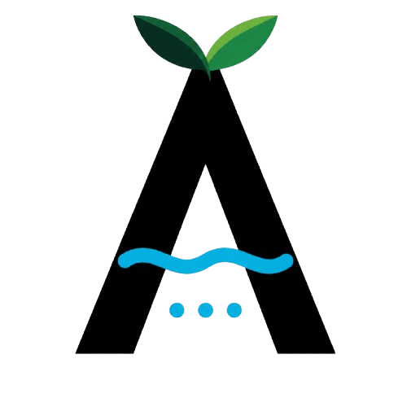

**Misión**

Brindar herramientas de monitoreo, orientación y control que ayuden a usuarios domésticos con diferentes niveles de experiencia a cuidar sus plantas, comprender sus necesidades de riego y utilizar el agua de manera informada.

**Visión**

Ser una solución de referencia para el cuidado doméstico de plantas en el mercado peruano, reconocida por su facilidad de uso, transparencia de la información y capacidad de acompañar el aprendizaje de sus usuarios.

**Valores**

- **Claridad:** comunicar lecturas, recomendaciones y limitaciones con términos comprensibles.
- **Confiabilidad:** mantener límites locales de operación y mostrar el estado confirmado del dispositivo.
- **Inclusión:** permitir distintos niveles de ayuda sin exigir formación técnica o profesional.
- **Sostenibilidad:** evaluar el uso del agua mediante mediciones o estimaciones identificadas.
- **Autonomía:** conservar el control del usuario sobre sus configuraciones y decisiones.

**Modelo de negocio propuesto**

Se plantea evaluar la venta del kit y servicios opcionales de seguimiento avanzado. La disposición de pago, el costo de soporte, la instalación y el mantenimiento se investigarán antes de definir precios. La condición de principiante o experto no equivale a un plan comercial. El monitoreo básico, la detención y las protecciones locales no deben depender de una suscripción activa.

#### 1.1.2. Perfiles de integrantes del equipo

  

  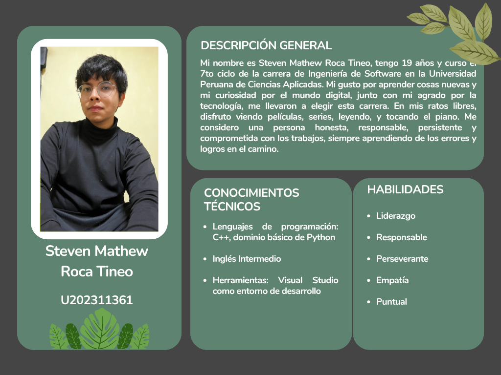

  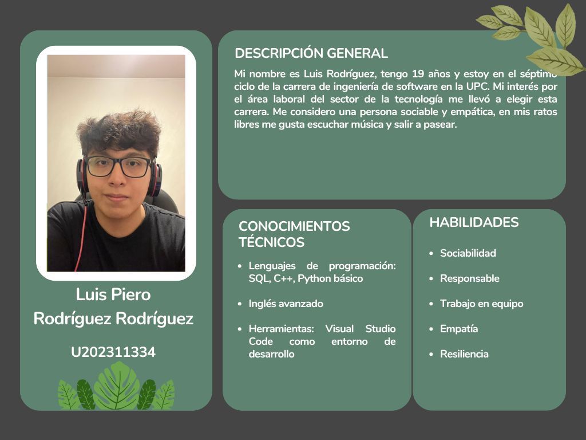

  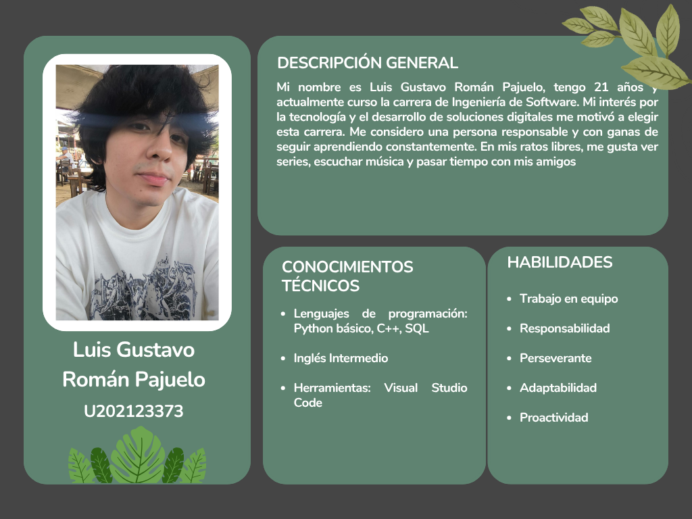

  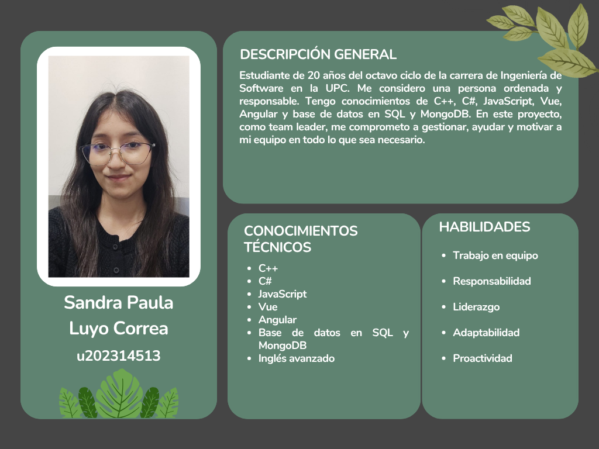

### 1.2. Solution Profile

#### 1.2.1. Antecedentes y problemática

El cuidado de plantas en viviendas requiere adaptar el riego a las condiciones de cada planta. La University of Maryland Extension (2023) señala que regar siguiendo únicamente un calendario puede proporcionar agua en exceso o en cantidad insuficiente, debido a las diferencias entre sustratos y condiciones ambientales. Por ello, el seguimiento de la humedad constituye un aspecto relevante para orientar el cuidado doméstico.

Las tecnologías de monitoreo ofrecen alternativas para apoyar esta actividad. Rojas-Rengifo et al. (2025) desarrollaron un sistema para plantas de interior que integra sensores y una aplicación móvil para consultar condiciones ambientales y recibir notificaciones. Su investigación, realizada durante diez semanas, constituye un antecedente del uso de dispositivos conectados para facilitar el seguimiento de plantas en espacios domésticos.

En este contexto, AquaSave se plantea como una solución dirigida a usuarios principiantes y expertos que necesitan orientación, monitoreo y control del riego de sus plantas.

**What — ¿Cuál es el problema?**

El problema consiste en decidir cuándo regar sin contar con información suficiente sobre las condiciones del sustrato y las necesidades de la planta. Shaughnessy y Pertuit (2024) explican que tanto el exceso como la falta de agua pueden deteriorar las raíces y producir síntomas similares, lo que dificulta interpretar correctamente el estado de una planta mediante observaciones aisladas.

Para AquaSave, esta problemática comprende dos necesidades: facilitar la interpretación del riego a quienes están aprendiendo y proporcionar seguimiento a quienes desean gestionar el cuidado con mayor detalle.

**When — ¿Cuándo sucede el problema?**

La necesidad de ajustar el riego aparece durante el cuidado cotidiano y cuando cambian las condiciones de crecimiento. Según Shaughnessy y Pertuit (2024), una ubicación cálida, seca y soleada requiere una frecuencia de riego diferente de un ambiente fresco y con poca luz.

También pueden producirse interrupciones en la rutina de cuidado. Killough et al. (2024) identifican el olvido del riego como una dificultad que motiva el desarrollo de sistemas de asistencia para plantas de interior. AquaSave considerará situaciones como viajes, jornadas prolongadas fuera de casa y cambios en la persona encargada del cuidado.

**Where — ¿Dónde ocurre el problema?**

El proyecto se enfocará inicialmente en viviendas de Lima Metropolitana que cuenten con plantas en interiores, balcones, patios, terrazas o jardines pequeños. Se contemplarán plantas en macetas y unidades de riego domésticas.

La configuración de cada unidad considerará su ubicación y exposición al entorno. Esta decisión responde a que las necesidades de riego dependen, entre otros factores, de la localización de la planta, el recipiente y las características del sustrato (Shaughnessy & Pertuit, 2024).

**Who — ¿Quiénes están involucrados?**

AquaSave atenderá a dos segmentos:

- **Usuarios principiantes:** personas que están iniciándose en el cuidado de plantas y buscan orientación para interpretar las condiciones del sustrato y decidir cuándo regar.
- **Usuarios expertos:** personas con experiencia en el cuidado doméstico que buscan consultar registros, ajustar configuraciones y supervisar sus plantas durante ausencias.

La segmentación orientará la investigación y el diseño de la experiencia. El monitoreo mediante aplicaciones móviles, como el desarrollado por Rojas-Rengifo et al. (2025), ofrece un antecedente tecnológico para acercar información sobre las plantas a sus cuidadores. AquaSave explorará cómo presentar esa información según las necesidades de cada segmento.

**Why — ¿Por qué ocurre esta situación?**

Una causa es la aplicación de rutinas generales a plantas con condiciones diferentes. La University of Maryland Extension (2023) recomienda determinar la necesidad de agua mediante la evaluación del sustrato, en lugar de depender exclusivamente de una frecuencia fija.

Otra dificultad es la interpretación de síntomas: una planta marchita no necesariamente necesita más agua, porque el daño radicular causado por el exceso también puede impedir su absorción (Shaughnessy & Pertuit, 2024). Estos antecedentes sustentan la necesidad de acompañar las observaciones con información contextualizada.

**How — ¿En qué condiciones usarán el producto?**

Actualmente, el cuidado puede apoyarse en la inspección del sustrato y en la comparación del peso de la maceta, métodos descritos por la University of Maryland Extension (2023). Estas prácticas requieren la participación presencial de la persona encargada.

AquaSave complementará el cuidado mediante un dispositivo IoT y aplicaciones web y móvil. El usuario podrá consultar lecturas de humedad, revisar el historial, recibir alertas y solicitar ciclos de riego. La integración de sensores y visualización móvil tiene antecedentes en la investigación de Rojas-Rengifo et al. (2025).

La solución requerirá energía y conectividad compatibles con el dispositivo para sus funciones remotas. Cada lectura mostrará su fecha de actualización y los ciclos de riego incorporarán límites locales de duración. La interfaz ofrecerá orientación comprensible para principiantes y acceso a configuraciones e historial para usuarios expertos.

**How Much — ¿Cuánto cuesta no resolverlo?**

El costo potencial comprende el agua empleada innecesariamente, el tiempo dedicado a revisar las plantas y los gastos de recuperación o reposición. La University of Maryland Extension (2023) identifica el riego excesivo e insuficiente como causas de pérdida de plantas domésticas.

Respecto al uso del agua, Killough et al. (2024) compararon tres modalidades de cuidado y reportaron resultados preliminares favorables para una modalidad inteligente. Sin embargo, mantener estable la humedad del sustrato continuó siendo un desafío. Estos resultados justifican evaluar el consumo, pero no establecen un porcentaje de ahorro aplicable directamente a AquaSave.

La magnitud del problema se determinará mediante entrevistas y registros del piloto. Se evaluarán el tiempo dedicado al cuidado, la frecuencia de incidentes de riego, el volumen de agua utilizado y los gastos reportados por los participantes. Esta información permitirá establecer una línea base para comparar los resultados de la solución.

**Enunciado del problema**

Los usuarios domésticos con distintos niveles de experiencia necesitan interpretar las condiciones de sus plantas y mantener un seguimiento del riego. La dependencia de rutinas generales, observaciones ocasionales y registros dispersos puede dificultar la adaptación del cuidado a cada unidad, especialmente durante ausencias. AquaSave buscará atender esta necesidad mediante información comprensible, historial y mecanismos de control.

**Objetivo general**

Diseñar y desarrollar una solución de software multicomponente que integre monitoreo IoT, control del riego y recomendaciones apoyadas por inteligencia artificial para facilitar el cuidado de plantas domésticas.

**Objetivos específicos**

1. Identificar las necesidades de orientación, monitoreo y seguimiento mediante entrevistas a usuarios principiantes y expertos.
2. Diseñar una experiencia coherente entre la landing page, la aplicación web y la aplicación móvil.
3. Desarrollar un dispositivo IoT que permita registrar condiciones del entorno y ejecutar ciclos de riego con límites definidos.
4. Implementar mecanismos de vinculación y acceso para proteger los dispositivos y la información de cada usuario.
5. Incorporar recomendaciones comprensibles que consideren los datos disponibles y su vigencia.
6. Evaluar la usabilidad, confiabilidad y trazabilidad de la solución mediante escenarios medibles.
7. Registrar el consumo de agua, diferenciando los valores medidos de los estimados, y compararlo con una línea base.

**Alcance**

La solución atenderá plantas domésticas y contemplará una unidad de riego por dispositivo. Permitirá consultar condiciones, controlar ciclos, configurar rutinas, recibir alertas y revisar el historial. El cuidado de parcelas productivas, la fertilización y el diagnóstico fitosanitario quedan fuera del alcance.

La operación conectada requerirá una red compatible y energía estable. El dispositivo incorporará límites locales de duración para controlar los ciclos ante interrupciones de comunicación.

#### 1.2.2. Lean UX Process

##### 1.2.2.1. Lean UX Problem Statements

**Problem Statement 1 — Usuarios principiantes**

AquaSave se propone ayudar a las personas que están iniciándose en el cuidado de plantas domésticas a comprender cuándo regar y cómo interpretar las condiciones del sustrato mediante monitoreo y orientación accesible.

La información visual puede resultar ambigua: Shaughnessy y Pertuit (2024) señalan que el exceso y la falta de agua pueden producir síntomas similares. Asimismo, la University of Maryland Extension (2023) explica que una rutina fija puede suministrar cantidades inadecuadas de agua y recomienda evaluar la necesidad de riego de cada planta.

A partir de estos antecedentes, planteamos que los principiantes pueden beneficiarse de una experiencia que relacione las lecturas con explicaciones y acciones comprensibles. Esta necesidad se contrastará mediante entrevistas y pruebas de interacción.

**¿Cómo podemos ayudar a los usuarios principiantes a interpretar las condiciones de sus plantas y tomar decisiones de riego informadas mediante una herramienta accesible que no requiera conocimientos técnicos especializados?**

**Problem Statement 2 — Usuarios expertos**

AquaSave se propone brindar a las personas con experiencia en el cuidado de plantas domésticas herramientas para consultar registros, supervisar sus unidades de riego y ajustar sus configuraciones desde una aplicación.

Rojas-Rengifo et al. (2025) presentan un sistema que permite consultar variables ambientales y recibir notificaciones mediante una aplicación móvil. Por su parte, Killough et al. (2024) muestran que mantener una humedad estable continúa siendo un desafío incluso al incorporar modalidades automatizadas de cuidado. Ambos antecedentes sustentan la importancia de combinar monitoreo, seguimiento y capacidad de ajuste.

Para este segmento, planteamos la necesidad de conservar el control sobre las decisiones de riego y disponer de información que permita revisar sus resultados, especialmente durante ausencias. La investigación con usuarios permitirá validar qué registros, alertas y configuraciones aportan mayor utilidad.

**¿Cómo podemos ofrecer a los usuarios expertos una herramienta que les permita supervisar sus plantas a distancia, consultar el historial y ajustar el riego de acuerdo con sus criterios de cuidado y las condiciones registradas?**

##### 1.2.2.2. Lean UX Assumptions

##### 1.2.2.2. Lean UX Assumptions

1. Creo que mis clientes necesitan una forma accesible y comprensible de conocer las condiciones de sus plantas domésticas, decidir cuándo regar y mantener su cuidado durante ausencias. Los principiantes necesitan orientación para interpretar la información, mientras que los expertos buscan registros y opciones de configuración.

2. Estas necesidades se pueden resolver con un sistema IoT compuesto por un dispositivo basado en ESP32, sensores de humedad del sustrato y temperatura ambiental, un mecanismo de riego y aplicaciones web y móvil. La solución permitirá consultar lecturas, recibir alertas, revisar el historial y obtener recomendaciones apoyadas por inteligencia artificial.

3. Mis clientes iniciales serán personas de Lima Metropolitana que cuidan plantas en interiores, balcones, patios, terrazas o jardines pequeños. Se considerarán dos segmentos: usuarios principiantes que buscan aprender a cuidar sus plantas y usuarios expertos que desean supervisar y ajustar el riego con mayor detalle.

4. El valor principal que un cliente quiere de mi servicio es contar con información comprensible y oportuna para tomar decisiones de riego y mantener el seguimiento de sus plantas, incluso cuando se encuentra fuera de casa.

5. El cliente también puede obtener estos beneficios adicionales: mayor organización de sus rutinas, identificación oportuna de condiciones que requieren atención, acceso al historial de riego y mayor autonomía en el cuidado. Se espera que estas funciones contribuyan a reducir el uso innecesario de agua y el tiempo dedicado a revisiones presenciales.

6. Voy a adquirir la mayoría de mis clientes mediante contenido en redes sociales sobre cuidado de plantas, participación en comunidades de jardinería doméstica, demostraciones del producto y alianzas con viveros y tiendas de jardinería.

7. Haré dinero mediante la venta del kit IoT y un modelo de servicios digitales con un plan básico incluido y una suscripción opcional. El plan básico contemplará monitoreo y control del riego; la suscripción ofrecerá funciones adicionales de análisis del historial, reportes y recomendaciones personalizadas.

8. Mi competencia principal estará conformada por aplicaciones de cuidado de plantas, recordatorios de riego, temporizadores y dispositivos domésticos de monitoreo o riego automatizado. También consideraré como alternativas las prácticas habituales de los usuarios, como revisar manualmente el sustrato y pedir a otra persona que cuide sus plantas.

9. Buscaremos diferenciarnos mediante una experiencia que integre lecturas del sustrato, orientación comprensible, historial y control del riego. La propuesta adaptará la presentación de la información a principiantes y expertos, permitiendo que cada usuario consulte el detalle que necesita.

10. Mi mayor riesgo de producto es que los usuarios no perciban suficiente utilidad para justificar la compra, instalación y mantenimiento del kit, o que no encuentren valor adicional en la suscripción después de utilizar las funciones básicas.

11. Abordaremos este riesgo mediante una instalación guiada, instrucciones de mantenimiento, demostraciones y pruebas con usuarios de ambos segmentos. Evaluaremos la comprensión de las lecturas, la facilidad de uso y la utilidad del historial y las recomendaciones para ajustar la propuesta.

12. **¿Quién es el usuario?** Los usuarios son personas que cuidan plantas en sus viviendas. Los principiantes buscan aprender a interpretar sus necesidades y establecer rutinas; los expertos desean supervisar sus plantas, comparar registros y modificar parámetros de riego. La experiencia en jardinería no implica necesariamente dominio de herramientas tecnológicas.

13. **¿Dónde encaja nuestro producto en su trabajo o vida?** AquaSave encajará en la rutina de cuidado doméstico al facilitar la consulta del estado de las plantas y el seguimiento del riego. También apoyará la supervisión durante viajes o jornadas fuera de casa, manteniendo al usuario informado sobre las condiciones registradas y las acciones ejecutadas.

14. **¿Qué problemas tiene nuestro producto que resolver?** La incertidumbre al decidir cuándo regar, la dificultad para interpretar las lecturas, la falta de registros organizados y la necesidad de supervisar el cuidado durante ausencias. También deberá facilitar la identificación de datos desactualizados para evitar decisiones basadas en información que ya no representa las condiciones actuales.

15. **¿Cuándo y cómo es nuestro producto usado?** El dispositivo registrará periódicamente las condiciones de la unidad de riego. El usuario accederá a la aplicación para consultar lecturas, revisar alertas, solicitar o detener ciclos y modificar configuraciones. El historial se utilizará para revisar las acciones realizadas y evaluar ajustes en la rutina.

16. **¿Qué características son importantes?** Monitoreo de humedad del sustrato y temperatura ambiental, lecturas con fecha de actualización, instalación guiada, control remoto, riego automático con límites definidos, alertas, historial y recomendaciones explicadas. También será importante distinguir el consumo de agua estimado del medido y permitir la detención de un ciclo de forma sencilla.

17. **¿Cómo debe verse nuestro producto y cómo comportarse?** Deberá presentar una interfaz limpia, legible y relacionada visualmente con el cuidado de plantas, utilizando colores verdes y tonos neutros. La información principal deberá comprenderse de un vistazo, con explicaciones accesibles para principiantes y opciones de detalle para expertos. Las acciones de riego deberán mostrar claramente si están pendientes, en ejecución, completadas o interrumpidas.

##### 1.2.2.3. Lean UX Hypothesis Statements

  Las metas siguientes son propuestas experimentales. Con muestras pequeñas se informará el conteo además del porcentaje y no se extrapolarán resultados al conjunto de hogares.

  | ID | Hipótesis | Experimento y medida de aceptación propuesta |
  | :--- | :--- | :--- |
  | H01 | Creemos que una configuración guiada permitirá a los principiantes iniciar el monitoreo con mayor autonomía. | En una prueba con cinco principiantes y kit preparado, al menos cuatro completan registro de planta y vinculación en diez minutos sin intervención del facilitador. |
  | H02 | Creemos que el historial por unidad permitirá a expertos justificar ajustes con mayor claridad. | En cinco tareas con expertos, al menos cuatro participantes identifican un cambio entre periodos y explican un ajuste usando los registros entregados. |
  | H03 | Creemos que explicar el fundamento y la vigencia de una recomendación apoyará decisiones informadas. | Al menos cuatro de cinco participantes por segmento reconocen el motivo y una limitación; todos los casos con datos vencidos impiden aplicar la recomendación. |
  | H04 | Creemos que el control local acotado evitará que una pérdida de red extienda el ciclo más allá del límite configurado. | En treinta pruebas de desconexión, la salida del actuador se desactiva dentro del límite más un segundo; se observa separadamente el cese del flujo. |
  | H05 | Creemos que una explicación asistida por IA puede ser más comprensible que una explicación fija. | Comparación contrabalanceada con diez participantes: al menos seis prefieren la explicación asistida y no se reduce la comprensión de límites ni la detección de datos insuficientes. |
  | H06 | Creemos que el seguimiento puede identificar oportunidades de menor consumo. | Registrar catorce días de línea base y catorce de piloto por unidad comparable; calcular la variación con método y cobertura explícitos, sin imponer un ahorro mínimo antes de conocer los datos. |

  Una hipótesis rechazada orientará cambios de diseño. Si la IA no mejora la comprensión o introduce afirmaciones sin sustento, se conservará el sistema de reglas y se limitará el componente de explicación hasta corregirlo.

##### 1.2.2.4. Lean UX Canvas

  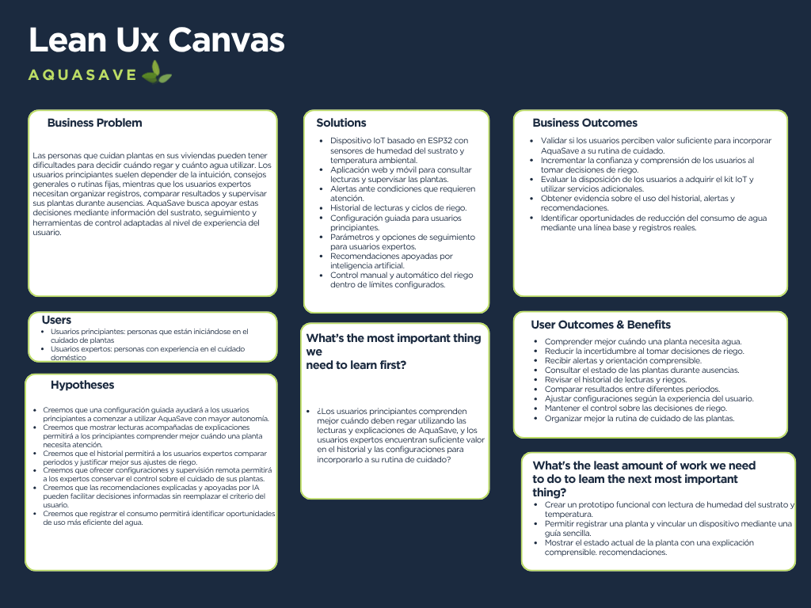

### 1.3. Segmentos objetivo

**Segmento Objetivo 1: Usuarios principiantes en el cuidado de plantas**

Este segmento está conformado por personas que están iniciándose en el cuidado de plantas domésticas o que necesitan orientación frecuente para mantenerlas. Incluye a quienes tienen plantas ornamentales, hierbas aromáticas u otras especies en interiores, balcones, patios, terrazas o jardines pequeños, y todavía no cuentan con criterios claros para decidir cuándo y cuánto regar.

**Características demográficas:**

Ubicación: Principalmente en Lima Metropolitana, en viviendas que dispongan de espacios interiores o exteriores adecuados para el cuidado de plantas.

Edad: Personas mayores de 18 años interesadas en aprender sobre el cuidado de plantas y organizar esta actividad dentro de su rutina.

Nivel socioeconómico: Sin una categoría socioeconómica exclusiva. Se considera a personas con acceso a un teléfono inteligente, conexión Wi-Fi doméstica y disposición para evaluar la adquisición de un kit de cuidado de plantas.

**Necesidades principales:**

Comprender cuándo sus plantas necesitan agua y cómo interpretar las lecturas de humedad. Recibir recomendaciones claras y alertas que indiquen qué condición requiere atención. Contar con una instalación guiada y herramientas que les permitan supervisar el cuidado durante ausencias.

**Desafíos:**

Dificultad para distinguir entre falta y exceso de riego. Dependencia de consejos generales o rutinas fijas que no siempre se ajustan a cada planta. Olvidos y dudas al modificar el cuidado. Posible falta de familiaridad con la instalación y configuración de dispositivos conectados.

**Segmento Objetivo 2: Usuarios expertos en el cuidado de plantas**

Este segmento está integrado por personas con experiencia práctica en el cuidado de plantas domésticas, capaces de adaptar sus rutinas según la especie, el sustrato, el recipiente y las condiciones del entorno. Buscan complementar su conocimiento con información organizada, registros y herramientas de supervisión remota. La experiencia no requiere una certificación profesional ni implica necesariamente conocimientos tecnológicos avanzados.

**Características demográficas:**

Ubicación: Principalmente en Lima Metropolitana, en viviendas con plantas distribuidas en interiores, balcones, patios, terrazas o jardines pequeños.

Edad: Personas mayores de 18 años que hayan desarrollado experiencia y autonomía en el cuidado de plantas, independientemente de su ocupación.

Nivel socioeconómico: Sin una categoría socioeconómica exclusiva. Se considera a personas con acceso a un teléfono inteligente, conexión Wi-Fi doméstica e interés en invertir en herramientas que complementen sus prácticas de cuidado.

**Necesidades principales:**

Consultar el historial de lecturas y acciones de riego por unidad. Comparar registros entre periodos para evaluar ajustes. Configurar parámetros dentro de límites definidos y mantener el control sobre las decisiones. Supervisar sus plantas a distancia y recibir alertas relevantes.

**Desafíos:**

Mantener registros consistentes cuando cuidan varias plantas. Supervisar las condiciones durante viajes o jornadas fuera de casa. Identificar si los ajustes de riego producen los resultados esperados. Evaluar la confiabilidad de las lecturas y conservar el control al utilizar funciones automatizadas.

---

## Capítulo II: Requirements Elicitation & Analysis

### 2.1. Competidores

#### 2.1.1. Análisis competitivo

El análisis competitivo es una herramienta clave por su importancia en la toma de decisiones estratégicas, así como en la detección de oportunidades y amenazas, y en la generación de ventajas competitivas sostenibles en el mercado. Por ello, permite a las empresas adaptarse con agilidad y tomar decisiones fundamentadas en un entorno empresarial dinámico y en constante evolución. A continuación, se presenta la aplicación de esta herramienta en el desarrollo del proyecto y el análisis de los competidores:

<table style="width: 100%; border-collapse: collapse; margin: 20px 0; font-family: Arial, sans-serif; font-size: 14px;">
  <thead>
    <tr>
      <td colspan="6" style="padding: 12px; border: 1px solid #333; background-color: #404040; color: white; text-align: center; font-weight: bold; font-size: 1.2em;">Competitive Analysis Landscape</td>
    </tr>
    <tr>
      <td colspan="2" style="padding: 10px; border: 1px solid #ddd; background-color: #f7f7f7; font-weight: bold; vertical-align: top;">¿Porqué llevar a cabo este análisis?</td>
      <td colspan="4" style="padding: 10px; border: 1px solid #ddd; background-color: #f7f7f7; vertical-align: top;">Identificar brechas tecnológicas y comerciales frente a soluciones residenciales y agrícolas, con el fin de posicionar a AquaSave como una plataforma integral, eficiente y basada en datos reales de consumo para una gestión hídrica sostenible.</td>
    </tr>
    <tr style="background-color: #eeeeee; font-weight: bold; text-align: center;">
      <td colspan="2" style="padding: 10px; border: 1px solid #ddd;"></td>
      <td style="padding: 10px; border: 1px solid #ddd;">AquaSave</td>
      <td style="padding: 10px; border: 1px solid #ddd;">Rachio</td>
      <td style="padding: 10px; border: 1px solid #ddd;">Orbit B-hyve</td>
      <td style="padding: 10px; border: 1px solid #ddd;">OpenSprinkler</td>
    </tr>
  </thead>
  <tbody>
    <tr>
      <td rowspan="2" style="padding: 10px; border: 1px solid #ddd; background-color: #fafafa; font-weight: bold; vertical-align: top; text-align: center;">Perfil</td>
      <td style="padding: 10px; border: 1px solid #ddd; background-color: #fafafa; font-weight: bold; vertical-align: top;">Overview</td>
      <td style="padding: 10px; border: 1px solid #ddd; vertical-align: top;">Sistema IoT (ESP32) con monitoreo de caudal y app multiplataforma en Flutter.</td>
      <td style="padding: 10px; border: 1px solid #ddd; vertical-align: top;">El líder en software de riego inteligente para el hogar, basado en la nube.</td>
      <td style="padding: 10px; border: 1px solid #ddd; vertical-align: top;">Hardware de riego tradicional adaptado a IoT con gran presencia en retail.</td>
      <td style="padding: 10px; border: 1px solid #ddd; vertical-align: top;">Solución Open Source basada en microcontroladores para control local y total.</td>
    </tr>
    <tr>
      <td style="padding: 10px; border: 1px solid #ddd; background-color: #fafafa; font-weight: bold; vertical-align: top;">Ventaja competitiva. ¿Qué valor ofrece a los clientes?</td>
      <td style="padding: 10px; border: 1px solid #ddd; vertical-align: top;">Datos de caudal y humedad real en tiempo real vs. solo pronóstico.</td>
      <td style="padding: 10px; border: 1px solid #ddd; vertical-align: top;">Inteligencia de software y algoritmos climáticos extremadamente pulidos.</td>
      <td style="padding: 10px; border: 1px solid #ddd; vertical-align: top;">Bajo costo inicial y facilidad de instalación para el usuario no técnico.</td>
      <td style="padding: 10px; border: 1px solid #ddd; vertical-align: top;">Sin dependencia de la nube (privacidad) y personalización total del código.</td>
    </tr>
    <tr>
      <td rowspan="2" style="padding: 10px; border: 1px solid #ddd; background-color: #fafafa; font-weight: bold; vertical-align: top; text-align: center;">Perfil de Marketing</td>
      <td style="padding: 10px; border: 1px solid #ddd; background-color: #fafafa; font-weight: bold; vertical-align: top;">Mercado Objetivo</td>
      <td style="padding: 10px; border: 1px solid #ddd; vertical-align: top;">Usuarios principiantes y expertos en el cuidado de plantas domésticas</td>
      <td style="padding: 10px; border: 1px solid #ddd; vertical-align: top;">Dueños de casas inteligentes de gama alta que buscan estética y facilidad.</td>
      <td style="padding: 10px; border: 1px solid #ddd; vertical-align: top;">Clientes "DIY" (hágalo usted mismo) que compran en ferreterías o Amazon.</td>
      <td style="padding: 10px; border: 1px solid #ddd; vertical-align: top;">Desarrolladores, ingenieros y entusiastas de la domótica y el código abierto.</td>
    </tr>
    <tr>
      <td style="padding: 10px; border: 1px solid #ddd; background-color: #fafafa; font-weight: bold; vertical-align: top;">Estrategias de Marketing</td>
      <td style="padding: 10px; border: 1px solid #ddd; vertical-align: top;">Enfoque en ahorro de costos y retorno de inversión por eficiencia hídrica.</td>
      <td style="padding: 10px; border: 1px solid #ddd; vertical-align: top;">Posicionamiento como el centro del jardín inteligente (Integración con Alexa/Google).</td>
      <td style="padding: 10px; border: 1px solid #ddd; vertical-align: top;">Distribución masiva en grandes superficies y precios de entrada agresivos.</td>
      <td style="padding: 10px; border: 1px solid #ddd; vertical-align: top;">Transparencia tecnológica y apoyo de una comunidad global activa.</td>
    </tr>
    <tr>
      <td rowspan="3" style="padding: 10px; border: 1px solid #ddd; background-color: #fafafa; font-weight: bold; vertical-align: top; text-align: center;">Perfil de Producto</td>
      <td style="padding: 10px; border: 1px solid #ddd; background-color: #fafafa; font-weight: bold; vertical-align: top;">Productos & Servicios</td>
      <td style="padding: 10px; border: 1px solid #ddd; vertical-align: top;">Hardware ESP32 + Sensores + API REST + App Móvil/Web + Landing.</td>
      <td style="padding: 10px; border: 1px solid #ddd; vertical-align: top;">Controladores de zonas, sensores inalámbricos y suscripciones de datos.</td>
      <td style="padding: 10px; border: 1px solid #ddd; vertical-align: top;">Temporizadores de grifo, controladores de pared y sensores de flujo básicos.</td>
      <td style="padding: 10px; border: 1px solid #ddd; vertical-align: top;">Kits de hardware DIY, placas ensambladas y firmware de código abierto.</td>
    </tr>
    <tr>
      <td style="padding: 10px; border: 1px solid #ddd; background-color: #fafafa; font-weight: bold; vertical-align: top;">Precios & Costos</td>
      <td style="padding: 10px; border: 1px solid #ddd; vertical-align: top; text-align: center;">Costo optimizado de hardware + potencial modelo SaaS para gestión de datos.</td>
      <td style="padding: 10px; border: 1px solid #ddd; vertical-align: top; text-align: center;">Premium (USD $180 - $250).</td>
      <td style="padding: 10px; border: 1px solid #ddd; vertical-align: top; text-align: center;">Económico/Medio (USD $60 - $130).</td>
      <td style="padding: 10px; border: 1px solid #ddd; vertical-align: top; text-align: center;">Accesible para makers (USD $50 - $150).</td>
    </tr>
    <tr>
      <td style="padding: 10px; border: 1px solid #ddd; background-color: #fafafa; font-weight: bold; vertical-align: top;">Canales de distribución (Web y/o Móvil)</td>
      <td style="padding: 10px; border: 1px solid #ddd; vertical-align: top; text-align: center;">Web y Móvil</td>
      <td style="padding: 10px; border: 1px solid #ddd; vertical-align: top; text-align: center;">Web y Móvil</td>
      <td style="padding: 10px; border: 1px solid #ddd; vertical-align: top; text-align: center;">Web y móvil</td>
      <td style="padding: 10px; border: 1px solid #ddd; vertical-align: top; text-align: center;">Web y Móvil</td>
    </tr>
    <tr>
      <td rowspan="4" style="padding: 10px; border: 1px solid #ddd; background-color: #fafafa; font-weight: bold; vertical-align: top; text-align: center;">Análisis SWOT</td>
      <td style="padding: 10px; border: 1px solid #ddd; background-color: #fafafa; font-weight: bold; vertical-align: top;">Fortalezas</td>
      <td style="padding: 10px; border: 1px solid #ddd; vertical-align: top;">Control total del stack (Flutter/ESP32); medición de caudal real.</td>
      <td style="padding: 10px; border: 1px solid #ddd; vertical-align: top;">Marca reconocida; ecosistema de integraciones muy robusto.</td>
      <td style="padding: 10px; border: 1px solid #ddd; vertical-align: top;">Infraestructura de hardware masiva y red de distribución física.</td>
      <td style="padding: 10px; border: 1px solid #ddd; vertical-align: top;">Flexibilidad de hardware y software; independencia de servidores externos.</td>
    </tr>
    <tr>
      <td style="padding: 10px; border: 1px solid #ddd; background-color: #fafafa; font-weight: bold; vertical-align: top;">Debilidades</td>
      <td style="padding: 10px; border: 1px solid #ddd; vertical-align: top;">Marca nueva en fase de desarrollo; requiere soporte inicial.</td>
      <td style="padding: 10px; border: 1px solid #ddd; vertical-align: top;">Precio elevado; dependencia total de la conexión a internet.</td>
      <td style="padding: 10px; border: 1px solid #ddd; vertical-align: top;">Interfaz de usuario (UI/UX) menos intuitiva que la competencia.</td>
      <td style="padding: 10px; border: 1px solid #ddd; vertical-align: top;">Curva de aprendizaje técnica alta para el usuario promedio.</td>
    </tr>
    <tr>
      <td style="padding: 10px; border: 1px solid #ddd; background-color: #fafafa; font-weight: bold; vertical-align: top;">Oportunidades</td>
      <td style="padding: 10px; border: 1px solid #ddd; vertical-align: top;">Mercado creciente en regiones con crisis hídrica (Perú/Chile/México).</td>
      <td style="padding: 10px; border: 1px solid #ddd; vertical-align: top;">Expansión a gestión de agua en interiores (sensores de fugas).</td>
      <td style="padding: 10px; border: 1px solid #ddd; vertical-align: top;">Dominar el mercado masivo de bajo costo con suscripciones de software.</td>
      <td style="padding: 10px; border: 1px solid #ddd; vertical-align: top;">Convertirse en el estándar para investigación agrícola educativa.</td>
    </tr>
    <tr>
      <td style="padding: 10px; border: 1px solid #ddd; background-color: #fafafa; font-weight: bold; vertical-align: top;">Amenazas</td>
      <td style="padding: 10px; border: 1px solid #ddd; vertical-align: top;">Gigantes tecnológicos lanzando hubs de riego económicos.</td>
      <td style="padding: 10px; border: 1px solid #ddd; vertical-align: top;">Nuevas normativas de agua que exijan hardware certificado.</td>
      <td style="padding: 10px; border: 1px solid #ddd; vertical-align: top;">Startups más rápidas con mejores capacidades de análisis de datos.</td>
      <td style="padding: 10px; border: 1px solid #ddd; vertical-align: top;">Descontinuación de soporte por parte de la comunidad voluntaria.</td>
    </tr>
  </tbody>
</table>

#### 2.1.2. Estrategias y tácticas frente a competidores

**Estrategias generales de AquaSave:**

- Diferenciación por precisión híbrida: Uso de sensores locales (caudal y humedad) cruzados con APIs climáticas para una toma de decisiones superior al promedio del mercado.

- Integración end-to-end simplificada: Ecosistema cerrado pero flexible entre hardware (ESP32), API propietaria y aplicaciones multiplataforma (Móvil/Web).

- Modelo de impacto medible: Enfoque en métricas de ahorro hídrico real y monetización del ahorro para el usuario (sostenibilidad rentable).

- Posicionamiento como experto local: Solución diseñada para enfrentar microclimas y condiciones de estrés hídrico específicas, superando a soluciones genéricas extranjeras.

**Tácticas frente a competidores:**

<table>
  <thead>
    <tr>
      <th align="left">Competidor</th>
      <th align="left">Estrategia</th>
      <th align="left">Táctica</th>
    </tr>
  </thead>
  <tbody>
    <tr>
      <td><b>Rachio</b></td>
      <td>Superar la dependencia de datos meteorológicos externos.</td>
      <td>Posicionar a AquaSave como un sistema de "precisión real" que utiliza sensores de humedad y caudal en sitio, evitando errores de riego basados en estaciones climáticas lejanas o inexactas.</td>
    </tr>
    <tr>
      <td><b>Orbit B-hyve</b></td>
      <td>Diferenciarse mediante UX/UI superior y analítica avanzada.</td>
      <td>Explotar el potencial de Flutter para ofrecer una interfaz móvil moderna, fluida y con dashboards que visualicen el ahorro de agua en litros reales, superando la experiencia de usuario limitada de la competencia.</td>
    </tr>
    <tr>
      <td><b>OpenSprinkler</b></td>
      <td>Competir en confiabilidad y facilidad de despliegue.</td>
      <td>Ofrecer una solución integral lista para usar, con soporte técnico y una API RESTful documentada, eliminando la barrera técnica y la complejidad de configuración del hardware DIY.</td>
    </tr>
  </tbody>
</table>

### 2.2. Entrevistas

Esta sección describe el proceso de investigación de los segmentos objetivo, basado en la recopilación de información a través de entrevistas.

#### 2.2.1. Diseño de entrevistas

Las entrevistas se organizarán según los dos segmentos objetivo de AquaSave para conocer sus hábitos, dificultades y expectativas respecto al cuidado de plantas domésticas. Se iniciará con preguntas de caracterización, seguidas de preguntas sobre las prácticas actuales. Finalmente, se presentará brevemente la propuesta para recoger opiniones sobre su utilidad y las funciones que cada participante considera necesarias.

***Segmento objetivo #1: Usuarios principiantes en el cuidado de plantas***

***Características demográficas:***

* ¿Cuál es tu nombre y edad?
* ¿En qué ciudad y distrito vives actualmente?
* ¿A qué te dedicas y cómo encaja el cuidado de tus plantas en tu rutina?
* ¿Qué plantas tienes, dónde están ubicadas y desde cuándo las cuidas?

***Preguntas principales:***

1. ¿Cómo aprendiste a cuidar tus plantas y a quién recurres cuando tienes dudas?
2. ¿Cómo decides actualmente cuándo regar y qué cantidad de agua utilizar?
3. ¿Utilizas recordatorios, aplicaciones o alguna otra herramienta para organizar el cuidado de tus plantas?
4. ¿Qué dificultades has tenido con el riego y qué ocurrió la última vez que se presentó alguna?
5. ¿Cómo organizas el cuidado de tus plantas cuando pasas varios días fuera de casa?

***Preguntas sobre el proyecto:***

6. ¿En qué situaciones te resultaría útil consultar desde tu celular la humedad del sustrato de tus plantas?
7. ¿Qué información necesitarías para comprender una alerta o recomendación de riego?
8. ¿Qué funciones considerarías más útiles: consultar lecturas, recibir alertas, revisar el historial, obtener recomendaciones o controlar el riego desde el celular?
9. ¿Cómo te sentirías utilizando riego automático y qué necesitarías para confiar en su funcionamiento?
10. ¿Qué ayuda necesitarías para instalar un sensor y un sistema de riego en una maceta y configurarlos desde una aplicación?

***Segmento objetivo #2: Usuarios expertos en el cuidado de plantas***

***Características demográficas:***

* ¿Cuál es tu nombre y edad?
* ¿En qué ciudad y distrito vives actualmente?
* ¿A qué te dedicas y cuánto tiempo llevas cuidando plantas?
* ¿Qué tipos de plantas cuidas y cómo están distribuidas en tu vivienda?

***Preguntas principales:***

1. ¿Qué factores consideras para decidir cuándo regar y cuánta agua necesita cada planta?
2. ¿Qué ajuste reciente realizaste en tu rutina de riego y cómo evaluaste su resultado?
3. ¿Llevas registros de riego o utilizas sensores, aplicaciones u otras herramientas para apoyar el cuidado?
4. ¿Cuáles son las principales dificultades que encuentras al supervisar tus plantas y mantener sus rutinas?
5. ¿Cómo organizas el cuidado durante una ausencia y qué información necesitas para supervisarlo?

***Preguntas sobre el proyecto:***

6. ¿En qué situaciones te sería útil consultar las lecturas y el historial de riego desde una aplicación?
7. ¿Qué parámetros te gustaría configurar y qué decisiones preferirías mantener bajo tu control?
8. ¿Qué información necesitarías para evaluar una recomendación de riego generada con apoyo de inteligencia artificial?
9. ¿Qué alertas considerarías necesarias para intervenir oportunamente en el cuidado de tus plantas?
10. ¿Qué tendría que ofrecer AquaSave para que consideres incorporarlo a tu rutina y adquirir el kit?

#### 2.2.2. Registro de entrevistas

Las entrevistas están en un video en el siguiente URL: https://upcedupe-my.sharepoint.com/:v:/g/personal/u202311334_upc_edu_pe/IQDzK0EKnZzBRI0KipOh-3IfASO4awboHbeUGCySeQEBNEw?e=T6AHSh&nav=eyJyZWZlcnJhbEluZm8iOnsicmVmZXJyYWxBcHAiOiJTdHJlYW1XZWJBcHAiLCJyZWZlcnJhbFZpZXciOiJTaGFyZURpYWxvZy1MaW5rIiwicmVmZXJyYWxBcHBQbGF0Zm9ybSI6IldlYiIsInJlZmVycmFsTW9kZSI6InZpZXcifX0%3D

**<u>Segmento objetivo #1: Usuarios principiantes en el cuidado de plantas</u>** 

**Entrevista #1:**

**Nombre:** Mariel Mendoza  
**Edad:** 28 años
**Ocupación:** Universitaria, prácticas a medio tiempo  
**Distrito:** Jesús María, Lima  
**Inicio:** 00:06  
**Fin:** 05:21  

  

**Resumen:** Mariel es una estudiante con una rutina muy variable que le dificulta mantener la constancia en el cuidado de sus plantas, llevándola muchas veces a ahogarlas (como a su menta) por no saber medir la cantidad de agua o distinguir si realmente la necesitan. Su principal dolor es el estrés y la dependencia de amigos para el riego cuando viaja o pasa todo el día fuera de casa, por lo que ve un inmenso valor en el control remoto y las alertas preventivas de AquaSave. Para adoptar el producto con confianza, necesita que la app le dé indicaciones directas sin tecnicismos, le confirme con notificaciones cada vez que el sistema automático actúe, y cuente con un kit de instalación sumamente intuitivo guiado por videos.

**Entrevista #2:**

**Nombre:** Gabriela Aliaga  
**Edad:** 20 años  
**Ocupación:** Universitaria  
**Distrito:** Pueblo Libre, Lima  
**Inicio:** 05:23  
**Fin:** 10:54

  

**Resumen:** Gabriela es una universitaria cuyos impredecibles horarios académicos y largas jornadas de estudio (especialmente en época de finales) le impiden establecer una rutina de riego, lo que la ha llevado a perder plantas, como su cactus, por exceso de riego basado en la pura intuición. Ella valora en AquaSave principalmente la capacidad de automatizar y controlar el riego desde el celular durante sus ausencias o viajes familiares, eliminando así su carga mental constante. Para confiar plenamente en el ecosistema, exige una aplicación que le hable de forma coloquial ("tu helecho necesita agua"), le confirme exactamente cuánta agua se suministró y que el dispositivo sea totalmente "a prueba de errores", armable solo con las manos y sin herramientas.

**Entrevista #3:**

**Nombre:** Alfredo Minaya  
**Edad:** 22 años 
**Ocupación:** Universitario   
**Distrito:** San Miguel, Lima  
**Inicio:** 10:55  
**Fin:** 15:59

  

**Resumen:** Alfredo es un estudiante de Ingeniería de 22 años que cuida cinco plantas distribuidas entre su habitación, la sala y el balcón desde hace aproximadamente ocho meses. El cuidado de sus plantas forma parte de sus actividades nocturnas y de fin de semana, aunque reconoce que en ocasiones lo descuida debido a sus responsabilidades académicas. Ha aprendido principalmente mediante videos, búsquedas en internet y consejos de familiares con mayor experiencia.

Actualmente decide cuándo regar observando la superficie de la tierra, pero no utiliza una medida específica para determinar la cantidad de agua. Esta falta de precisión le genera dudas y ya ocasionó que regara en exceso una suculenta, cuyas hojas comenzaron a ponerse blandas. Utiliza una alarma semanal como recordatorio, aunque admite que puede ignorarla o regar cuando el sustrato todavía conserva humedad. Durante sus ausencias, suele regar antes de salir y solicitar ayuda a un familiar, pero tiene dificultades para brindar instrucciones diferentes para cada planta.

Alfredo considera que AquaSave podría ayudarlo a comprobar la humedad antes de regar y supervisar sus plantas cuando se encuentre fuera de casa. Valora especialmente las alertas, las recomendaciones y el control del riego desde el celular. Sin embargo, siente cierta preocupación por el funcionamiento del riego automático, por lo que necesitaría configurar límites, recibir notificaciones y conservar la posibilidad de detenerlo. Asimismo, considera fundamental disponer de instrucciones visuales paso a paso y una confirmación que le indique que el sensor y el sistema de riego fueron instalados correctamente.

**<u>Segmento objetivo #2: Usuarios expertos en el cuidado de plantas</u>**

**Entrevista #4:**

**Nombre:** Ernesto Rodas  
**Edad:** 22 años  
**Ocupación:** Diseñador gráfico  
**Distrito:** San Miguel, Lima  
**Inicio:** 16:03  
**Fin:** 21:34

  

**Resumen:** Ernesto es un diseñador gráfico de 22 años que cuenta con aproximadamente siete años de experiencia en el cuidado de plantas. Actualmente mantiene cerca de dieciocho ejemplares, entre monsteras, potus, calatheas, cactus, suculentas y hierbas aromáticas, distribuidos en diferentes espacios de su vivienda según sus necesidades de iluminación.

Para decidir el riego considera la especie, el tamaño de la maceta, el tipo de sustrato, la temperatura y la exposición a la luz. También revisa la humedad de la tierra antes de regar. Como parte de su experiencia, menciona que redujo la frecuencia de riego de una monstera después de observar hojas amarillas y comprobó una mejora al permitir que el sustrato se secara durante más tiempo. Utiliza un medidor básico de humedad, alarmas y anotaciones para las plantas que requieren mayor seguimiento, aunque no mantiene un registro completo de toda su colección.

Su principal dificultad consiste en recordar cuándo regó cada planta y determinar si un problema se relaciona con el agua, la iluminación o el sustrato. Considera que AquaSave sería especialmente útil durante sus ausencias y para comparar el comportamiento de las plantas mediante un historial. Le interesaría configurar los niveles de humedad, la duración del riego y las alertas, manteniendo bajo su control la activación del modo automático y la detención de los ciclos. Para considerar la adquisición del kit, espera que sea fácil de instalar, confiable, accesible y capaz de explicar las recomendaciones a partir de datos comprensibles.

**Entrevista #5:**

**Nombre:** Santiago Suarez   
**Edad:** 20 años  
**Ocupación:** Profesor    
**Distrito:** Jesús María, Lima    
**Inicio:** 21:37  
**Fin:** 26:44

  

**Resumen:** Santiago es un profesor de 20 años que lleva aproximadamente cinco años cuidando plantas. Su colección está formada por cerca de veinticinco ejemplares, incluyendo orquídeas, helechos, begonias, cactus y hierbas aromáticas. Las distribuye entre el balcón y las ventanas de la sala de acuerdo con la cantidad de luz que requiere cada especie.

Para determinar el riego observa la humedad del sustrato, el estado de las hojas, el clima, el tipo de planta y el material de la maceta. Como parte de sus ajustes recientes, cambió el sustrato de unas begonias para mejorar el drenaje y redujo la cantidad de agua, evaluando el resultado mediante el estado de las hojas y las raíces. A diferencia de otros usuarios, utiliza una hoja de cálculo para registrar el riego y la fertilización, además de un medidor de humedad para sus plantas más delicadas.

Santiago identifica como principal dificultad la variación de las necesidades de las plantas según la temporada y la detección oportuna del exceso de humedad. Durante sus ausencias utiliza recipientes de autorriego y solicita apoyo a un familiar, aunque considera importante conocer el último riego y recibir avisos ante condiciones anormales. AquaSave le resultaría útil para consultar lecturas durante viajes y comparar las condiciones actuales con registros anteriores. Valora la posibilidad de configurar límites de humedad, duración máxima del riego y alertas, manteniendo bajo su control la activación del modo automático. Para incorporar el kit a su rutina, espera mediciones confiables, una instalación sencilla, configuraciones diferentes para cada planta y poco mantenimiento.

**Entrevista #6:**

**Nombre:** Gabriel Borja  
**Edad:** 23 años  
**Ocupación:** Arquitecto  
**Distrito:** Santiago de Surco, Lima  
**Inicio:** 26:46  
**Fin:** 32:18

  

**Resumen:** Gabriel Borja es un arquitecto de 23 años residente en Santiago de Surco que cuenta con aproximadamente ocho años de experiencia en el cuidado de plantas. Mantiene alrededor de veinte plantas de interior, suculentas y aromáticas distribuidas entre la sala, las ventanas y el balcón de su vivienda. Para decidir el riego considera la humedad del sustrato, la especie, la luz, el clima y el tamaño de la maceta; sin embargo, reconoce que supervisar varias plantas y recordar sus distintas rutinas puede ser complicado.

Actualmente utiliza de forma ocasional registros en el celular y un medidor manual de humedad, pero no conserva un historial ordenado que le permita comparar resultados. Durante sus ausencias deja indicaciones a familiares, por lo que valora poder revisar a distancia la humedad actual, el último riego y las plantas que requieren atención. Muestra interés en AquaSave para consultar lecturas e historial, configurar límites de humedad, duración y horarios de riego, además de recibir alertas sobre condiciones críticas, desconexiones o ciclos no realizados. Consideraría adquirir el kit si ofrece lecturas confiables, control de varias plantas, configuración flexible y recomendaciones explicadas que mantengan al usuario como responsable de la decisión final.

#### 2.2.3. Análisis de entrevistas

A partir de los registros de las seis entrevistas, se identificaron los principales hábitos, dificultades y expectativas de los participantes respecto al cuidado de plantas domésticas. El análisis se organiza en dos segmentos, con tres entrevistados en cada uno. Los porcentajes describen únicamente las respuestas documentadas en esta muestra y no representan a todos los usuarios del mercado objetivo.

***Segmento objetivo #1: Usuarios principiantes en el cuidado de plantas***

**Hallazgos:**

| Característica | Hallazgos | Porcentaje |
| :---- | :---- | :---- |
| Organización del cuidado | Las responsabilidades académicas y los horarios variables dificultan mantener una rutina de cuidado constante. | 100% (3 de 3) |
| Decisión de riego | Presentan dudas para determinar cuándo regar o qué cantidad de agua utilizar. | 100% (3 de 3) |
| Problemas experimentados | Relatan episodios de exceso de riego asociados al deterioro o pérdida de plantas. | 100% (3 de 3) |
| Cuidado durante ausencias | Valoran supervisar o controlar el riego desde el celular cuando no se encuentran en casa. | 100% (3 de 3) |
| Claridad de la información | Necesitan mensajes sencillos que expliquen qué planta requiere atención y qué acción realizar. | 100% (3 de 3) |
| Alertas y confirmaciones | Valoran recibir avisos sobre las necesidades de sus plantas o las acciones del sistema de riego. | 100% (3 de 3) |
| Confianza en la automatización | Condicionan su confianza a poder comprobar el funcionamiento mediante notificaciones, información sobre el agua suministrada o límites de operación. | 100% (3 de 3) |
| Instalación guiada | Solicitan instrucciones visuales, videos o pasos claros para instalar y configurar el kit. | 100% (3 de 3) |
| Control manual de seguridad | Alfredo solicita expresamente establecer límites y poder detener el riego automático desde el celular. | 33,3% (1 de 3) |
| Facilidad de montaje | Gabriela solicita expresamente un dispositivo que pueda armarse con las manos y sin herramientas. | 33,3% (1 de 3) |

| Insights | Respaldo |
| :---- | :---- |
| El apoyo debe ayudar a decidir si corresponde regar, además de recordar la tarea. | Mariel, Gabriela y Alfredo describen dudas o errores por exceso de agua. Alfredo señala que una alarma puede llevarlo a regar aunque el sustrato siga húmedo. |
| La supervisión remota puede reducir la incertidumbre durante las ausencias. | Los tres participantes valoran consultar o controlar el riego fuera de casa; Mariel y Alfredo también describen la dependencia de otras personas para el cuidado. |
| La confianza requiere que el sistema explique sus acciones y permita comprobarlas. | Mariel solicita confirmaciones cuando actúa el riego automático; Gabriela quiere conocer el agua suministrada; Alfredo pide notificaciones, límites y posibilidad de detenerlo. |
| La instalación y el lenguaje forman parte central de la experiencia del principiante. | Los tres solicitan orientación visual para la instalación y explicaciones comprensibles. Gabriela añade la preferencia por un montaje sin herramientas. |

**Conclusiones:**

Los usuarios principiantes entrevistados necesitan apoyo para decidir cuándo regar y cuánta agua utilizar. Sus dificultades combinan la falta de experiencia con horarios variables, olvidos e interpretación imprecisa del estado del sustrato. Los episodios de exceso de riego muestran que un recordatorio por sí solo no resuelve la necesidad de comprender las condiciones de cada planta.

AquaSave debe facilitar la consulta de humedad, ofrecer alertas claras y presentar recomendaciones con acciones comprensibles. La automatización resulta atractiva para este grupo, especialmente durante sus ausencias, pero su aceptación depende de que puedan entender qué hace el sistema y conservar mecanismos de control. Una instalación guiada mediante imágenes o videos, junto con confirmaciones de configuración y funcionamiento, contribuiría a reducir la incertidumbre inicial.

***Segmento objetivo #2: Usuarios expertos en el cuidado de plantas***

**Hallazgos:**

| Característica | Hallazgos | Porcentaje |
| :---- | :---- | :---- |
| Experiencia de cuidado | Reportan entre cinco y ocho años de experiencia y mantienen colecciones de aproximadamente dieciocho a veinticinco plantas domésticas. | 100% (3 de 3) |
| Toma de decisiones | Consideran la humedad del sustrato, el tipo de planta y las condiciones ambientales al decidir el riego. | 100% (3 de 3) |
| Ajustes de la rutina | Describen cambios recientes en la frecuencia, cantidad de agua o sustrato y observan posteriormente la respuesta de las plantas. | 100% (3 de 3) |
| Uso de sensores | Utilizan un medidor manual o básico de humedad como apoyo para el cuidado. | 100% (3 de 3) |
| Registros parciales | Ernesto y Gabriel realizan anotaciones ocasionales o incompletas y dependen también de su memoria para el seguimiento. | 66,7% (2 de 3) |
| Registro organizado | Santiago utiliza una hoja de cálculo para registrar el riego y la fertilización. | 33,3% (1 de 3) |
| Monitoreo e historial | Valoran consultar las condiciones de sus plantas durante ausencias y comparar registros para evaluar sus rutinas. | 100% (3 de 3) |
| Configuración y control | Solicitan ajustar límites de humedad y duración del riego, conservando decisiones sobre la automatización o la detención de los ciclos. | 100% (3 de 3) |
| Alertas relevantes | Solicitan avisos ante humedad baja o excesiva, desconexiones y problemas en la ejecución del riego. | 100% (3 de 3) |
| Condiciones de adopción | Consideran necesaria la confiabilidad de las lecturas o del sistema para incorporar AquaSave a su rutina. | 100% (3 de 3) |

| Insights | Respaldo |
| :---- | :---- |
| La solución debe complementar el criterio del usuario experto, no sustituirlo. | Los tres consideran múltiples factores al regar y solicitan configuraciones ajustables. Ernesto y Santiago quieren decidir cuándo habilitar la automatización; Gabriel enfatiza conservar la decisión final. |
| El historial aporta valor al permitir evaluar ajustes, incluso cuando ya existen herramientas de seguimiento. | Ernesto y Gabriel reconocen registros incompletos. Santiago ya utiliza una hoja de cálculo, pero también valora comparar las condiciones actuales con registros anteriores. |
| La supervisión remota debe mostrar tanto el estado de las plantas como los problemas del dispositivo. | Los tres quieren consultar información durante ausencias y recibir alertas de desconexión o fallos del riego, además de avisos sobre humedad. |
| Las recomendaciones necesitan fundamentos comprensibles para resultar útiles. | Ernesto pide conocer los datos utilizados y las limitaciones; Santiago solicita lecturas, fecha y motivo; Gabriel requiere información contextual y una explicación de la decisión propuesta. |

**Conclusiones:**

Los usuarios expertos entrevistados cuentan con experiencia práctica, adaptan sus rutinas a cada planta y utilizan medidores de humedad u otras herramientas de seguimiento. Sus dificultades se relacionan con organizar el cuidado de varias especies, reconocer cambios en sus necesidades y disponer de registros suficientes para evaluar los ajustes realizados. Por tanto, no se trata de introducir tecnología en una actividad sin herramientas, sino de integrar y facilitar información que actualmente consultan o registran de manera separada.

AquaSave debe priorizar lecturas confiables, historial por unidad de riego, supervisión remota y parámetros configurables. Las alertas deben informar tanto sobre condiciones de humedad como sobre desconexiones o problemas durante los ciclos. Las recomendaciones apoyadas por inteligencia artificial deberán explicar sus motivos y los datos utilizados, manteniendo al usuario en control de las decisiones. El interés expresado está condicionado a estas prestaciones y no constituye una decisión de compra confirmada.

### 2.3. Needfinding

#### 2.3.1. User Personas

***Segmento objetivo #1: Usuarios principiantes en el cuidado de plantas:***

  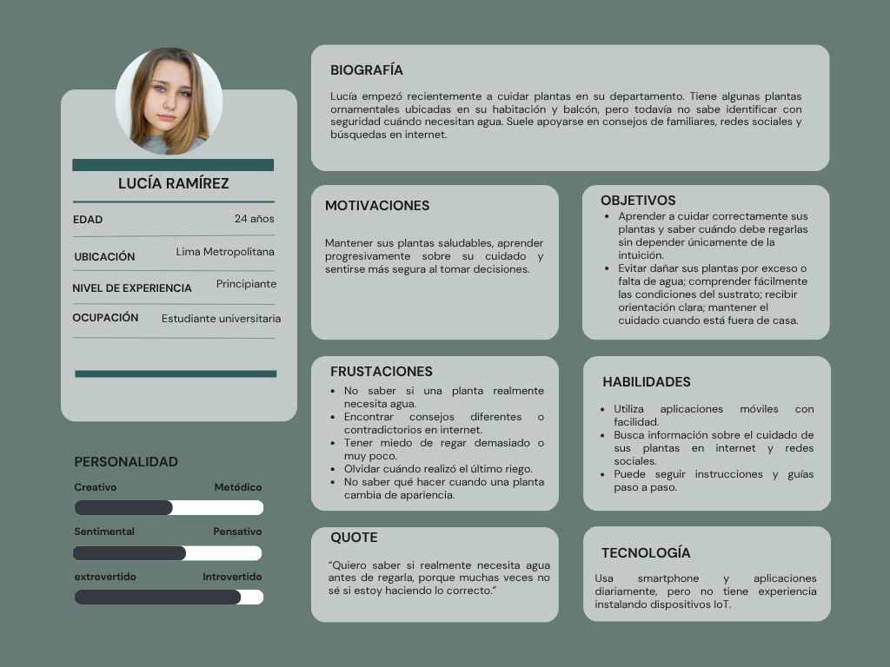

***Segmento objetivo #2: Usuarios expertos en el cuidado de plantas:***

  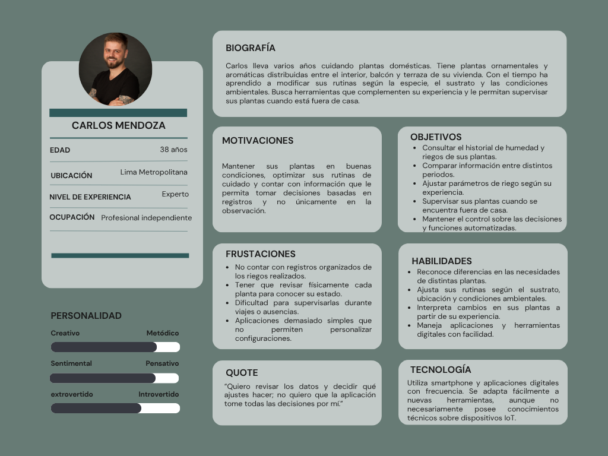

#### 2.3.2. User Task Matrix

Las tareas describen actividades de cuidado que existen independientemente de AquaSave. Las frecuencias e importancias son hipótesis iniciales: alta implica relación directa con el objetivo; media representa apoyo o una tarea ocasional.

| Tarea | Principiante: frecuencia propuesta | Principiante: importancia | Experto: frecuencia propuesta | Experto: importancia |
| :--- | :--- | :--- | :--- | :--- |
| Observar la planta y el sustrato | En cada evaluación | Alta | En cada evaluación | Alta |
| Decidir si corresponde regar | En cada evaluación | Alta | En cada evaluación | Alta |
| Determinar cuánto regar | En cada riego | Alta | En cada riego | Alta |
| Buscar orientación | Frecuente | Alta | Ocasional | Media |
| Ajustar rutinas ante cambios | Ocasional | Alta | Recurrente | Alta |
| Registrar acciones y resultados | Ocasional | Media | Recurrente | Alta |
| Comparar periodos de cuidado | Ocasional | Media | Recurrente | Alta |
| Organizar el cuidado durante ausencias | Según necesidad | Alta | Según necesidad | Alta |
| Revisar el suministro disponible | Antes del riego | Alta | Antes del riego | Alta |

Ambos segmentos necesitan decidir cuándo y cuánto regar. El principiante requiere mayor orientación para interpretar las condiciones, mientras que el experto busca comparar registros y ajustar sus rutinas.

#### 2.3.3. Empathy Mapping

***Segmento objetivo #1: Usuarios principiantes en el cuidado de plantas:***

  

***Segmento 2: Usuarios expertos en el cuidado de plantas:***

  

#### 2.3.4. As-Is Scenario Mapping

Los As-Is Scenario Maps describirán la experiencia actual de los usuarios al evaluar sus plantas, decidir el riego y verificar los resultados. Cada escenario organizará las acciones, pensamientos y emociones del segmento para reconocer sus dificultades de cuidado.

**Usuarios principiantes en el cuidado de plantas**

  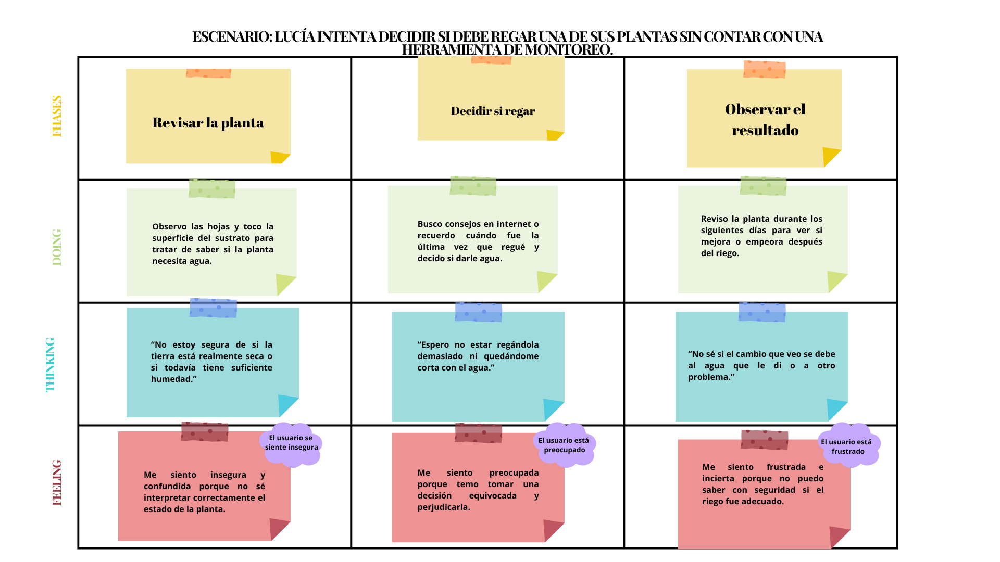

**Usuarios expertos en el cuidado de plantas**

  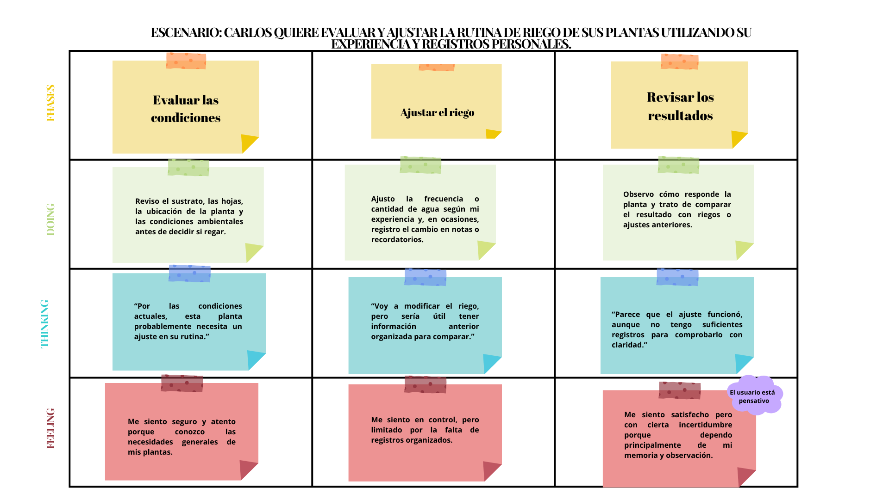

### 2.4. Ubiquitous Language

El glosario establece significados comunes entre usuarios, equipo y otras personas interesadas. Incluye conceptos del cuidado doméstico; los protocolos, frameworks y patrones técnicos se describen en arquitectura.

| Término | Definición |
| :--- | :--- |
| Beginner Plant Care User (Usuario principiante) | Persona que requiere orientación frecuente para interpretar necesidades y decidir el cuidado. |
| Experienced Plant Care User (Usuario experto) | Persona con autonomía práctica para explicar y adaptar el cuidado de sus plantas domésticas. |
| Experience Level (Nivel de experiencia) | Preferencia que adapta la orientación; no constituye permiso ni plan comercial. |
| Domestic Growing Space (Espacio doméstico de cultivo) | Área de la vivienda donde se cuidan plantas. |
| Plant Profile (Perfil de planta) | Información conocida de la planta, recipiente, sustrato y condiciones de cuidado. |
| Irrigation Unit (Unidad de riego) | Planta o conjunto compatible que recibe una misma acción de suministro. |
| Substrate (Sustrato) | Medio donde crece la planta y se conserva parte del agua disponible. |
| Substrate Moisture (Humedad del sustrato) | Condición de humedad interpretada según la lectura y calibración disponibles. |
| Moisture Reading (Lectura de humedad) | Observación identificada y fechada de la condición del sustrato. |
| Reading Freshness (Vigencia de lectura) | Condición temporal que determina si una observación puede usarse para una decisión. |
| Rain Exposure (Exposición a lluvia) | Posibilidad de que una unidad reciba directamente agua de precipitación. |
| Irrigation Threshold (Umbral de riego) | Valor aprobado que interviene en el inicio o detención del riego automático. |
| Irrigation Policy (Política de riego) | Conjunto de límites y condiciones autorizadas para una unidad. |
| Irrigation Recommendation (Recomendación de riego) | Sugerencia contextualizada cuyo fundamento, vigencia y limitaciones pueden revisarse. |
| Irrigation Cycle (Ciclo de riego) | Intervalo delimitado de funcionamiento del suministro a una unidad. |
| Manual Irrigation (Riego manual) | Ciclo solicitado expresamente por el usuario y sujeto a límites. |
| Automatic Irrigation (Riego automático) | Ciclo iniciado por una política aprobada al cumplirse sus condiciones. |
| Irrigation Schedule (Horario de riego) | Momento programado para evaluar un riego, sin omitir las demás condiciones. |
| Irrigation History (Historial de riego) | Registro de ciclos y resultados confirmados, incluyendo interrupciones. |
| Water Consumption (Consumo de agua) | Volumen utilizado, identificado como medido o estimado según su obtención. |
| Consumption Baseline (Línea base de consumo) | Referencia documentada de volumen y condiciones para comparar periodos. |
| Water Savings (Ahorro de agua) | Reducción respecto de una línea base comparable, calculada con método explícito. |
| Critical Moisture Alert (Alerta de humedad crítica) | Aviso de una condición que supera los límites de atención configurados. |
| Care Plan (Plan de cuidado) | Organización del seguimiento y riego de una planta según sus condiciones. |
| Service Plan (Plan de servicio) | Conjunto de prestaciones comerciales contratado; independiente de la experiencia. |

## Capítulo III: Requirements Specification

### 3.1. To-Be Scenario Mapping

Los To-Be Scenario Maps presentarán la experiencia que AquaSave ofrecerá a los usuarios principiantes y expertos. Los escenarios abarcarán la configuración de una unidad, la consulta de sus condiciones, la decisión de riego y la revisión de los resultados, mostrando las mejoras esperadas en cada etapa.

**Usuarios principiantes en cuidado de plantas**

  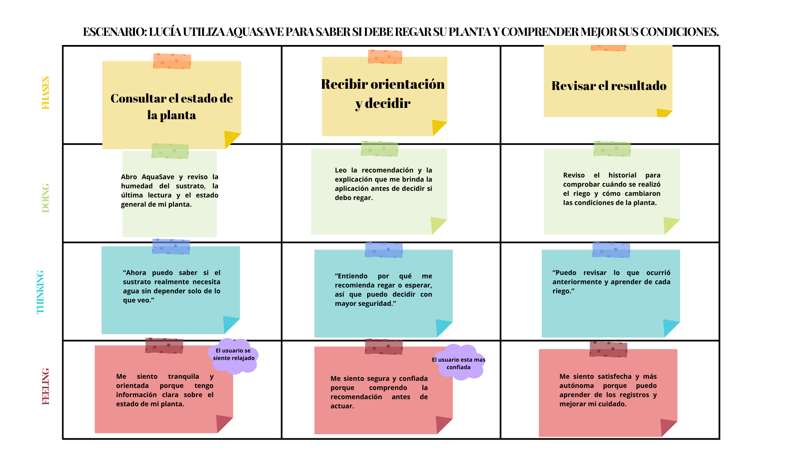

**Usuarios expertos en cuidado de plantas**

  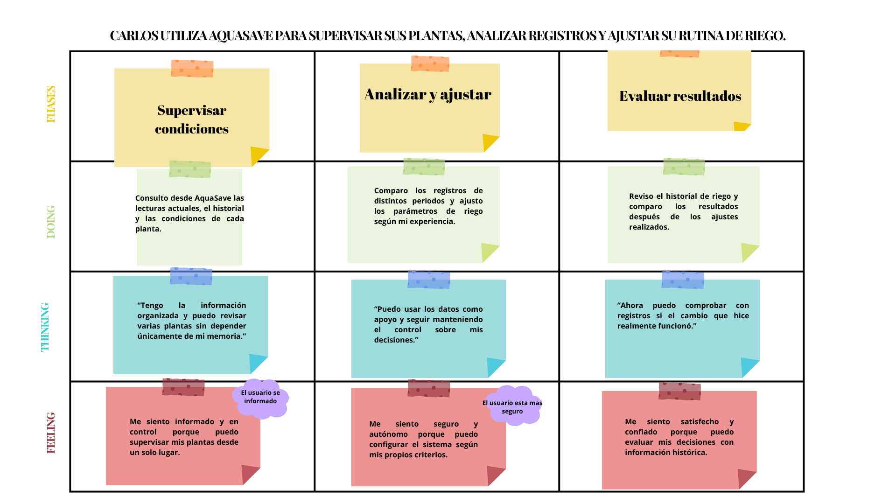

### 3.2. User Stories

## EPICS

| Epic ID | Título | Descripción |
|:-------:|--------|-------------|
| EP01 | Autenticación y Registro | Registro, inicio de sesión, acceso con Google y recuperación de cuentas para usuarios principiantes y expertos. |
| EP02 | Gestión de Perfiles y Plantas Domésticas | Configuración de perfiles, registro de plantas y personalización de la orientación según el nivel de experiencia. |
| EP03 | Monitoreo y Gestión de Dispositivos IoT | Vinculación de dispositivos ESP32, consulta de humedad del sustrato y temperatura ambiental, configuración y seguimiento de la conexión. |
| EP04 | Control y Automatización del Riego | Activación y detención del riego, configuración de umbrales y programación de ciclos con límites de duración. |
| EP05 | Integración con Pronóstico Climático | Consulta del pronóstico y configuración de aplazamientos de riego para plantas expuestas a la lluvia. |
| EP06 | Alertas y Notificaciones | Avisos sobre humedad, temperatura y condiciones que impiden o modifican un riego previsto. |
| EP07 | Historial y Consumo de Agua | Consulta de ciclos, consumo por periodo y comparación con una línea base, diferenciando mediciones y estimaciones. |
| EP08 | Dashboard Principal | Panel con el estado de las plantas, alertas recientes, resumen de consumo y accesos al control del riego. |
| EP09 | Recomendaciones Apoyadas por IA | Recomendaciones explicadas a partir de las condiciones de cada unidad, con aceptación o descarte por parte del usuario. |
| EP10 | Landing Page y Acceso a las Aplicaciones | Presentación de AquaSave, información del kit y acceso a los productos digitales con una experiencia accesible e internacionalizada. |
| EP11 | Planes de Servicio | Consulta de planes y gestión de suscripciones para prestaciones opcionales. |

---

## USER STORIES

| Story ID | Título | Descripción | Criterios de Aceptación | Epic ID |
|:--------:|--------|-------------|-------------------------|:-------:|
| US01 | Registrar cuenta nueva | Como nuevo usuario, quiero crear una cuenta e indicar mi nivel de experiencia, para acceder a una orientación adecuada. | **Escenario 1: Registro exitoso.** Given que el usuario accede al registro, When completa datos válidos y selecciona Principiante o Experto, Then se crea su cuenta y accede a la configuración inicial.  **Escenario 2: Registro inválido.** Given que existen campos incorrectos o el correo ya está registrado, When intenta crear la cuenta, Then el sistema evita el registro duplicado e indica cómo continuar. | EP01 |
| US02 | Iniciar sesión con correo y contraseña | Como usuario registrado, quiero iniciar sesión con mis credenciales, para consultar y gestionar mis unidades domésticas. | **Escenario 1: Acceso exitoso.** Given que el usuario tiene una cuenta, When ingresa credenciales válidas, Then accede al dashboard y a los recursos de su cuenta.  **Escenario 2: Credenciales incorrectas.** Given que el usuario ingresa credenciales inválidas, When intenta iniciar sesión, Then el sistema muestra "Correo o contraseña incorrectos" sin identificar cuál dato falló. | EP01 |
| US03 | Iniciar sesión con cuenta de Google | Como usuario, quiero utilizar mi cuenta de Google, para acceder a AquaSave con una identidad existente. | **Escenario 1: Acceso con Google.** Given que el usuario selecciona "Continuar con Google", When autoriza el acceso y se verifica su identidad, Then se reconoce su cuenta vinculada o se crea una nueva.  **Escenario 2: Autorización cancelada.** Given que el usuario cancela el proceso o la identidad no puede verificarse, When regresa a AquaSave, Then permanece sin autenticar y no se vinculan cuentas únicamente por coincidencia de correo. | EP01 |
| US04 | Recuperar contraseña olvidada | Como usuario registrado, quiero restablecer mi contraseña, para recuperar acceso sin perder mis registros. | **Escenario 1: Restablecimiento exitoso.** Given que el usuario dispone de un enlace válido y no utilizado, When registra una nueva contraseña, Then se actualiza la contraseña y el enlace queda invalidado.  **Escenario 2: Enlace inválido.** Given que el enlace venció o ya fue utilizado, When intenta restablecer la contraseña, Then se rechaza la operación y se ofrece solicitar otro enlace. La solicitud inicial muestra el mismo mensaje exista o no el correo. | EP01 |
| US05 | Cerrar sesión | Como usuario autenticado, quiero cerrar mi sesión, para proteger el acceso desde un equipo compartido. | **Escenario 1: Cierre exitoso.** Given que existe una sesión activa, When el usuario selecciona "Cerrar sesión", Then se eliminan las credenciales locales, se revoca la renovación de esa sesión y se muestra la pantalla de acceso.  **Escenario 2: Sesión vencida.** Given que la sesión ha vencido, When el usuario intenta acceder a una función protegida, Then se solicita iniciar sesión nuevamente. | EP01 |
| US06 | Configurar perfil de usuario principiante | Como usuario principiante, quiero registrar mis plantas con orientación, para preparar su monitoreo y comprender la configuración. | **Escenario 1: Configuración guiada.** Given que el usuario seleccionó el nivel Principiante, When registra su planta, recipiente y ubicación, Then el sistema guarda los datos y explica los pasos para preparar el monitoreo.  **Escenario 2: Información desconocida.** Given que el usuario desconoce un dato de cuidado, When lo indica durante la configuración, Then puede conservarlo como desconocido sin activar automáticamente parámetros de riego que dependan de ese dato. | EP02 |
| US07 | Configurar perfil de usuario experto | Como usuario experto, quiero registrar las condiciones de mis plantas y revisar sus parámetros, para adaptar el seguimiento a mi cuidado doméstico. | **Escenario 1: Configuración guardada.** Given que el usuario configura una unidad, When registra condiciones, exposición y parámetros válidos, Then el sistema guarda la información confirmada.  **Escenario 2: Parámetros inconsistentes.** Given que los límites ingresados son incompatibles, When intenta guardar, Then se explica el error y se mantiene la configuración anterior. | EP02 |
| US08 | Actualizar perfil y nivel de experiencia | Como usuario, quiero modificar mi información y nivel de experiencia, para adaptar la orientación sin perder mis registros. | **Escenario 1: Perfil actualizado.** Given que el usuario accede a su perfil, When modifica datos válidos y confirma, Then los cambios se guardan y la orientación corresponde al nivel elegido.  **Escenario 2: Conservación de información.** Given que la cuenta tiene plantas y dispositivos, When cambia de Principiante a Experto o viceversa, Then se conservan sus dispositivos, permisos, plan, umbrales e historial. | EP02 |
| US09 | Consultar humedad del sustrato | Como usuario, quiero consultar la humedad y su vigencia, para evaluar las condiciones de mis plantas antes de regar. | **Escenario 1: Lectura disponible.** Given que existe una lectura válida y calibrada, When el usuario consulta su unidad, Then ve el porcentaje normalizado de humedad, su escala y la fecha de medición.  **Escenario 2: Lectura desactualizada.** Given que la lectura es inválida o tiene más de sesenta segundos, When se muestra, Then se identifica como inválida o desactualizada y no se presenta como una medición actual. | EP03 |
| US10 | Consultar temperatura ambiente | Como usuario, quiero consultar la temperatura ambiente disponible, para interpretar el entorno de mis plantas. | **Escenario 1: Temperatura disponible.** Given que el sensor ambiental registra una medición válida, When el usuario consulta su unidad, Then ve la temperatura en grados Celsius y su fecha de medición.  **Escenario 2: Fallo de lectura.** Given que el sensor no proporciona un dato válido, When se consulta la temperatura, Then se informa que no está disponible, sin sustituirla por una temperatura del sustrato inferida. | EP03 |
| US11 | Consultar el método de cálculo del consumo | Como usuario, quiero conocer cómo se obtiene el consumo del riego, para distinguir mediciones de estimaciones. | **Escenario 1: Consumo estimado.** Given que existe un caudal calibrado y una duración confirmada, When se consulta el volumen, Then se muestra como estimado y se explica que se calculó mediante caudal y duración.  **Escenario 2: Información insuficiente.** Given que no existe una medición ni una calibración suficiente, When se consulta el consumo, Then se muestra "No disponible" en lugar de cero litros. | EP03 |
| US12 | Consultar conexión del dispositivo | Como usuario, quiero conocer el estado y último contacto de mi dispositivo, para interpretar la actualidad de los datos. | **Escenario 1: Dispositivo conectado.** Given que el dispositivo tuvo un contacto autenticado durante los últimos sesenta segundos, When el usuario consulta su estado, Then se muestra "En línea" y la fecha del último contacto.  **Escenario 2: Contacto interrumpido.** Given que transcurren más de sesenta segundos sin contacto, When se actualiza el estado, Then se indica "Sin conexión" y se conservan los registros anteriores. | EP03 |
| US13 | Activar el riego de una unidad doméstica | Como usuario, quiero iniciar un ciclo de mi unidad doméstica, para atenderla cuando lo necesite. | **Escenario 1: Activación confirmada.** Given que la unidad pertenece al usuario, está conectada y cumple los límites de operación, When solicita iniciar el riego con una duración válida, Then la orden aparece pendiente y cambia a activa después de la confirmación del dispositivo.  **Escenario 2: Activación no confirmada.** Given que el dispositivo está desconectado o no confirma dentro de cinco segundos, When se solicita el riego, Then no se muestra como activo y la orden vence sin ejecutarse al reconectar. | EP04 |
| US14 | Detener el riego de una unidad doméstica | Como usuario, quiero detener un ciclo activo, para interrumpir el suministro cuando lo considere necesario. | **Escenario 1: Detención solicitada.** Given que existe un ciclo activo, When el usuario selecciona "Detener riego", Then se envía una orden prioritaria sin pedir otra confirmación al usuario y se muestra la detención cuando el dispositivo la confirma.  **Escenario 2: Pérdida de comunicación.** Given que el dispositivo no responde, When se solicita detener, Then se informa que la detención remota no está confirmada y el dispositivo conserva su límite local de duración. | EP04 |
| US15 | Configurar el riego automático | Como usuario, quiero revisar y aprobar umbrales y límites de riego, para automatizar el cuidado de una unidad. | **Escenario 1: Automatización configurada.** Given que los umbrales, la duración máxima y la pausa entre ciclos son válidos, When el usuario confirma y el dispositivo acepta la configuración, Then se habilita el riego automático con esos límites.  **Escenario 2: Condiciones insuficientes.** Given que la configuración no fue confirmada o la lectura es inválida, When se evalúa iniciar un ciclo automático, Then el ciclo no comienza y se registra el motivo. | EP04 |
| US16 | Programar evaluaciones de riego | Como usuario, quiero programar momentos de evaluación, para organizar el cuidado sin omitir las condiciones de la planta. | **Escenario 1: Evaluación programada.** Given que existe un horario válido y el reloj del dispositivo es confiable, When llega la hora, Then se revisan humedad, pausas y límites de duración y consumo antes de iniciar el riego.  **Escenario 2: Ciclo omitido.** Given que hay un ciclo activo, humedad suficiente o un horario que ya pasó, When se procesa la programación, Then no se duplica ni se recupera automáticamente el ciclo omitido. | EP04 |
| US17 | Consultar pronóstico climático | Como usuario con plantas exteriores, quiero consultar el pronóstico de mi ubicación, para anticipar condiciones relevantes. | **Escenario 1: Pronóstico disponible.** Given que el proveedor devuelve información válida, When el usuario consulta el clima, Then ve la ubicación, el periodo previsto y la hora de actualización.  **Escenario 2: Pronóstico no disponible.** Given que el servicio falla o el pronóstico está vencido, When se consulta, Then se informa la condición sin bloquear el monitoreo ni la detención del riego. | EP05 |
| US18 | Considerar lluvia para plantas expuestas | Como usuario con plantas expuestas a lluvia, quiero que se evalúe el pronóstico junto con la humedad, para evitar riegos innecesarios. | **Escenario 1: Aplazamiento por lluvia.** Given que la unidad está expuesta y cumple las condiciones configuradas de pronóstico y humedad, When se evalúa un riego, Then se aplaza dentro del límite permitido y se registra el motivo.  **Escenario 2: Pronóstico no aplicable.** Given que la planta está protegida de la lluvia o el pronóstico está vencido, When se evalúa el riego, Then se utiliza la configuración local aprobada sin aplicar un aplazamiento climático. | EP05 |
| US19 | Configurar la consideración de lluvia | Como usuario, quiero registrar exposición a lluvia y límites de aplazamiento, para adaptar la política a la ubicación real. | **Escenario 1: Configuración climática válida.** Given que la planta está expuesta a lluvia, When el usuario define una probabilidad entre cero y cien por ciento y un periodo de aplazamiento válido, Then se guarda la configuración aprobada.  **Escenario 2: Configuración no aplicable.** Given que la planta está protegida o el porcentaje está fuera de rango, When intenta activar el aplazamiento, Then se deshabilita esa opción o se solicita corregir el valor, según corresponda. | EP05 |
| US20 | Recibir alerta de humedad baja | Como usuario, quiero recibir un aviso de humedad baja, para revisar oportunamente mis plantas. | **Escenario 1: Alerta registrada.** Given que una lectura válida está por debajo del límite configurado, When se confirma la condición, Then se genera una alerta con la unidad afectada, la fecha y una orientación de revisión.  **Escenario 2: Control de repetición.** Given que la misma alerta continúa abierta, When llegan lecturas equivalentes durante las siguientes dos horas, Then no se repite la notificación salvo que se cumpla una condición de agravamiento configurada. | EP06 |
| US21 | Recibir alerta de humedad excesiva | Como usuario, quiero recibir un aviso de humedad elevada, para revisar el riego y el drenaje. | **Escenario 1: Humedad elevada.** Given que una lectura válida supera el límite superior, When se procesa, Then se genera una alerta y se interrumpe el ciclo si se cumple su condición de corte.  **Escenario 2: Lectura inválida.** Given que el sensor entrega una lectura inválida, When se evalúa la humedad, Then se informa el problema de lectura sin afirmar que el sustrato está saturado. | EP06 |
| US22 | Recibir alerta de temperatura extrema | Como usuario, quiero conocer condiciones ambientales fuera de mis límites configurados, para evaluar medidas de cuidado. | **Escenario 1: Temperatura fuera de rango.** Given que una lectura ambiental válida supera el máximo o está por debajo del mínimo configurado, When se procesa, Then se genera una alerta con el valor, la unidad y la fecha.  **Escenario 2: Temperatura no disponible.** Given que no existe una lectura válida, When se evalúa la condición, Then se informa la falta de datos sin atribuir una temperatura extrema a la planta. | EP06 |
| US23 | Conocer riegos omitidos por las condiciones | Como usuario, quiero conocer por qué se omite un riego previsto, para revisar mi configuración con información. | **Escenario 1: Motivo registrado.** Given que un horario coincide con humedad suficiente o una pausa activa, When se evalúa el riego, Then se omite el ciclo y se registra su motivo.  **Escenario 2: Omisiones recurrentes.** Given que existen varias omisiones, When el usuario consulta el resumen, Then se presentan agrupadas y diferenciadas de los ciclos ejecutados. | EP06 |
| US24 | Consultar historial de riego | Como usuario, quiero consultar ciclos y resultados por unidad, para revisar qué ocurrió durante el cuidado. | **Escenario 1: Historial disponible.** Given que existen ciclos registrados, When el usuario selecciona una unidad y un periodo, Then ve inicio, fin, origen, resultado y volumen disponible de cada ciclo.  **Escenario 2: Ciclo incompleto.** Given que un ciclo no tiene cierre confirmado, When se consulta, Then aparece como incompleto sin asignarle una duración final inventada. | EP07 |
| US25 | Consultar consumo por periodo | Como usuario, quiero consultar consumo diario, semanal y mensual, para comparar patrones de uso del agua. | **Escenario 1: Consumo agrupado.** Given que existen registros compatibles, When el usuario selecciona una vista diaria, semanal o mensual, Then ve el volumen, el método de obtención y la cobertura de datos del periodo.  **Escenario 2: Datos incompletos.** Given que faltan registros o existen métodos diferentes, When se calcula el consumo, Then se muestran las diferencias y los vacíos sin tratarlos como consumo cero. | EP07 |
| US26 | Comparar consumo con una línea base | Como usuario, quiero comparar el consumo con una referencia documentada, para evaluar posibles reducciones. | **Escenario 1: Comparación válida.** Given que existe una línea base positiva con condiciones y periodos comparables, When se solicita la comparación, Then se muestra la variación en litros y porcentaje junto con el método utilizado.  **Escenario 2: Referencia insuficiente.** Given que la línea base no existe, es cero o no es comparable, When se solicita calcular una reducción, Then se informa que no puede determinarse. Un aumento de consumo se presenta como aumento. | EP07 |
| US27 | Consultar el estado de mis plantas | Como usuario, quiero consultar un resumen por unidad, para reconocer cuáles requieren atención. | **Escenario 1: Dashboard actualizado.** Given que existen lecturas vigentes y estados confirmados, When el usuario abre el dashboard, Then ve humedad, temperatura disponible, estado del riego y alertas de cada unidad.  **Escenario 2: Datos antiguos.** Given que hay lecturas desactualizadas o dispositivos desconectados, When se muestra el resumen, Then se indican las fechas y la falta de información sin presentar las unidades como normales. | EP08 |
| US28 | Acceder al control de la unidad consultada | Como usuario, quiero actuar sobre la unidad que estoy revisando, para controlar el riego sin confundir dispositivos. | **Escenario 1: Control de la unidad seleccionada.** Given que el usuario consulta una unidad de su cuenta, When solicita iniciar o detener el riego, Then la orden corresponde al identificador de esa unidad.  **Escenario 2: Cambio de selección.** Given que el usuario cambia de unidad mientras una orden está pendiente, When llega la respuesta, Then el resultado se asocia a la unidad original. | EP08 |
| US29 | Consultar alertas recientes | Como usuario, quiero revisar alertas recientes por unidad, para priorizar mi atención. | **Escenario 1: Alertas visibles.** Given que existen alertas, When el usuario abre el panel, Then aparecen ordenadas por fecha e identifican la unidad y su estado abierto o resuelto.  **Escenario 2: Ausencia de lecturas.** Given que no hay alertas recientes pero faltan lecturas vigentes, When se consulta el panel, Then se informa la falta de datos sin afirmar que todas las plantas están en condiciones normales. | EP08 |
| US30 | Consultar un resumen de consumo | Como usuario, quiero revisar un resumen de consumo y cobertura, para interpretar rápidamente mis registros. | **Escenario 1: Resumen disponible.** Given que existen datos del periodo seleccionado, When el usuario consulta el dashboard, Then ve el volumen registrado, su método de obtención y la cobertura.  **Escenario 2: Sin línea base.** Given que no existe una referencia válida para comparar, When se muestra el resumen, Then se presenta el consumo disponible sin atribuirle un ahorro. | EP08 |
| US31 | Vincular un dispositivo doméstico | Como usuario, quiero vincular un kit mediante pasos guiados, para comenzar a monitorear mi unidad de riego. | **Escenario 1: Vinculación exitosa.** Given que el dispositivo está disponible y su código es válido, When el usuario completa la guía y acredita su posesión, Then el kit queda asociado de forma única a su cuenta y unidad.  **Escenario 2: Vinculación rechazada.** Given que el código fue utilizado o el dispositivo pertenece a otra cuenta, When intenta vincularlo, Then se rechaza la asociación sin revelar información del propietario. | EP03 |
| US32 | Ajustar parámetros de interpretación | Como usuario, quiero revisar límites de interpretación y calibración, para comprender el significado de las lecturas. | **Escenario 1: Ajuste válido.** Given que existe una calibración verificada, When el usuario confirma límites ordenados, Then se guarda la versión del ajuste y se aplica a las siguientes lecturas.  **Escenario 2: Independencia del control.** Given que el usuario cambia la interpretación de las lecturas, When guarda el ajuste, Then los umbrales del riego automático se mantienen hasta que apruebe expresamente su modificación. | EP03 |
| US33 | Gestionar múltiples dispositivos domésticos | Como usuario, quiero identificar y consultar mis distintos kits, para supervisar varias unidades desde una cuenta. | **Escenario 1: Dispositivo adicional.** Given que el usuario tiene un kit vinculado, When incorpora otro dispositivo autorizado, Then aparece como una unidad adicional con un nombre identificador.  **Escenario 2: Consulta independiente.** Given que existen varias unidades, When selecciona una, Then se muestran únicamente sus lecturas, configuración e historial. | EP03 |
| US34 | Consultar una recomendación de riego | Como usuario, quiero recibir una recomendación apoyada por IA con explicación, para evaluar el cuidado de mi unidad. | **Escenario 1: Recomendación disponible.** Given que hay un perfil suficiente, una lectura de hasta sesenta segundos y una configuración válida, When se solicita una recomendación, Then se muestra la propuesta, su fundamento, los datos utilizados y una vigencia máxima de cinco minutos.  **Escenario 2: Recomendación no disponible.** Given que faltan datos o la respuesta de IA no es válida, When se solicita orientación, Then se informa la limitación sin generar una orden de riego. | EP09 |
| US35 | Decidir sobre una recomendación | Como usuario, quiero aceptar o descartar una recomendación, para conservar el control de mis decisiones. | **Escenario 1: Recomendación aceptada.** Given que la recomendación está vigente, When el usuario la acepta, Then se verifican nuevamente propiedad, lecturas, configuración y límites antes de emitir una única orden, si corresponde.  **Escenario 2: Recomendación no ejecutable.** Given que la propuesta fue descartada, venció o ya no corresponde al estado actual, When se procesa la decisión, Then no se inicia el riego y se registra el motivo. | EP09 |
| US36 | Conocer AquaSave desde la landing page | Como visitante, quiero conocer el problema y la propuesta de AquaSave, para evaluar su utilidad en mi hogar. | **Escenario 1: Propuesta visible.** Given que una persona visita la landing page, When revisa su contenido, Then encuentra el propósito doméstico, los productos y las condiciones de instalación.  **Escenario 2: Función prevista.** Given que una función todavía no está disponible, When se presenta en la página, Then se identifica como prevista. | EP10 |
| US37 | Acceder a orientación según mi experiencia | Como visitante principiante o experto, quiero encontrar información relevante para mi experiencia, para comprender cómo AquaSave me ayudaría. | **Escenario 1: Orientación para principiantes.** Given que el visitante consulta la información para principiantes, When revisa la propuesta, Then encuentra explicaciones sobre instalación, interpretación de lecturas y aprendizaje del cuidado.  **Escenario 2: Orientación para expertos.** Given que consulta la información para expertos, When revisa la propuesta, Then encuentra funciones de seguimiento, comparación y configuración. | EP10 |
| US38 | Acceder a las aplicaciones | Como visitante, quiero acceder a la aplicación web o al punto de descarga móvil, para continuar la experiencia de AquaSave. | **Escenario 1: Acceso disponible.** Given que la aplicación está publicada, When el visitante selecciona el acceso web o móvil, Then llega a la aplicación o al punto de distribución correspondiente.  **Escenario 2: Acceso pendiente.** Given que una aplicación todavía no está publicada, When se presenta su acceso, Then se informa que no está disponible y no se utiliza un enlace ficticio. | EP10 |
| US39 | Consultar requisitos y soporte del kit | Como visitante, quiero conocer requisitos, mantenimiento y soporte, para decidir si puedo utilizar AquaSave. | **Escenario 1: Requisitos disponibles.** Given que el visitante consulta la información del kit, When revisa sus condiciones, Then identifica requisitos de red, energía, instalación, mantenimiento y el canal de soporte.  **Escenario 2: Condiciones pendientes.** Given que un costo o prestación aún no está definido, When se consulta, Then se indica que está pendiente de definición sin mostrar un valor inventado. | EP10 |
| US40 | Consultar planes de servicio | Como usuario, quiero comparar las condiciones de los planes, para elegir prestaciones según mis necesidades. | **Escenario 1: Comparación de planes.** Given que existen planes publicados, When el usuario los consulta, Then identifica precio, vigencia y funciones incluidas.  **Escenario 2: Elección independiente.** Given que el usuario tiene nivel Principiante o Experto, When consulta los planes, Then puede compararlos sin recibir una suscripción automática por su nivel. | EP11 |
| US41 | Gestionar la suscripción del servicio | Como usuario, quiero conocer y modificar el estado de mi suscripción, para controlar prestaciones opcionales. | **Escenario 1: Suscripción confirmada.** Given que una operación comercial fue verificada en el entorno de prueba, When se confirma la suscripción, Then su vigencia y prestaciones se aplican una sola vez y se muestran en la cuenta.  **Escenario 2: Cancelación o vencimiento.** Given que el usuario cancela o la suscripción vence, When se actualiza el plan, Then se informa el cambio de prestaciones sin bloquear la detención del riego ni modificar los límites locales. | EP11 |
| TS01 | Recibir telemetría mediante API interna | Como desarrollador, quiero un contrato de telemetría versionado, para integrar dispositivos sin ambigüedad de unidades. | **Escenario 1: Telemetría aceptada.** Given que llega un POST autenticado con identificadores, fecha, unidades y valores válidos, When se procesa, Then se guarda y responde 201; una repetición idéntica responde 200 sin duplicar el registro.  **Escenario 2: Telemetría rechazada.** Given que el contenido es inválido o las credenciales no autorizan el envío, When se recibe, Then responde 422, 401 o 403 según corresponda y los datos no se utilizan para controlar el riego. | EP03 |
| TS02 | Gestionar órdenes idempotentes | Como desarrollador, quiero un contrato de órdenes con confirmación, para evitar ciclos duplicados y estados falsos. | **Escenario 1: Orden aceptada.** Given que una solicitud autorizada contiene un commandId y vencimiento válidos, When se acepta, Then responde 202 y permite consultar el estado de la orden.  **Escenario 2: Orden repetida.** Given que se reenvía el mismo commandId, When el contenido coincide, Then se devuelve su estado sin repetir la acción; si el contenido cambia, se responde 409. | EP04 |
| TS03 | Validar el contrato de recomendaciones | Como desarrollador, quiero validar entradas y salidas del servicio de IA, para integrar recomendaciones sin delegar el control del actuador. | **Escenario 1: Respuesta válida.** Given que el servicio recibe una solicitud válida, When devuelve una propuesta dentro del tiempo permitido, Then se verifican acción, explicación y vigencia antes de guardarla.  **Escenario 2: Respuesta inválida.** Given que la respuesta incumple el contrato o supera el tiempo permitido, When se procesa, Then se registra el fallo y se informa indisponibilidad sin emitir órdenes de riego. | EP09 |
| TS04 | Publicar y consumir eventos persistentes | Como desarrollador, quiero eventos persistentes con consumidores idempotentes, para construir el historial sin perder ni duplicar ciclos. | **Escenario 1: Evento publicado.** Given que una operación y su evento quedan guardados en una transacción, When se publica desde outbox, Then conserva su eventId y el consumidor actualiza el historial una sola vez.  **Escenario 2: Evento repetido.** Given que un reinicio provoca la reentrega del evento, When el consumidor reconoce su identificador, Then evita duplicar los registros. | EP07 |
| TS05 | Integrar los productos digitales del curso | Como desarrollador, quiero integrar una landing page en HTML, CSS y JavaScript, aplicaciones web y móvil en Flutter con Dart y una API en Node.js con Express y TypeScript, para ofrecer una experiencia integrada de AquaSave. | **Escenario 1: Integración de los productos.** Given que los productos digitales están disponibles y el usuario tiene una cuenta válida, When accede desde las aplicaciones web y móvil, Then ambas utilizan la misma API y permiten consultar los datos asociados a su cuenta.  **Escenario 2: Tecnologías verificadas.** Given que se revisa la implementación de los productos, When se comprueban el código fuente y sus dependencias, Then la landing page utiliza HTML, CSS y JavaScript; las aplicaciones web y móvil utilizan Flutter con Dart; y la API utiliza Node.js con Express y TypeScript. | EP10 |
| TS06 | Consumir un servicio externo con aislamiento | Como desarrollador, quiero consumir un pronóstico externo mediante un adaptador, para incorporar información de terceros sin acoplar el dominio. | **Escenario 1: Pronóstico normalizado.** Given que el proveedor devuelve una respuesta válida, When el adaptador la procesa, Then normaliza ubicación, unidades, hora de obtención y vigencia.  **Escenario 2: Fallo del proveedor.** Given que ocurre un error o se supera el tiempo de espera, When se consulta el servicio, Then se informa indisponibilidad sin bloquear el control local. | EP05 |
| TS07 | Diseñar e implementar el dispositivo IoT | Como desarrollador, quiero diseñar e implementar un dispositivo IoT basado en ESP32, para medir las condiciones de una unidad doméstica y controlar su riego. | **Escenario 1: Dispositivo integrado.** Given que se dispone del controlador, sensores, alimentación y actuador, When se integran y prueban, Then se obtienen lecturas calibradas y se ejecuta un ciclo dentro de los límites definidos.  **Escenario 2: Condiciones insuficientes.** Given que falta un componente necesario o una lectura válida, When se evalúa el riego automático, Then se informa el problema y se impide iniciar el ciclo. | EP03 |
| TS08 | Separar experiencia y autorización | Como desarrollador, quiero verificar propiedad en cada operación, para mantener el acceso independiente del nivel de experiencia. | **Escenario 1: Cambio de experiencia.** Given que una cuenta tiene dispositivos asociados, When cambia su nivel de experiencia, Then conserva los mismos permisos y propiedades.  **Escenario 2: Recurso ajeno.** Given que una solicitud intenta consultar o controlar una unidad de otra cuenta, When se verifica la autorización, Then se rechaza antes de devolver información o publicar una orden. | EP01 |
| TS09 | Conservar procedencia de las mediciones | Como desarrollador, quiero registrar método, tiempo y versión de calibración, para evitar que estimaciones se presenten como mediciones. | **Escenario 1: Procedencia registrada.** Given que se guarda una lectura o un consumo, When se persiste, Then incluye fecha, método y versión de calibración cuando corresponde, junto con los datos necesarios para reproducir el cálculo.  **Escenario 2: Registro ausente.** Given que falta una medición, When se agrega el consumo de un periodo, Then se informa la cobertura incompleta sin sustituir la ausencia por cero. | EP07 |
| TS10 | Aplicar límites locales de riego | Como desarrollador, quiero que el controlador valide y detenga los ciclos localmente, para mantener la operación acotada ante fallos de red. | **Escenario 1: Corte local.** Given que existe un ciclo activo, When alcanza su duración máxima o una condición de corte, Then el controlador desactiva el actuador sin depender de internet.  **Escenario 2: Reinicio o fallo.** Given que ocurre un reinicio, una lectura inválida o falta una configuración válida, When se evalúa la operación, Then el actuador permanece apagado y no se reejecutan órdenes anteriores. | EP04 |
| TS11 | Mantener documentación y versiones trazables | Como desarrollador, quiero mantener contratos y documentación en repositorios versionados, para reproducir y revisar la solución durante el curso. | **Escenario 1: Entrega identificable.** Given que se prepara una entrega, When se revisan sus repositorios, Then existen documentación, contratos, historial de cambios y referencias de versión.  **Escenario 2: Cambio integrado.** Given que se incorpora una modificación, When se registra en el repositorio, Then sigue el flujo GitFlow acordado y utiliza Conventional Commits en inglés. | EP10 |
| TS12 | Aislar IA del control físico | Como desarrollador, quiero que la IA solo produzca propuestas estructuradas, para impedir que una respuesta del modelo active directamente el riego. | **Escenario 1: Propuesta revisada.** Given que la IA genera una propuesta, When se procesa, Then requiere validación, aceptación del usuario y comprobación de límites antes de originar una orden.  **Escenario 2: Acceso restringido.** Given que el servicio de IA intenta publicar una orden directamente, When se verifica su acceso al broker, Then se rechaza porque no dispone de credenciales ni permisos de control. | EP09 |
| TS13 | Internacionalizar y hacer accesible la experiencia | Como desarrollador, quiero ofrecer inglés por defecto y español con una experiencia accesible, para atender de manera inclusiva a los usuarios de los productos. | **Escenario 1: Idioma configurable.** Given que no existe una preferencia guardada, When se utiliza el producto, Then se muestra inglés en_US y se permite seleccionar español es_419 sin modificar identificadores ni unidades; los mensajes y la documentación de API siguen la política de idioma establecida.  **Escenario 2: Interacción accesible.** Given que se utilizan teclado o tecnologías de asistencia, When se recorren los controles, Then existen etiquetas, foco y semántica accesibles, y los estados no dependen únicamente del color. | EP10 |

### 3.3. Impact Mapping

Usuario: Usuario Principiante

  

Usuario: Usuario Experto

  

### 3.4. Product Backlog

URL del Product Backlog: https://trello.com/b/tQbBo5rs

  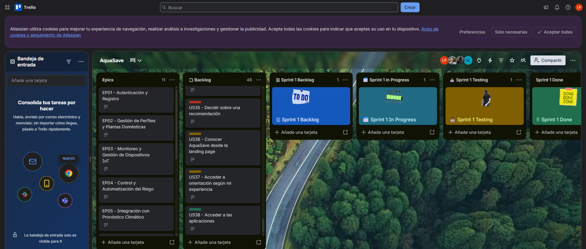

| Orden | User Story ID | Título | Descripción | Story Points |
|:-----:|:-------------:|--------|-------------|:------------:|
| 1 | US01 | Registrar cuenta nueva | Como nuevo usuario, quiero crear una cuenta e indicar mi nivel de experiencia, para acceder a una orientación adecuada. | 3 |
| 2 | US02 | Iniciar sesión con correo y contraseña | Como usuario registrado, quiero iniciar sesión con mis credenciales, para consultar y gestionar mis unidades domésticas. | 3 |
| 3 | US03 | Iniciar sesión con cuenta de Google | Como usuario, quiero utilizar mi cuenta de Google, para acceder a AquaSave con una identidad existente. | 5 |
| 4 | US04 | Recuperar contraseña olvidada | Como usuario registrado, quiero restablecer mi contraseña, para recuperar acceso sin perder mis registros. | 3 |
| 5 | US05 | Cerrar sesión | Como usuario autenticado, quiero cerrar mi sesión, para proteger el acceso desde un equipo compartido. | 2 |
| 6 | US06 | Configurar perfil de usuario principiante | Como usuario principiante, quiero registrar mis plantas con orientación, para preparar su monitoreo y comprender la configuración. | 5 |
| 7 | US07 | Configurar perfil de usuario experto | Como usuario experto, quiero registrar las condiciones de mis plantas y revisar sus parámetros, para adaptar el seguimiento a mi cuidado doméstico. | 5 |
| 8 | US08 | Actualizar perfil y nivel de experiencia | Como usuario, quiero modificar mi información y nivel de experiencia, para adaptar la orientación sin perder mis registros. | 3 |
| 9 | TS08 | Separar experiencia y autorización | Como desarrollador, quiero verificar propiedad en cada operación, para mantener el acceso independiente del nivel de experiencia. | 5 |
| 10 | TS07 | Diseñar e implementar el dispositivo IoT | Como desarrollador, quiero diseñar e implementar un dispositivo IoT basado en ESP32, para medir las condiciones de una unidad doméstica y controlar su riego. | 8 |
| 11 | TS01 | Recibir telemetría mediante API interna | Como desarrollador, quiero un contrato de telemetría versionado, para integrar dispositivos sin ambigüedad de unidades. | 5 |
| 12 | US31 | Vincular un dispositivo doméstico | Como usuario, quiero vincular un kit mediante pasos guiados, para comenzar a monitorear mi unidad de riego. | 8 |
| 13 | US32 | Ajustar parámetros de interpretación | Como usuario, quiero revisar límites de interpretación y calibración, para comprender el significado de las lecturas. | 5 |
| 14 | US33 | Gestionar múltiples dispositivos domésticos | Como usuario, quiero identificar y consultar mis distintos kits, para supervisar varias unidades desde una cuenta. | 5 |
| 15 | US09 | Consultar humedad del sustrato | Como usuario, quiero consultar la humedad y su vigencia, para evaluar las condiciones de mis plantas antes de regar. | 5 |
| 16 | US10 | Consultar temperatura ambiente | Como usuario, quiero consultar la temperatura ambiente disponible, para interpretar el entorno de mis plantas. | 3 |
| 17 | US12 | Consultar conexión del dispositivo | Como usuario, quiero conocer el estado y último contacto de mi dispositivo, para interpretar la actualidad de los datos. | 3 |
| 18 | TS09 | Conservar procedencia de las mediciones | Como desarrollador, quiero registrar método, tiempo y versión de calibración, para evitar que estimaciones se presenten como mediciones. | 3 |
| 19 | US11 | Consultar el método de cálculo del consumo | Como usuario, quiero conocer cómo se obtiene el consumo del riego, para distinguir mediciones de estimaciones. | 3 |
| 20 | TS02 | Gestionar órdenes idempotentes | Como desarrollador, quiero un contrato de órdenes con confirmación, para evitar ciclos duplicados y estados falsos. | 8 |
| 21 | TS10 | Aplicar límites locales de riego | Como desarrollador, quiero que el controlador valide y detenga los ciclos localmente, para mantener la operación acotada ante fallos de red. | 8 |
| 22 | US13 | Activar el riego de una unidad doméstica | Como usuario, quiero iniciar un ciclo de mi unidad doméstica, para atenderla cuando lo necesite. | 8 |
| 23 | US14 | Detener el riego de una unidad doméstica | Como usuario, quiero detener un ciclo activo, para interrumpir el suministro cuando lo considere necesario. | 5 |
| 24 | US15 | Configurar el riego automático | Como usuario, quiero revisar y aprobar umbrales y límites de riego, para automatizar el cuidado de una unidad. | 8 |
| 25 | US16 | Programar evaluaciones de riego | Como usuario, quiero programar momentos de evaluación, para organizar el cuidado sin omitir las condiciones de la planta. | 5 |
| 26 | TS06 | Consumir un servicio externo con aislamiento | Como desarrollador, quiero consumir un pronóstico externo mediante un adaptador, para incorporar información de terceros sin acoplar el dominio. | 5 |
| 27 | US17 | Consultar pronóstico climático | Como usuario con plantas exteriores, quiero consultar el pronóstico de mi ubicación, para anticipar condiciones relevantes. | 3 |
| 28 | US19 | Configurar la consideración de lluvia | Como usuario, quiero registrar exposición a lluvia y límites de aplazamiento, para adaptar la política a la ubicación real. | 3 |
| 29 | US18 | Considerar lluvia para plantas expuestas | Como usuario con plantas expuestas a lluvia, quiero que se evalúe el pronóstico junto con la humedad, para evitar riegos innecesarios. | 5 |
| 30 | US20 | Recibir alerta de humedad baja | Como usuario, quiero recibir un aviso de humedad baja, para revisar oportunamente mis plantas. | 3 |
| 31 | US21 | Recibir alerta de humedad excesiva | Como usuario, quiero recibir un aviso de humedad elevada, para revisar el riego y el drenaje. | 3 |
| 32 | US22 | Recibir alerta de temperatura extrema | Como usuario, quiero conocer condiciones ambientales fuera de mis límites configurados, para evaluar medidas de cuidado. | 3 |
| 33 | US23 | Conocer riegos omitidos por las condiciones | Como usuario, quiero conocer por qué se omite un riego previsto, para revisar mi configuración con información. | 3 |
| 34 | US27 | Consultar el estado de mis plantas | Como usuario, quiero consultar un resumen por unidad, para reconocer cuáles requieren atención. | 5 |
| 35 | US28 | Acceder al control de la unidad consultada | Como usuario, quiero actuar sobre la unidad que estoy revisando, para controlar el riego sin confundir dispositivos. | 3 |
| 36 | US29 | Consultar alertas recientes | Como usuario, quiero revisar alertas recientes por unidad, para priorizar mi atención. | 3 |
| 37 | TS04 | Publicar y consumir eventos persistentes | Como desarrollador, quiero eventos persistentes con consumidores idempotentes, para construir el historial sin perder ni duplicar ciclos. | 5 |
| 38 | US24 | Consultar historial de riego | Como usuario, quiero consultar ciclos y resultados por unidad, para revisar qué ocurrió durante el cuidado. | 5 |
| 39 | US25 | Consultar consumo por periodo | Como usuario, quiero consultar consumo diario, semanal y mensual, para comparar patrones de uso del agua. | 5 |
| 40 | US26 | Comparar consumo con una línea base | Como usuario, quiero comparar el consumo con una referencia documentada, para evaluar posibles reducciones. | 5 |
| 41 | US30 | Consultar un resumen de consumo | Como usuario, quiero revisar un resumen de consumo y cobertura, para interpretar rápidamente mis registros. | 3 |
| 42 | TS03 | Validar el contrato de recomendaciones | Como desarrollador, quiero validar entradas y salidas del servicio de IA, para integrar recomendaciones sin delegar el control del actuador. | 8 |
| 43 | TS12 | Aislar IA del control físico | Como desarrollador, quiero que la IA solo produzca propuestas estructuradas, para impedir que una respuesta del modelo active directamente el riego. | 5 |
| 44 | US34 | Consultar una recomendación de riego | Como usuario, quiero recibir una recomendación apoyada por IA con explicación, para evaluar el cuidado de mi unidad. | 8 |
| 45 | US35 | Decidir sobre una recomendación | Como usuario, quiero aceptar o descartar una recomendación, para conservar el control de mis decisiones. | 5 |
| 46 | US36 | Conocer AquaSave desde la landing page | Como visitante, quiero conocer el problema y la propuesta de AquaSave, para evaluar su utilidad en mi hogar. | 3 |
| 47 | US37 | Acceder a orientación según mi experiencia | Como visitante principiante o experto, quiero encontrar información relevante para mi experiencia, para comprender cómo AquaSave me ayudaría. | 3 |
| 48 | US38 | Acceder a las aplicaciones | Como visitante, quiero acceder a la aplicación web o al punto de descarga móvil, para continuar la experiencia de AquaSave. | 2 |
| 49 | US39 | Consultar requisitos y soporte del kit | Como visitante, quiero conocer requisitos, mantenimiento y soporte, para decidir si puedo utilizar AquaSave. | 3 |
| 50 | TS05 | Integrar los productos digitales del curso | Como desarrollador, quiero integrar una landing page en HTML, CSS y JavaScript, aplicaciones web y móvil en Flutter con Dart y una API en Node.js con Express y TypeScript, para ofrecer una experiencia integrada de AquaSave. | 8 |
| 51 | TS13 | Internacionalizar y hacer accesible la experiencia | Como desarrollador, quiero ofrecer inglés por defecto y español con una experiencia accesible, para atender de manera inclusiva a los usuarios de los productos. | 5 |
| 52 | TS11 | Mantener documentación y versiones trazables | Como desarrollador, quiero mantener contratos y documentación en repositorios versionados, para reproducir y revisar la solución durante el curso. | 3 |
| 53 | US40 | Consultar planes de servicio | Como usuario, quiero comparar las condiciones de los planes, para elegir prestaciones según mis necesidades. | 3 |
| 54 | US41 | Gestionar la suscripción del servicio | Como usuario, quiero conocer y modificar el estado de mi suscripción, para controlar prestaciones opcionales. | 5 |

## Capítulo IV: Solution Software Design

### 4.1. Strategic-Level Attribute-Driven Design

El proceso de Attribute-Driven Design de AquaSave establece las decisiones de arquitectura a partir de las funcionalidades principales, los atributos de calidad y las restricciones del proyecto. Su propósito es organizar una solución que permita monitorear las condiciones de las plantas, controlar el riego, consultar registros y recibir recomendaciones, manteniendo una separación clara entre la experiencia de usuario, las reglas de negocio y la operación del dispositivo IoT.

El diseño considera la colaboración entre cinco bounded contexts: Device Management, Irrigation Intelligence, Identity Access Management, Monetization y Analytics. Las decisiones sobre comunicación, persistencia, seguridad y disponibilidad se relacionan con las historias de usuario y se expresan mediante escenarios verificables.

#### 4.1.1. Design Purpose

El propósito del diseño es definir una arquitectura que permita a AquaSave integrar las aplicaciones web y móvil con un dispositivo IoT encargado del monitoreo y la ejecución del riego. La solución debe presentar información comprensible, permitir el seguimiento de las acciones y mantener el control del dispositivo aun cuando se interrumpa temporalmente la comunicación con la plataforma.

Desde la perspectiva del negocio, la arquitectura debe facilitar la incorporación de usuarios, la vinculación de dispositivos y la evolución de los servicios digitales. Desde la perspectiva del usuario, debe permitir consultar el estado de sus plantas, conocer la vigencia de las lecturas y distinguir entre una acción solicitada y una acción confirmada.

Los objetivos del diseño son:

1. Separar las responsabilidades de identidad, dispositivos, decisiones de riego, suscripciones y análisis de información.
2. Integrar los productos digitales mediante contratos consistentes, evitando duplicar reglas de negocio en cada aplicación.
3. Proteger el acceso a las cuentas, los dispositivos y los registros de cada usuario.
4. Mantener límites locales de operación para impedir que una interrupción de red prolongue indefinidamente un ciclo de riego.
5. Incorporar servicios climáticos y recomendaciones apoyadas por IA sin entregarles el control directo del actuador.
6. Conservar el origen y el método de obtención de los datos utilizados en el historial y las métricas de consumo.

#### 4.1.2. Attribute-Driven Design Inputs

Las entradas del proceso de diseño se organizan en tres grupos. La funcionalidad principal identifica las historias que tienen mayor impacto sobre la estructura de la solución. Los escenarios de calidad establecen cómo debe responder el sistema ante condiciones concretas. Finalmente, las restricciones delimitan las tecnologías, reglas de acceso y condiciones de operación que deben respetarse durante el desarrollo.

##### 4.1.2.1. Primary Functionality (Primary User Stories)

Se seleccionan las historias relacionadas con la vinculación del dispositivo, la consulta de telemetría, el control del riego, el seguimiento del consumo y las recomendaciones. Estas capacidades determinan las principales interacciones entre los usuarios, la API, los bounded contexts y el controlador IoT.

| Epic / User Story ID | Título | Descripción | Criterios de Aceptación | Relacionado con (Epic ID) |
|:-------------------:|--------|-------------|-------------------------|:-----------------------:|
| US31 | Vincular un dispositivo doméstico | Como usuario, quiero vincular un kit mediante pasos guiados, para comenzar a monitorear mi unidad de riego. | **Escenario 1: Vinculación exitosa.** Given que el dispositivo está disponible y su código es válido, When el usuario completa la guía y acredita su posesión, Then el kit queda asociado de forma única a su cuenta y unidad.  **Escenario 2: Vinculación rechazada.** Given que el código fue utilizado o el dispositivo pertenece a otra cuenta, When intenta vincularlo, Then se rechaza la asociación sin revelar información del propietario. | EP03 |
| US09 | Consultar humedad del sustrato | Como usuario, quiero consultar la humedad y su vigencia, para evaluar las condiciones de mis plantas antes de regar. | **Escenario 1: Lectura disponible.** Given que existe una lectura válida y calibrada, When el usuario consulta su unidad, Then ve el porcentaje normalizado de humedad, su escala y la fecha de medición.  **Escenario 2: Lectura desactualizada.** Given que la lectura es inválida o tiene más de sesenta segundos, When se muestra, Then se identifica como inválida o desactualizada y no se presenta como una medición actual. | EP03 |
| US13 | Activar el riego de una unidad doméstica | Como usuario, quiero iniciar un ciclo de mi unidad doméstica, para atenderla cuando lo necesite. | **Escenario 1: Activación confirmada.** Given que la unidad pertenece al usuario, está conectada y cumple los límites de operación, When solicita iniciar el riego con una duración válida, Then la orden aparece pendiente y cambia a activa después de la confirmación del dispositivo.  **Escenario 2: Activación no confirmada.** Given que el dispositivo está desconectado o no confirma dentro de cinco segundos, When se solicita el riego, Then no se muestra como activo y la orden vence sin ejecutarse al reconectar. | EP04 |
| US14 | Detener el riego de una unidad doméstica | Como usuario, quiero detener un ciclo activo, para interrumpir el suministro cuando lo considere necesario. | **Escenario 1: Detención solicitada.** Given que existe un ciclo activo, When el usuario selecciona "Detener riego", Then se envía una orden prioritaria sin pedir otra confirmación al usuario y se muestra la detención cuando el dispositivo la confirma.  **Escenario 2: Pérdida de comunicación.** Given que el dispositivo no responde, When se solicita detener, Then se informa que la detención remota no está confirmada y el dispositivo conserva su límite local de duración. | EP04 |
| US15 | Configurar el riego automático | Como usuario, quiero revisar y aprobar umbrales y límites de riego, para automatizar el cuidado de una unidad. | **Escenario 1: Automatización configurada.** Given que los umbrales, la duración máxima y la pausa entre ciclos son válidos, When el usuario confirma y el dispositivo acepta la configuración, Then se habilita el riego automático con esos límites.  **Escenario 2: Condiciones insuficientes.** Given que la configuración no fue confirmada o la lectura es inválida, When se evalúa iniciar un ciclo automático, Then el ciclo no comienza y se registra el motivo. | EP04 |
| US24 | Consultar historial de riego | Como usuario, quiero consultar ciclos y resultados por unidad, para revisar qué ocurrió durante el cuidado. | **Escenario 1: Historial disponible.** Given que existen ciclos registrados, When el usuario selecciona una unidad y un periodo, Then ve inicio, fin, origen, resultado y volumen disponible de cada ciclo.  **Escenario 2: Ciclo incompleto.** Given que un ciclo no tiene cierre confirmado, When se consulta, Then aparece como incompleto sin asignarle una duración final inventada. | EP07 |
| US26 | Comparar consumo con una línea base | Como usuario, quiero comparar el consumo con una referencia documentada, para evaluar posibles reducciones. | **Escenario 1: Comparación válida.** Given que existe una línea base positiva con condiciones y periodos comparables, When se solicita la comparación, Then se muestra la variación en litros y porcentaje junto con el método utilizado.  **Escenario 2: Referencia insuficiente.** Given que la línea base no existe, es cero o no es comparable, When se solicita calcular una reducción, Then se informa que no puede determinarse. Un aumento de consumo se presenta como aumento. | EP07 |
| US34 | Consultar una recomendación de riego | Como usuario, quiero recibir una recomendación apoyada por IA con explicación, para evaluar el cuidado de mi unidad. | **Escenario 1: Recomendación disponible.** Given que hay un perfil suficiente, una lectura de hasta sesenta segundos y una configuración válida, When se solicita una recomendación, Then se muestra la propuesta, su fundamento, los datos utilizados y una vigencia máxima de cinco minutos.  **Escenario 2: Recomendación no disponible.** Given que faltan datos o la respuesta de IA no es válida, When se solicita orientación, Then se informa la limitación sin generar una orden de riego. | EP09 |
| US35 | Decidir sobre una recomendación | Como usuario, quiero aceptar o descartar una recomendación, para conservar el control de mis decisiones. | **Escenario 1: Recomendación aceptada.** Given que la recomendación está vigente, When el usuario la acepta, Then se verifican nuevamente propiedad, lecturas, configuración y límites antes de emitir una única orden, si corresponde.  **Escenario 2: Recomendación no ejecutable.** Given que la propuesta fue descartada, venció o ya no corresponde al estado actual, When se procesa la decisión, Then no se inicia el riego y se registra el motivo. | EP09 |

##### 4.1.2.2. Quality Attribute Scenarios

Los escenarios iniciales priorizan la confiabilidad del riego, la protección de los recursos del usuario, la respuesta de las aplicaciones y la trazabilidad de la información. Las medidas establecidas representan objetivos de aceptación para las pruebas de la solución.

| ID | Atributo | Fuente | Estímulo | Artefacto | Entorno | Respuesta | Medida |
|:--:|----------|--------|----------|-----------|---------|-----------|--------|
| QAS01 | Usabilidad | Usuario que utiliza AquaSave por primera vez. | Intenta vincular un dispositivo. | Aplicación y proceso de vinculación. | Cuenta activa, kit preparado y red compatible. | Presenta instrucciones ordenadas, informa el avance y permite corregir errores. | Al menos 4 de 5 participantes completan la vinculación en un máximo de 10 minutos, sin intervención del moderador. |
| QAS02 | Rendimiento | Usuarios y dispositivos IoT. | Se consulta el dashboard mientras se recibe telemetría. | API, Device Management y almacenamiento de lecturas. | 50 usuarios concurrentes y 100 dispositivos con una lectura cada 30 segundos. | Devuelve el último dato registrado, su fecha y su vigencia. | Tiempo de consulta menor o igual a 2 segundos en el percentil 95; toda lectura de más de 60 segundos se identifica como desactualizada. |
| QAS03 | Confiabilidad | Aplicación o canal de mensajería. | Reenvía una orden de inicio. | API, Device Management y controlador. | Red con retrasos, duplicados o reconexiones. | Reconoce el identificador de la orden y evita iniciar otro ciclo por el mismo comando. | En 100 órdenes con hasta 5 entregas por orden, cada identificador inicia como máximo un ciclo. Sin confirmación a los 5 segundos, se informa el estado no confirmado. |
| QAS04 | Seguridad | Usuario sin propiedad sobre un recurso. | Intenta consultar o controlar un dispositivo de otra cuenta. | Identity Access Management, API y Device Management. | Sesiones válidas de cuentas diferentes. | Rechaza la operación antes de devolver información o publicar comandos. | En 100 intentos de acceso cruzado se obtienen 0 lecturas no autorizadas y 0 órdenes publicadas; todos los rechazos quedan registrados. |
| QAS05 | Confiabilidad y disponibilidad del control local | Interrupción de red o reinicio. | Se pierde la comunicación durante el riego. | Firmware y salida de control del actuador. | Dispositivo energizado sin acceso al backend; reinicio en prueba independiente. | Aplica el límite local de duración y mantiene la salida apagada tras reiniciar. | En 20 desconexiones, la salida se desactiva a más tardar 1 segundo después del límite configurado; en 20 reinicios se producen 0 reactivaciones de órdenes anteriores. |
| QAS06 | Trazabilidad e integridad | Dispositivo y publicación de eventos. | Se recibe un resultado, se repite un evento o falta una confirmación. | Device Management, Irrigation Intelligence y Analytics. | Operación normal y recuperación tras interrupciones. | Conserva un registro identificable por ciclo, su procedencia y su completitud. | El 100 % de los ciclos confirmados de prueba conserva identificador, tiempos, resultado y procedencia del volumen; los duplicados no incrementan consumo y los registros incompletos se identifican. |
| QAS07 | Modificabilidad | Equipo de desarrollo. | Sustituye el proveedor climático por otro con datos equivalentes. | Adaptador climático de Irrigation Intelligence. | Contratos y respuestas de prueba disponibles. | Sustituye el adaptador manteniendo el contrato interno y las interfaces públicas. | Cambio en un máximo de 1 jornada de 8 horas, sin modificar los otros cuatro bounded contexts y con todas las pruebas de contrato aprobadas. |
| QAS08 | Resiliencia | Servicio externo de IA. | No responde o devuelve una propuesta inválida. | Adaptador de recomendaciones e Irrigation Intelligence. | Proveedor lento o no disponible. | Limita la espera, informa la condición y no emite órdenes. | En 30 casos de fallo, la solicitud finaliza en un máximo de 5 segundos con 0 órdenes. Las propuestas válidas vencen en un máximo de 5 minutos y se revalidan antes de ejecutarse. |

##### 4.1.2.3. Constraints

Las restricciones seleccionadas establecen la base tecnológica y las condiciones de operación de AquaSave. La landing page utiliza HTML, CSS y JavaScript. Las aplicaciones web y móvil se desarrollan con Flutter y Dart, compartiendo una base de código y componentes de Material Design. La API se implementa en Node.js con Express y TypeScript, mientras que el firmware del dispositivo ESP32 utiliza C++ con el entorno Arduino.

La integración del dispositivo se realiza mediante una EdgeAPI desarrollada en Node.js y TypeScript, que conecta la mensajería MQTT de HiveMQ Cloud con los endpoints HTTP del backend. La persistencia principal utiliza PostgreSQL y los contratos de la API se documentan mediante OpenAPI y Swagger.

La propiedad del dispositivo, los límites locales del riego y la separación entre recomendaciones y ejecución constituyen restricciones de diseño. Las funciones comerciales y la personalización de la experiencia no deben anular estas condiciones.

| Technical Story ID | Título | Descripción | Criterios de Aceptación | Relacionado con (Epic ID) |
|:------------------:|--------|-------------|-------------------------|:-----------------------:|
| TS05 | Integrar los productos digitales del curso | Como desarrollador, quiero integrar una landing page en HTML, CSS y JavaScript, aplicaciones web y móvil en Flutter con Dart y una API en Node.js con Express y TypeScript, para ofrecer una experiencia integrada de AquaSave. | **Escenario 1: Integración de los productos.** Given que los productos digitales están disponibles y el usuario tiene una cuenta válida, When accede desde las aplicaciones web y móvil, Then ambas utilizan la misma API y permiten consultar los datos asociados a su cuenta.  **Escenario 2: Tecnologías verificadas.** Given que se revisa la implementación de los productos, When se comprueban el código fuente y sus dependencias, Then la landing page utiliza HTML, CSS y JavaScript; las aplicaciones web y móvil utilizan Flutter con Dart; y la API utiliza Node.js con Express y TypeScript. | EP10 |
| TS07 | Diseñar e implementar el dispositivo IoT | Como desarrollador, quiero diseñar e implementar un dispositivo IoT basado en ESP32, para medir las condiciones de una unidad doméstica y controlar su riego. | **Escenario 1: Dispositivo integrado.** Given que se dispone del controlador, sensores, alimentación y actuador, When se integran y prueban, Then se obtienen lecturas calibradas y se ejecuta un ciclo dentro de los límites definidos.  **Escenario 2: Condiciones insuficientes.** Given que falta un componente necesario o una lectura válida, When se evalúa el riego automático, Then se informa el problema y se impide iniciar el ciclo. | EP03 |
| TS08 | Separar experiencia y autorización | Como desarrollador, quiero verificar propiedad en cada operación, para mantener el acceso independiente del nivel de experiencia. | **Escenario 1: Cambio de experiencia.** Given que una cuenta tiene dispositivos asociados, When cambia su nivel de experiencia, Then conserva los mismos permisos y propiedades.  **Escenario 2: Recurso ajeno.** Given que una solicitud intenta consultar o controlar una unidad de otra cuenta, When se verifica la autorización, Then se rechaza antes de devolver información o publicar una orden. | EP01 |
| TS10 | Aplicar límites locales de riego | Como desarrollador, quiero que el controlador valide y detenga los ciclos localmente, para mantener la operación acotada ante fallos de red. | **Escenario 1: Corte local.** Given que existe un ciclo activo, When alcanza su duración máxima o una condición de corte, Then el controlador desactiva el actuador sin depender de internet.  **Escenario 2: Reinicio o fallo.** Given que ocurre un reinicio, una lectura inválida o falta una configuración válida, When se evalúa la operación, Then el actuador permanece apagado y no se reejecutan órdenes anteriores. | EP04 |
| TS11 | Mantener documentación y versiones trazables | Como desarrollador, quiero mantener contratos y documentación en repositorios versionados, para reproducir y revisar la solución durante el curso. | **Escenario 1: Entrega identificable.** Given que se prepara una entrega, When se revisan sus repositorios, Then existen documentación, contratos, historial de cambios y referencias de versión.  **Escenario 2: Cambio integrado.** Given que se incorpora una modificación, When se registra en el repositorio, Then sigue el flujo GitFlow acordado y utiliza Conventional Commits en inglés. | EP10 |
| TS12 | Aislar IA del control físico | Como desarrollador, quiero que la IA solo produzca propuestas estructuradas, para impedir que una respuesta del modelo active directamente el riego. | **Escenario 1: Propuesta revisada.** Given que la IA genera una propuesta, When se procesa, Then requiere validación, aceptación del usuario y comprobación de límites antes de originar una orden.  **Escenario 2: Acceso restringido.** Given que el servicio de IA intenta publicar una orden directamente, When se verifica su acceso al broker, Then se rechaza porque no dispone de credenciales ni permisos de control. | EP09 |
| TS13 | Internacionalizar y hacer accesible la experiencia | Como desarrollador, quiero ofrecer inglés por defecto y español con una experiencia accesible, para atender de manera inclusiva a los usuarios de los productos. | **Escenario 1: Idioma configurable.** Given que no existe una preferencia guardada, When se utiliza el producto, Then se muestra inglés en_US y se permite seleccionar español es_419 sin modificar identificadores ni unidades; los mensajes y la documentación de API siguen la política de idioma establecida.  **Escenario 2: Interacción accesible.** Given que se utilizan teclado o tecnologías de asistencia, When se recorren los controles, Then existen etiquetas, foco y semántica accesibles, y los estados no dependen únicamente del color. | EP10 |

#### 4.1.3. Architectural Drivers Backlog

El Architectural Drivers Backlog reúne los requisitos que orientan las decisiones de arquitectura. Su priorización considera el valor para los usuarios y el negocio, las consecuencias de un fallo y la complejidad técnica de implementar cada capacidad.

El orden propuesto sitúa primero los drivers de alta importancia y alto impacto arquitectónico. Los identificadores FD agrupan las historias funcionales seleccionadas; los identificadores QAS corresponden a escenarios de calidad, y los TS conservan la relación con las restricciones técnicas.

| Driver ID | Título de Driver | Descripción | Importancia para Stakeholders | Impacto en Architecture Technical Complexity |
|:---------:|------------------|-------------|:-----------------------------:|:-------------------------------------------:|
| FD03 | Control y automatización del riego | US13, US14 y US15: solicitar, detener y automatizar ciclos con confirmación y límites locales. | High | High |
| QAS05 | Continuidad del control local | Mantener el corte por duración y el estado apagado tras reinicios. | High | High |
| TS10 | Límites locales obligatorios | Aplicar validaciones y corte sin depender de servicios externos. | High | High |
| QAS03 | Procesamiento único de órdenes | Evitar ciclos duplicados por reintentos y distinguir solicitudes de ejecuciones. | High | High |
| QAS04 | Protección de recursos | Rechazar consultas y órdenes sobre unidades de otras cuentas. | High | High |
| TS08 | Autorización independiente de la experiencia | Verificar propiedad en cada operación. | High | High |
| FD01 | Vinculación de dispositivos | US31: asociar un dispositivo disponible con la cuenta que acredita su posesión. | High | High |
| TS07 | Integración del dispositivo IoT | Integrar controlador, sensores, alimentación y actuador con calibración y límites. | High | High |
| FD02 | Monitoreo de humedad | US09: consultar mediciones calibradas con vigencia visible. | High | High |
| QAS02 | Rendimiento del monitoreo | Atender consultas concurrentes y distinguir datos desactualizados. | High | High |
| FD04 | Historial y comparación del consumo | US24 y US26: registrar ciclos y comparar consumo con una línea base documentada. | High | High |
| QAS06 | Integridad del historial | Conservar procedencia, evitar duplicados e identificar registros incompletos. | High | High |
| FD05 | Recomendaciones revisables | US34 y US35: generar propuestas explicadas y revalidarlas antes de una posible ejecución. | High | High |
| QAS08 | Resiliencia de las recomendaciones | Aislar fallos de IA y evitar órdenes derivadas de respuestas inválidas. | High | High |
| TS12 | Separación entre IA y control físico | Restringir la IA a propuestas sin credenciales de control. | High | High |
| TS05 | Integración multicomponente | Utilizar las tecnologías definidas y una API propia compartida por web y móvil. | High | High |
| QAS01 | Vinculación comprensible | Facilitar el primer uso con instrucciones y recuperación de errores. | High | Medium |
| TS13 | Internacionalización y accesibilidad | Ofrecer inglés por defecto, español y controles accesibles. | High | Medium |
| QAS07 | Sustitución de proveedores | Aislar el pronóstico externo mediante un contrato estable. | Medium | Medium |
| TS11 | Versionado y documentación | Mantener contratos, decisiones e historial de cambios trazables. | Medium | Low |

#### 4.1.4. Architectural Design Decisions

El proceso de decisión se organiza siguiendo las etapas del Quality Attribute Workshop: presentación de los objetivos del negocio, revisión de la propuesta arquitectónica, identificación de drivers, generación de escenarios, consolidación, priorización y refinamiento. Las decisiones relacionan las necesidades de AquaSave con la organización de sus aplicaciones, servicios y dispositivo IoT.

**Iteración 1: Organización de responsabilidades e integración**

Los drivers FD01, FD02, TS05 y TS07 orientan la separación entre presentación, reglas de negocio, persistencia y operación del dispositivo. Se consideran una arquitectura por capas, un monolito modular y una arquitectura de microservicios.

Se adopta un backend modular implementado en Node.js con Express y TypeScript. La organización inicial contiene los módulos Identity Access Management, Device Management e Irrigation Intelligence, con responsabilidades distribuidas en dominio, aplicación, infraestructura e interfaces HTTP. El diseño mantiene los cinco bounded contexts e incorpora progresivamente las capacidades de Analytics y Monetization.

Las aplicaciones web y móvil utilizan Flutter con Dart y comparten componentes de presentación y acceso a datos. Su organización distingue presentación, dominio y datos; BLoC y Cubit gestionan los estados de interacción. Ambas consumen la misma API, mientras que la landing page se mantiene como un sitio independiente en HTML, CSS y JavaScript.

La EdgeAPI se ejecuta como un servicio técnico separado que conecta MQTT con HTTP. Su responsabilidad es transportar telemetría, estados y comandos entre el dispositivo y el backend. Las reglas de acceso y los casos de uso permanecen en la API.

**Iteración 2: Seguridad y confiabilidad del riego**

Los drivers FD03, QAS03, QAS04, QAS05, TS08 y TS10 orientan la protección del acceso y la ejecución del riego. Identity Access Management administra la autenticación mediante JWT y las sesiones. Los servicios de aplicación verifican la asociación entre la cuenta y el dispositivo antes de permitir las operaciones correspondientes.

Irrigation Intelligence utiliza un puerto de comunicación para registrar los comandos de riego. La EdgeAPI consulta periódicamente los comandos pendientes del backend y los publica en HiveMQ Cloud. El ESP32 recibe los mensajes MQTT, procesa las acciones y comunica sus respuestas. La EdgeAPI devuelve los reconocimientos al backend mediante HTTP, mientras que la telemetría permite actualizar el estado reportado por el dispositivo.

Como objetivos de confiabilidad se mantienen la distinción entre solicitud y ejecución confirmada, el tratamiento de comandos duplicados, el vencimiento de órdenes y la prioridad de detención. Estas condiciones se evaluarán mediante los escenarios de calidad definidos. El reconocimiento de un mensaje y la comprobación del estado físico se consideran aspectos distintos del seguimiento.

El control local del ESP32 debe mantener límites de duración y condiciones de corte independientes de la comunicación con la nube.

**Iteración 3: Recomendaciones e integración externa**

Los drivers FD05, QAS07, QAS08 y TS12 orientan la integración de servicios externos mediante puertos y adaptadores. Irrigation Intelligence utiliza un contrato interno de información climática y un adaptador para consultar Open-Meteo. Esta separación permite modificar el proveedor sin trasladar sus formatos a las aplicaciones.

La incorporación de recomendaciones apoyadas por IA se contempla como una ampliación de Irrigation Intelligence. Las propuestas deberán incluir una explicación y someterse a las validaciones del dominio antes de originar una acción aceptada por el usuario.

La adaptación del riego al pronóstico y las recomendaciones conservarán las condiciones de ubicación, vigencia de las lecturas y límites de operación establecidos para cada unidad.

**Iteración 4: Historial, evolución e interacción**

Los drivers FD04, QAS01, QAS06, TS11 y TS13 orientan la persistencia y la experiencia de uso. El backend utiliza interfaces de repositorio con implementaciones para PostgreSQL. También dispone de almacenamiento en archivos JSON para escenarios de desarrollo y pruebas sin base de datos.

Irrigation Intelligence conserva inicialmente los registros de los ciclos y proporciona su consulta a las aplicaciones. Analytics mantiene su responsabilidad prevista sobre el análisis del historial y las métricas. La incorporación de Transactional Outbox y consumidores idempotentes se considera una evolución para publicar eventos de forma recuperable cuando se implemente esa colaboración.

Una estimación de volumen se distinguirá de una medición, y la ausencia de datos no se reemplazará por cero. Las comparaciones requerirán periodos y condiciones equivalentes.

La experiencia compartida en Flutter permite mantener recorridos de vinculación, consulta y control consistentes entre web y móvil. Monetization incorporará la gestión de planes y prestaciones opcionales sin impedir la detención ni modificar los límites locales cuando una suscripción venza.

**Candidate Pattern Evaluation Matrix**

| Driver ID | Título de Driver | Pattern 1: Pro / Con | Pattern 2: Pro / Con | Pattern 3: Pro / Con |
|:---------:|------------------|---------------------|---------------------|---------------------|
| FD01, FD02, TS05 | Organización del backend | **Arquitectura por capas.** Pro: organización inicial sencilla. Con: las capas por sí solas no delimitan los dominios. | **Monolito modular.** Pro: separación de responsabilidades y despliegue unificado. Con: requiere controlar las dependencias entre módulos. | **Microservicios.** Pro: despliegue y escalado independientes. Con: mayor complejidad operativa y de consistencia distribuida. |
| FD03, QAS03 | Entrega de comandos | **Consulta HTTP desde el dispositivo.** Pro: integración directa con la API. Con: traslada al firmware la consulta periódica y la adaptación al backend. | **MQTT con puente HTTP.** Pro: combina mensajería del dispositivo con la API existente. Con: requiere supervisar la EdgeAPI y tratar reintentos y reconocimientos. | **Acceso directo aplicación–dispositivo.** Pro: comunicación local sencilla. Con: dificulta el acceso remoto y la autorización central. |
| QAS04, TS08 | Protección del acceso | **Autorización en la interfaz.** Pro: permite ocultar controles. Con: no protege la API frente a solicitudes directas. | **Autenticación central y verificación de propiedad.** Pro: permite validar cada recurso solicitado. Con: requiere mantener asociaciones y pruebas por operación. | **Autorización duplicada por producto.** Pro: controles locales de experiencia. Con: riesgo de reglas inconsistentes. |
| QAS05, TS10 | Control ante desconexiones | **Control exclusivo en la nube.** Pro: configuración central. Con: perder la comunicación puede impedir el corte remoto. | **Control local con sincronización.** Pro: límites independientes de internet. Con: requiere reconciliar los estados del dispositivo y la plataforma. | **Control exclusivamente local.** Pro: autonomía. Con: limita la supervisión remota y el historial compartido. |
| QAS07, QAS08, TS12 | Integración externa | **Llamadas desde las aplicaciones.** Pro: implementación directa. Con: duplica la integración. | **Integración acoplada al dominio.** Pro: menos intermediarios. Con: los cambios del proveedor afectan las reglas internas. | **Ports and Adapters.** Pro: separa los contratos internos de los proveedores. Con: requiere adaptadores y pruebas de integración. |
| FD04, QAS06 | Registro del historial | **Repositorios y persistencia relacional.** Pro: consulta directa de ciclos y organización de los datos. Con: la publicación de eventos requiere un mecanismo adicional. | **Transactional Outbox y consumidor idempotente.** Pro: permite recuperar publicaciones y evitar duplicados. Con: añade procesamiento asíncrono y supervisión. | **Event Sourcing.** Pro: reconstrucción desde eventos. Con: mayor complejidad de versionado y reconstrucción. |
| QAS01, TS13 | Configuración inicial | **Formulario único.** Pro: todos los campos visibles. Con: concentra decisiones y errores. | **Asistente por pasos.** Pro: orientación progresiva. Con: requiere gestionar estados intermedios. | **Configuración por soporte.** Pro: acompañamiento individual. Con: crea dependencia y limita la autonomía. |

La base arquitectónica combina un backend modular, clientes Flutter, persistencia mediante repositorios y comunicación MQTT a través de la EdgeAPI. Los mecanismos adicionales de confiabilidad y publicación de eventos se incorporarán conforme se implementen y validen los escenarios definidos.

#### 4.1.5. Quality Attribute Scenario Refinements

Los escenarios refinados precisan las condiciones de prueba, los componentes involucrados y las medidas de aceptación. Se presentan en orden de prioridad: primero la operación del riego y la protección del acceso; luego la integridad de los registros, las recomendaciones, el rendimiento, la vinculación y la evolución de las integraciones.

Cada escenario vincula una necesidad del negocio con una respuesta observable. Las preguntas e incidencias delimitan los aspectos que deberán comprobarse durante la implementación y validación.

**Scenario Refinement for QAS05: Confiabilidad del control local**

| Campo | Descripción |
|:------|-------------|
| Scenario(s) | Interrupción de comunicación durante un ciclo y reinicio del dispositivo. |
| Business Goals | Evitar que la pérdida de conexión prolongue el riego y mantener límites verificables de operación. |
| Relevant Quality Attributes | Confiabilidad y disponibilidad del control local. |
| Stimulus | La conexión se interrumpe mientras el actuador está encendido; en una prueba independiente se reinicia el controlador. |
| Stimulus Source | Red doméstica o reinicio del ESP32. |
| Environment | Dispositivo con política válida y ciclo activo. Para la prueba de desconexión, la alimentación permanece estable. |
| Artifact | Firmware, temporizador local y salida que controla el actuador. |
| Response | El temporizador aplica el límite de duración sin consultar al backend. Al reiniciar, la salida permanece apagada y el ciclo anterior no se reanuda. Los nuevos ciclos automáticos requieren lecturas y configuración válidas. |
| Response Measure | En 20 desconexiones, la salida se desactiva a más tardar 1 segundo después de la duración máxima. En 20 reinicios durante un ciclo, se obtienen 0 reactivaciones de órdenes anteriores. |
| Questions | ¿La salida permanece apagada desde el arranque hasta que el firmware termina su inicialización? Se comprobará midiendo la señal de control durante el reinicio. |
| Issues | La desactivación eléctrica no demuestra por sí sola el cierre hidráulico. El actuador, la alimentación y el montaje requieren comprobación física independiente. |

**Scenario Refinement for QAS03: Ejecución única de comandos**

| Campo | Descripción |
|:------|-------------|
| Scenario(s) | Recepción repetida de una misma orden de inicio y pérdida de su confirmación. |
| Business Goals | Evitar riegos duplicados y mostrar al usuario un estado coherente con las confirmaciones disponibles. |
| Relevant Quality Attributes | Confiabilidad e integridad de las operaciones. |
| Stimulus | La aplicación reintenta una solicitud o el canal de mensajería entrega nuevamente un comando. |
| Stimulus Source | Aplicación web, aplicación móvil o broker MQTT. |
| Environment | Dispositivo conectado o en reconexión, con retrasos y pérdida de respuestas. |
| Artifact | API, registro de comandos de Device Management y firmware. |
| Response | La orden conserva un identificador único y un vencimiento. Su repetición consulta el resultado registrado y no inicia otro ciclo. El dispositivo descarta órdenes de inicio vencidas y conserva la información necesaria para reconocer duplicados después de un reinicio. |
| Response Measure | En 100 órdenes con hasta 5 entregas por identificador, se produce como máximo un inicio por orden. A los 5 segundos sin confirmación, la interfaz deja de esperar una respuesta inmediata y muestra que la ejecución no está confirmada. |
| Questions | ¿El dispositivo puede verificar el vencimiento al reconectar? El diseño exige una referencia de tiempo confiable; sin ella, no acepta nuevos inicios remotos. |
| Issues | La pérdida de la confirmación puede ocurrir después del inicio físico. El sistema no debe presentar ese caso como una detención ni emitir automáticamente otra orden con un identificador distinto. |

**Scenario Refinement for QAS04: Autorización sobre dispositivos**

| Campo | Descripción |
|:------|-------------|
| Scenario(s) | Acceso a lecturas, historial o control de una unidad perteneciente a otra cuenta. |
| Business Goals | Proteger la información de los usuarios y evitar acciones no autorizadas sobre sus dispositivos. |
| Relevant Quality Attributes | Seguridad y confidencialidad. |
| Stimulus | Un usuario modifica el identificador de la unidad en una solicitud válida. |
| Stimulus Source | Usuario autenticado sin autorización sobre la unidad solicitada. |
| Environment | Dos cuentas activas con dispositivos diferentes y servicios disponibles. |
| Artifact | Controles de acceso de la API, Identity Access Management y Device Management. |
| Response | La API obtiene la identidad de la sesión y verifica la asociación de propiedad del recurso. Rechaza el acceso antes de devolver información o enviar comandos y registra el intento sin exponer datos sensibles. |
| Response Measure | En 100 solicitudes de acceso cruzado distribuidas entre consulta, configuración y control, se devuelven 0 datos de recursos ajenos y se publican 0 comandos. El 100 % de los rechazos queda registrado. |
| Questions | ¿Todas las operaciones que reciben un identificador de unidad verifican la propiedad? La revisión incluirá las rutas de historial, configuración y recomendaciones. |
| Issues | Un cambio de experiencia o suscripción no concede propiedad sobre dispositivos. Las credenciales de cada dispositivo deben limitar su comunicación a sus propios canales. |

**Scenario Refinement for QAS06: Integridad del historial y consumo**

| Campo | Descripción |
|:------|-------------|
| Scenario(s) | Publicación repetida de eventos y reconstrucción del historial después de una interrupción. |
| Business Goals | Permitir que el usuario revise lo ocurrido y compare consumo sin duplicaciones ni valores inventados. |
| Relevant Quality Attributes | Trazabilidad e integridad de datos. |
| Stimulus | Se recibe un cierre de ciclo, se repite un evento ya procesado o falta la confirmación final. |
| Stimulus Source | Device Management y proceso de entrega de eventos. |
| Environment | Operación normal y recuperación del procesamiento después de una interrupción temporal. |
| Artifact | Registro de ciclos, Transactional Outbox y proyecciones de Analytics. |
| Response | El ciclo y el evento pendiente se guardan de forma consistente. Analytics procesa cada evento de manera idempotente y conserva identificador, tiempos, resultado y método de obtención del volumen. Los ciclos sin cierre quedan identificados como incompletos. |
| Response Measure | Con un conjunto de 100 ciclos confirmados y reentrega de sus eventos, se conservan exactamente 100 ciclos completos. El 100 % identifica la procedencia del volumen o su indisponibilidad. Los casos incompletos adicionales no reciben un cierre ni consumo cero por defecto. |
| Questions | ¿Se puede reconstruir una estimación con su caudal calibrado, duración y versión de calibración? Cada registro deberá conservar los datos utilizados. |
| Issues | Una estimación no confirma que existió flujo de agua. La comparación con una línea base debe usar métodos y periodos compatibles, y no presentar un aumento como ahorro. |

**Scenario Refinement for QAS08: Aislamiento de fallos de IA**

| Campo | Descripción |
|:------|-------------|
| Scenario(s) | Indisponibilidad del proveedor de IA y respuesta incompatible con las reglas de riego. |
| Business Goals | Ofrecer orientación sin comprometer el control del dispositivo ni bloquear el uso de la plataforma. |
| Relevant Quality Attributes | Resiliencia y confiabilidad. |
| Stimulus | La consulta excede el tiempo permitido, devuelve un formato inválido o sugiere una acción fuera de los límites. |
| Stimulus Source | Servicio externo de IA. |
| Environment | Usuario autenticado, unidad autorizada y datos de entrada suficientes para solicitar orientación. |
| Artifact | Adaptador de IA y servicios de recomendaciones de Irrigation Intelligence. |
| Response | Se limita el tiempo de espera, se valida la respuesta y se informa la indisponibilidad cuando corresponde. Las propuestas válidas incluyen fundamento y vencimiento. La aceptación del usuario vuelve a comprobar propiedad, lecturas, política y límites antes de solicitar una orden. |
| Response Measure | En 30 casos de fallo, la solicitud finaliza en un máximo de 5 segundos y se publican 0 órdenes de riego. El 100 % de las propuestas válidas vence en un máximo de 5 minutos; ninguna propuesta vencida se ejecuta. |
| Questions | ¿Los datos actuales todavía respaldan una propuesta aceptada? La comprobación se realiza nuevamente al aceptar, aunque la recomendación no haya vencido. |
| Issues | El proveedor de IA no dispondrá de credenciales de control ni acceso autorizado a los canales de comandos. El monitoreo y la detención deben permanecer disponibles si falla la recomendación. |

**Scenario Refinement for QAS02: Rendimiento de las consultas**

| Campo | Descripción |
|:------|-------------|
| Scenario(s) | Consulta concurrente del dashboard durante la recepción periódica de telemetría. |
| Business Goals | Permitir revisar el estado de las unidades sin demoras que dificulten el uso cotidiano. |
| Relevant Quality Attributes | Rendimiento y actualidad de la información. |
| Stimulus | Los usuarios consultan sus unidades mientras los dispositivos envían nuevas lecturas. |
| Stimulus Source | Aplicaciones web y móvil, y dispositivos IoT. |
| Environment | 50 usuarios concurrentes consultando cada 5 segundos y 100 dispositivos enviando una lectura cada 30 segundos durante una prueba de 15 minutos. |
| Artifact | Endpoint de consulta, Device Management y almacenamiento de últimas lecturas. |
| Response | La consulta utiliza la lectura más reciente almacenada y devuelve su fecha y estado. No espera una respuesta del dispositivo ni una recomendación de IA para mostrar el dashboard. |
| Response Measure | El percentil 95 del tiempo de consulta de la API es menor o igual a 2 segundos, medido desde el envío hasta la recepción de la respuesta. Toda lectura de más de 60 segundos se presenta como desactualizada. |
| Questions | ¿La recepción de telemetría y la lectura del dashboard mantienen estos tiempos bajo la misma carga? Se medirán juntas en el entorno de integración. |
| Issues | La latencia de internet del usuario puede aumentar el tiempo de carga visual. Una respuesta rápida de la API no convierte una lectura antigua en una medición vigente. |

**Scenario Refinement for QAS01: Usabilidad de la vinculación**

| Campo | Descripción |
|:------|-------------|
| Scenario(s) | Primer registro y asociación de un dispositivo a una cuenta. |
| Business Goals | Facilitar la activación del kit y reducir el abandono durante la instalación. |
| Relevant Quality Attributes | Usabilidad y accesibilidad. |
| Stimulus | El usuario inicia el asistente de vinculación. |
| Stimulus Source | Persona que utiliza AquaSave por primera vez. |
| Environment | Cuenta creada, kit preparado y energizado, red compatible y credenciales disponibles. |
| Artifact | Asistente de configuración de la aplicación web o móvil y servicio de vinculación. |
| Response | Presenta pasos claros, identifica el dispositivo, valida el código de asociación e informa errores de conexión. Conserva los pasos completados y muestra una confirmación final únicamente cuando se verifica el vínculo. |
| Response Measure | Al menos 4 de 5 participantes completan la asociación en un máximo de 10 minutos, contados desde el inicio del asistente hasta la confirmación, sin intervención del moderador. |
| Questions | ¿El participante entiende qué corregir si introduce una contraseña de red incorrecta? La prueba incluirá observación de la recuperación del error sin instrucciones del moderador. |
| Issues | La prueba evalúa la vinculación digital con el kit preparado. El montaje eléctrico y la calibración física requieren instrucciones y comprobaciones propias. |

**Scenario Refinement for QAS07: Sustitución del proveedor climático**

| Campo | Descripción |
|:------|-------------|
| Scenario(s) | Cambio del proveedor de pronóstico sin alterar la lógica de riego ni las aplicaciones. |
| Business Goals | Reducir la dependencia de un proveedor y facilitar el mantenimiento de las integraciones. |
| Relevant Quality Attributes | Modificabilidad e interoperabilidad. |
| Stimulus | Se requiere integrar un proveedor climático alternativo con información equivalente. |
| Stimulus Source | Equipo de desarrollo. |
| Environment | Entorno de desarrollo con documentación, credenciales de prueba y ejemplos de respuesta disponibles. |
| Artifact | Puerto de pronóstico y adaptador externo de Irrigation Intelligence. |
| Response | Se implementa el adaptador alternativo y se normalizan ubicación, probabilidad de lluvia, periodo del pronóstico, unidades y fecha de obtención. Los consumidores conservan el contrato interno. |
| Response Measure | La sustitución se completa en un máximo de 1 jornada de 8 horas, sin cambios en los otros cuatro bounded contexts ni en los contratos públicos de web y móvil. Se aprueba el 100 % de las pruebas de contrato definidas. |
| Questions | ¿Ambos proveedores representan la probabilidad de lluvia para periodos equivalentes? Las diferencias deben resolverse en el adaptador antes de aplicar una política. |
| Issues | El objetivo presupone datos equivalentes disponibles. Un proveedor que carece de información necesaria requiere revisar la capacidad ofrecida, no completar campos con valores ficticios. |

### 4.2. Strategic-Level Domain-Driven Design

En esta sección se describe el procedimiento de identificación y organización de los bounded contexts de AquaSave. Se utilizan EventStorming, Candidate Context Discovery, Domain Message Flows y Bounded Context Canvas para reconocer las responsabilidades del negocio y establecer cómo deben colaborar.

El diseño mantiene cinco bounded contexts: Device Management, Irrigation Intelligence, Identity Access Management, Monetization y Analytics. La implementación inicial del backend organiza los tres primeros en módulos de dominio. Analytics y Monetization conservan su lugar en el diseño para incorporar progresivamente las capacidades analíticas y comerciales.

La EdgeAPI participa como un componente técnico de integración entre HTTP y MQTT. Su separación como servicio permite mantener la conexión con los dispositivos sin añadir otro bounded context al modelo.

#### 4.2.1. EventStorming

El EventStorming presenta una aproximación al dominio mediante eventos, comandos, políticas y modelos de lectura. El proceso se organiza en nueve pasos para comprender la secuencia de acciones e identificar los límites naturales de la solución.

**Paso 1: Collect Domain Events**

En esta etapa se identifican los eventos relevantes del dominio. Cada evento representa un hecho significativo dentro del proceso de negocio, como vincular un dispositivo, completar un ciclo de riego o activar una suscripción. Se utilizan post-its naranjas para distinguirlos de las acciones que los originan.

**Paso 2: Timeline**

Los eventos se organizan en una línea de tiempo para comprender el orden del proceso. Esta secuencia permite reconocer qué debe ocurrir antes de vincular un dispositivo, recibir lecturas, solicitar el riego y consultar sus resultados.

[.jpg)](https://postimg.cc/RJN90dGK)

**Paso 3: Pain and Pivotal Points**

Se identifican los puntos de dolor y las transiciones que requieren especial atención. Entre ellos se consideran la falta de lecturas vigentes, la pérdida de conexión y las órdenes sin confirmación. Estos puntos orientan las reglas y las decisiones de diseño.

[.jpg)](https://postimg.cc/t7rK28Nc)

[.jpg)](https://postimg.cc/z3XmwqKz)

**Paso 4: Commands**

Se incorporan los comandos que expresan una intención de cambio, utilizando post-its azules. Acciones como vincular un dispositivo, configurar una política o iniciar el riego se diferencian de los eventos que confirman su resultado.

[.jpg)](https://postimg.cc/3dXq0Rxn)

[.jpg)](https://postimg.cc/624jW6Pd)

[.jpg)](https://postimg.cc/87kZFm3C)

[.jpg)](https://postimg.cc/cg3hq9Kn)

[.jpg)](https://postimg.cc/WFm9FY2P)

**Paso 5: Policies**

Se establecen las políticas que relacionan eventos con nuevas decisiones, utilizando post-its morados. Una lectura puede activar la evaluación de una política de riego, mientras que un resultado confirmado puede actualizar el historial. Las políticas verifican las condiciones de operación antes de solicitar un nuevo ciclo.

[.jpg)](https://postimg.cc/0Mf7pLhJ)

[.jpg)](https://postimg.cc/67xZFWXK)

[.jpg)](https://postimg.cc/0rywTXLj)

[.jpg)](https://postimg.cc/rKvRtVzD)

[.jpg)](https://postimg.cc/d79hXG6x)

**Paso 6: Read Models**

Se identifican los modelos de lectura que necesitan los usuarios para tomar decisiones. Entre ellos se encuentran el estado del dispositivo, la última medición, la configuración vigente, las alertas y el historial. Cada vista muestra la información necesaria junto con su fecha o estado de confirmación.

[.jpg)](https://postimg.cc/kVx7h9nz)

[.jpg)](https://postimg.cc/Vdp1f5vV)

[.jpg)](https://postimg.cc/ThHv0hVJ)

[.jpg)](https://postimg.cc/4YpCX5rP)

[.jpg)](https://postimg.cc/vgqk0SVd)

**Paso 7: External Systems**

Se reconocen los sistemas externos que intervienen en la solución, representados mediante post-its rosados. La autenticación externa, el pronóstico climático, los pagos y las notificaciones requieren contratos de integración. Las respuestas de terceros se validan antes de incorporarse a las reglas del negocio.

[.jpg)](https://postimg.cc/TLMKzc5P)

[.jpg)](https://postimg.cc/V5FJhnfM)

[.jpg)](https://postimg.cc/tnR4bvq3)

[.jpg)](https://postimg.cc/BjPQJK02)

[.jpg)](https://postimg.cc/5Ygfs5BW)

**Paso 8: Aggregates**

Los comandos y eventos relacionados se agrupan alrededor de las unidades que mantienen reglas de consistencia. Se consideran responsabilidades como la asociación de un dispositivo, la configuración de una política de riego y la vigencia de una suscripción. Los agregados delimitan qué condiciones deben comprobarse juntas para aceptar un cambio.

[.jpg)](https://postimg.cc/jw3SsQLF)

[.jpg)](https://postimg.cc/pmMXXdLN)

[.jpg)](https://postimg.cc/0Mj9HMcy)

[.jpg)](https://postimg.cc/jCWsHfDB)

[.jpg)](https://postimg.cc/nsRJ7Vph)

**Paso 9: Bounded Context**

Se delimitan las áreas de responsabilidad a partir de los eventos, comandos, reglas y agregados. La organización conserva cinco bounded contexts: Device Management, Irrigation Intelligence, Identity Access Management, Monetization y Analytics. Cada contexto mantiene su modelo y colabora con los demás mediante contratos definidos.

[.jpg)](https://postimg.cc/zyDWXpf4)

[.jpg)](https://postimg.cc/T5X58JS9)

[.jpg)](https://postimg.cc/9rCwJ1ym)

[.jpg)](https://postimg.cc/5XkH9VT9)

[.jpg)](https://postimg.cc/Ny35TxgX)

[.jpg)](https://postimg.cc/vxQ9gvzB)

#### 4.2.2. Candidate Context Discovery

A partir del modelo de EventStorming se identifican los bounded contexts de la solución. El proceso combina las técnicas Start-with-Value, Start-with-Simple y Look-for-Pivotal-Events para reconocer responsabilidades que comparten lenguaje, reglas y objetivos.

**Revisión del modelo**

Se revisan los eventos y agregados del proceso completo, prestando especial atención a las acciones relacionadas con el acceso, los dispositivos, el riego, los planes y las métricas.

[.jpg)](https://postimg.cc/mtYJGZcJ)

[.jpg)](https://postimg.cc/Y4ZbWTGx)

[.jpg)](https://postimg.cc/dhS9bg9N)

[.jpg)](https://postimg.cc/WhNCTLMp)

[.jpg)](https://postimg.cc/hXw5LXNf)

**Detección de agrupaciones naturales**

Se agrupan los comandos, eventos y políticas que operan sobre las mismas entidades o requieren reglas de consistencia compartidas. Esta revisión permite distinguir la gestión del hardware de las decisiones de riego y separar los registros analíticos de las operaciones comerciales.

[.jpg)](https://postimg.cc/TLMKzc5P)

[.jpg)](https://postimg.cc/V5FJhnfM)

[.jpg)](https://postimg.cc/tnR4bvq3)

[.jpg)](https://postimg.cc/BjPQJK02)

[.jpg)](https://postimg.cc/5Ygfs5BW)

[.jpg)](https://postimg.cc/CBZDj1y9)

**1. Start-with-Value**

Se identifican las capacidades que aportan mayor valor al producto. Irrigation Intelligence concentra las decisiones de riego y las recomendaciones. Device Management permite obtener información del dispositivo y ejecutar acciones, mientras que Analytics transforma los registros en historial y métricas. Identity Access Management y Monetization aportan las capacidades de acceso y gestión comercial que acompañan la experiencia.

**2. Start-with-Simple**

El proceso se divide en pasos comprensibles: acceder a la plataforma, vincular un dispositivo, consultar lecturas, evaluar el riego, ejecutar un ciclo y revisar su resultado. Esta secuencia ayuda a asignar responsabilidades sin mezclar en una misma operación la identidad del usuario, el criterio de riego y la ejecución física.

**3. Look-for-Pivotal-Events**

Se reconocen eventos que indican un cambio relevante entre áreas del negocio. La vinculación de un dispositivo habilita su uso por una cuenta; la finalización de un ciclo genera información para el historial; y la activación de una suscripción modifica las prestaciones comerciales disponibles. Estas transiciones permiten identificar qué contexto produce información y cuál necesita consumirla.

[.jpg)](https://postimg.cc/vxQ9gvzB)

**Primer agrupamiento**

Se delimitan Identity Access Management y Device Management. El primero se encarga de las cuentas, sesiones y condiciones de acceso. El segundo administra la identidad del dispositivo, su vinculación, sus lecturas y la comunicación con el controlador.

[.jpg)](https://postimg.cc/TKKvrMN2)

**Segundo agrupamiento**

Se delimitan Irrigation Intelligence, Monetization y Analytics. Irrigation Intelligence administra las políticas y decisiones de riego; Monetization gestiona planes y suscripciones; y Analytics organiza los registros para su consulta y comparación.

[.jpg)](https://postimg.cc/sQ6JP80K)

**Consolidación final**

El modelo queda organizado en los siguientes cinco bounded contexts:

- **Device Management:** gestiona la vinculación, configuración operativa, conectividad, telemetría y seguimiento de comandos de los dispositivos IoT.
- **Irrigation Intelligence:** interpreta las condiciones registradas, administra políticas de riego y genera recomendaciones. Incluye las capacidades de pronóstico climático, orientación apoyada por IA y alertas relacionadas con el cuidado.
- **Identity Access Management:** administra cuentas, autenticación, sesiones y preferencias de usuario. Proporciona la identidad necesaria para verificar el acceso a cada recurso.
- **Monetization:** administra planes, suscripciones y prestaciones opcionales del servicio.
- **Analytics:** organiza el historial de ciclos y las métricas de consumo, conservando el método de obtención y la cobertura de los datos.

#### 4.2.3. Domain Message Flows Modeling

Los Domain Message Flows representan la colaboración entre los bounded contexts. Mediante Domain Storytelling se identifican los participantes, las acciones y la información que intercambian para completar un proceso del negocio.

El modelado parte de una acción del usuario y sigue los mensajes necesarios hasta obtener un resultado. Los comandos expresan una solicitud, los eventos informan un hecho ocurrido y las consultas recuperan información sin modificar el estado del dominio.

[.jpg)](https://postimg.cc/SjdjGpgJ)

[.jpg)](https://postimg.cc/bDTYLQHC)

La colaboración se organiza alrededor de tres recorridos principales:

1. **Acceso y uso del dispositivo.** Identity Access Management valida la identidad del usuario. Device Management comprueba la vinculación de la unidad y proporciona sus lecturas y estado. La experiencia de usuario consulta esta información mediante la API.
2. **Decisión y ejecución del riego.** Irrigation Intelligence evalúa la política, la vigencia de las lecturas y los límites de operación. Cuando corresponde solicitar un ciclo, Device Management registra y transmite el comando. La confirmación del controlador permite actualizar el resultado, y Analytics incorpora los eventos confirmados al historial.
3. **Suscripción y prestaciones.** Monetization verifica la operación comercial y actualiza la vigencia del plan. Los contextos consumidores consultan las prestaciones habilitadas, conservando la propiedad del dispositivo y las funciones necesarias para detener un ciclo.

Los mensajes entre contextos incluyen identificadores que permiten relacionar la solicitud, el dispositivo y su resultado. Los eventos de un ciclo conservan su fecha y origen, de modo que un reintento no duplique el historial. El acceso a servicios externos se realiza mediante adaptadores del contexto responsable.

#### 4.2.4. Bounded Context Canvases

Los Bounded Context Canvases permiten documentar las características esenciales de cada contexto, incluyendo su propósito, lenguaje ubicuo, reglas de negocio, capacidades, mensajes y relaciones con otros contextos.

La revisión sigue las etapas de Context Overview Definition, Business Rules Distillation & Ubiquitous Language Capture, Capability Analysis, Capability Layering, Dependencies Capture y Design Critique. Se comienza por el propósito del contexto, se precisan sus reglas y capacidades, y se contrastan sus dependencias para evitar responsabilidades duplicadas.

Los canvases corresponden a Device Management, Irrigation Intelligence, Identity Access Management, Monetization y Analytics.

  

  

  

  

#### 4.2.5. Context Mapping

El Context Mapping presenta las relaciones entre los cinco bounded contexts de AquaSave. Para definirlas se revisan los mensajes, la propiedad de la información y las capacidades que cada contexto necesita de los demás.

  

La relación **Partnership** entre Identity Access Management y Monetization permite coordinar la identificación de la cuenta con las prestaciones de su suscripción. Ambos contextos conservan modelos separados: IAM administra la identidad y Monetization determina las condiciones comerciales.

Las relaciones **Customer–Supplier** establecen quién proporciona información y quién la consume. Device Management actúa como proveedor de telemetría y resultados de ejecución para Irrigation Intelligence. Por su parte, Irrigation Intelligence consume la identidad proporcionada por IAM y las prestaciones opcionales informadas por Monetization.

La relación **Published Language** entre Irrigation Intelligence y Analytics utiliza eventos con una estructura conocida para comunicar decisiones y resultados de riego. Analytics consume esta información junto con los datos confirmados del dispositivo para construir el historial y las comparaciones de consumo.

Para los proveedores externos se propone una **Anti-corruption Layer** dentro del contexto que realiza la integración. De esta manera, cambios en las respuestas del servicio climático, la autenticación externa o los pagos no modifican directamente los modelos internos.

Al evaluar la ubicación de las capacidades, se mantiene la gestión de planes en Monetization, la ejecución del dispositivo en Device Management y la decisión de riego en Irrigation Intelligence. Las métricas permanecen en Analytics para que la generación de reportes no condicione la ejecución de un ciclo. Esta organización conserva los cinco límites del dominio y evita compartir reglas de negocio mediante accesos directos a tablas de otro contexto.

### 4.3. Software Architecture

La arquitectura de AquaSave se presenta mediante las vistas System Landscape, Context, Container y Deployment. Estas permiten comprender el entorno de la solución, sus interacciones, la distribución de responsabilidades y los recursos necesarios para su ejecución.

La solución integra una landing page, aplicaciones web y móvil desarrolladas con Flutter, una API modular en Node.js con Express y TypeScript, una EdgeAPI de integración y un dispositivo ESP32. PostgreSQL proporciona la persistencia principal, HiveMQ Cloud permite la comunicación MQTT y Open-Meteo aporta información climática.

Los cinco bounded contexts orientan la organización del dominio. La implementación inicial concentra acceso, dispositivos y riego, mientras que las recomendaciones apoyadas por IA, las capacidades especializadas de Analytics y la gestión comercial de Monetization se incorporarán progresivamente.

#### 4.3.1. Software Architecture System Landscape Diagram

El System Landscape Diagram presenta la vista general de AquaSave. Permite identificar a los usuarios, los productos digitales, el dispositivo IoT y los servicios externos que intervienen en el monitoreo y control del riego.

  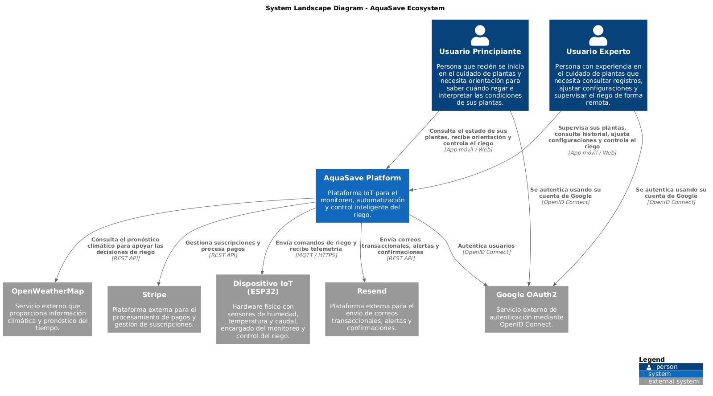

Los usuarios conocen la propuesta mediante la landing page y acceden a las aplicaciones web o móvil para consultar sus dispositivos, revisar lecturas y gestionar el riego. Ambas aplicaciones se comunican con la misma API, que concentra los casos de uso y el acceso a los datos.

El dispositivo ESP32 intercambia mensajes con HiveMQ Cloud. La EdgeAPI recibe esos mensajes y los comunica al backend mediante HTTP; también obtiene los comandos pendientes y los publica hacia el dispositivo.

Open-Meteo proporciona el pronóstico climático utilizado por Irrigation Intelligence. La autenticación de las cuentas se gestiona en la API mediante JWT y sesiones. La autenticación externa, los pagos, el correo transaccional y las recomendaciones apoyadas por IA se contemplan como integraciones posteriores según las funcionalidades previstas.

#### 4.3.2. Software Architecture Context Level Diagrams

El diagrama de contexto delimita AquaSave como un sistema y presenta sus relaciones con los usuarios, el entorno físico y los servicios externos. Esta vista permite comprender qué información intercambia la solución y de qué servicios depende.

  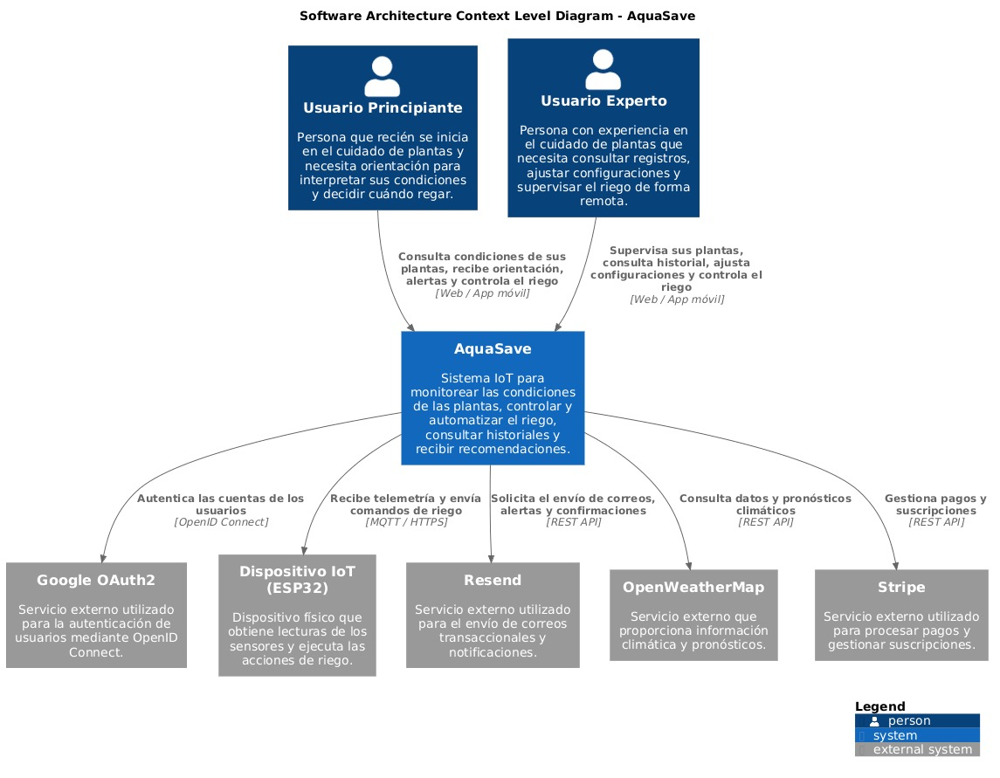

Los usuarios consultan las condiciones de sus plantas y solicitan operaciones desde las aplicaciones web y móvil. La plataforma administra sus cuentas, identifica los dispositivos asociados y proporciona acceso al historial de riego.

El ESP32 obtiene las lecturas y ejecuta las acciones sobre el actuador. HiveMQ Cloud transporta los mensajes MQTT y la EdgeAPI conecta ese intercambio con la API de AquaSave. Open-Meteo aporta información meteorológica consultada desde el backend.

Las recomendaciones apoyadas por IA se incorporarán como una capacidad de orientación dentro de Irrigation Intelligence. Las integraciones comerciales se vincularán con Monetization, manteniendo la gestión del dispositivo y las decisiones de riego dentro de la plataforma.

#### 4.3.3. Software Architecture Container Level Diagrams

El diagrama de contenedores descompone AquaSave en sus principales unidades de ejecución y almacenamiento. Esta vista permite identificar las tecnologías utilizadas y las responsabilidades de cada componente.

  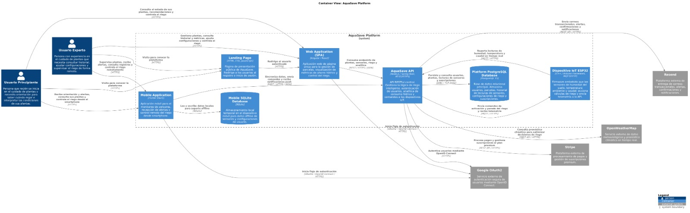

La arquitectura se organiza en los siguientes contenedores:

- **Landing Page:** sitio desarrollado con HTML, CSS y JavaScript. Presenta la propuesta de AquaSave, sus características y los accesos a los productos digitales.
- **Web Application:** aplicación desarrollada con Flutter y Dart, compilada para ejecutarse en el navegador. Permite acceder a cuentas, dispositivos, lecturas, historial y control del riego mediante la API.
- **Mobile Application:** aplicación desarrollada con Flutter y Dart para Android. Comparte la base de código y los contratos de acceso a datos de la versión web.
- **AquaSave API:** backend desarrollado con Node.js, Express y TypeScript. Expone endpoints REST para autenticación, gestión de dispositivos, telemetría, riego y pronóstico climático. Organiza los casos de uso mediante módulos con capas de dominio, aplicación, infraestructura e interfaces.
- **Platform PostgreSQL Database:** almacena usuarios, sesiones, dispositivos, telemetría, comandos y registros de riego mediante los repositorios del backend.
- **AquaSave EdgeAPI:** servicio desarrollado con Node.js y TypeScript que conecta MQTT con HTTP. Recibe telemetría y estados, consulta comandos pendientes, los publica en HiveMQ Cloud y comunica los reconocimientos al backend.
- **Dispositivo IoT ESP32:** ejecuta el firmware desarrollado en C++ con Arduino, obtiene las lecturas y controla el actuador de riego. Se comunica con HiveMQ Cloud mediante MQTT.

Las aplicaciones Flutter organizan su código en presentación, dominio y datos. Utilizan BLoC y Cubit para gestionar estados, repositorios para el acceso a la información y SharedPreferences para conservar datos locales de sesión. El almacenamiento local forma parte de los clientes y no constituye una base de datos SQLite independiente.

La API mantiene PostgreSQL como persistencia principal. Para desarrollo y pruebas también existen implementaciones de repositorio basadas en archivos JSON. Los contratos HTTP se documentan con OpenAPI y Swagger.

La telemetría recorre el dispositivo, HiveMQ Cloud y la EdgeAPI antes de llegar al backend. En sentido inverso, la API registra comandos que la EdgeAPI consulta y publica hacia el ESP32. Las aplicaciones consultan la API y no necesitan conectarse directamente al broker.

Los bounded contexts constituyen límites del dominio dentro del backend modular. La EdgeAPI se despliega por separado debido a su función de comunicación; esa separación no convierte cada contexto en un microservicio.

#### 4.3.4. Software Architecture Deployment Diagrams

El diagrama de despliegue presenta la distribución de los componentes entre los dispositivos de los usuarios, los servicios de infraestructura y el entorno físico de las plantas.

  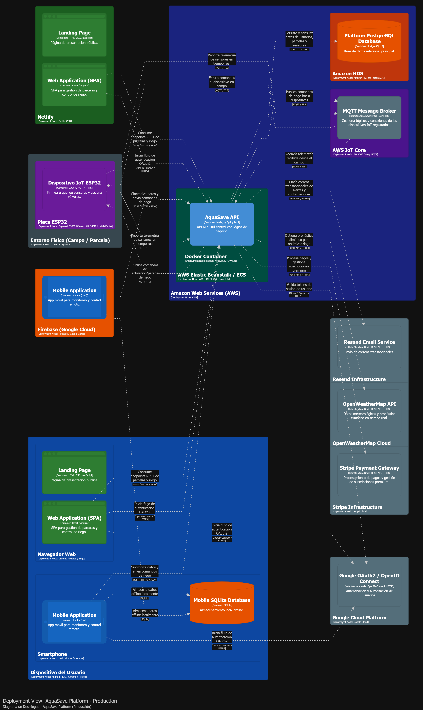

La distribución de la solución considera:

- **Landing page:** publicación como sitio estático independiente, compuesto por archivos HTML, CSS, JavaScript y recursos visuales. Sus enlaces permiten continuar hacia las aplicaciones.
- **Frontend web:** compilación de Flutter para web y publicación en Firebase Hosting mediante GitHub Actions. El navegador ejecuta la aplicación y consume la API por HTTPS.
- **Aplicación móvil:** compilación de Flutter para Android y distribución de versiones de prueba mediante Firebase App Distribution. La aplicación se ejecuta en el teléfono y utiliza la misma API que el frontend web.
- **Backend:** ejecución de la API Node.js con Express y TypeScript en Render. El servicio recibe las solicitudes de las aplicaciones y de la EdgeAPI, consulta PostgreSQL y expone la documentación OpenAPI mediante Swagger.
- **Persistencia:** conexión del backend a PostgreSQL mediante la configuración del entorno. Los clientes acceden a la información a través de la API.
- **EdgeAPI:** ejecución como servicio Node.js en Fly.io, utilizando el contenedor definido para ese componente. Mantiene la conexión MQTT, consulta los comandos pendientes del backend y expone una comprobación HTTP de salud para la plataforma de despliegue.
- **Broker MQTT:** uso de HiveMQ Cloud para el intercambio de telemetría, estados, comandos y reconocimientos entre la EdgeAPI y el ESP32.
- **Entorno físico:** instalación del ESP32 con sus sensores, alimentación y actuador. El firmware obtiene las lecturas y ejecuta el control local del riego.
- **Servicio climático:** consulta de Open-Meteo desde el backend mediante el adaptador de Irrigation Intelligence.

La configuración permite administrar las direcciones de los servicios y los parámetros de conexión por entorno. La compilación y publicación de las aplicaciones web y Android se automatizan mediante los flujos de GitHub Actions definidos para cada producto.

La comunicación entre el dispositivo y la plataforma depende de la conexión con el broker y la EdgeAPI. Los límites locales de operación y las condiciones de recuperación se evaluarán mediante los escenarios de calidad definidos. Las integraciones posteriores de IA y servicios comerciales se incorporarán sin cambiar las tecnologías base de los clientes y la API.

---

## Conclusiones

### Conclusiones y recomendaciones

1. Existe una problemática crítica y validada en el uso ineficiente del agua que justifica plenamente la propuesta de AquaSave. El análisis del contexto demuestra que el sector agrícola peruano presenta niveles muy bajos de eficiencia hídrica (alrededor del 35%), afectando especialmente a pequeños productores y horticultores urbanos que dependen de métodos manuales e intuitivos. Esto confirma que el problema no solo es real, sino también recurrente, masivo y con impacto económico y ambiental significativo.

2. Los usuarios objetivo muestran una necesidad clara de tecnificación, pero con fuertes restricciones de simplicidad, accesibilidad y usabilidad. Tanto horticultores urbanos como micro-agricultores periurbanos comparten patrones: toman decisiones basadas en experiencia, carecen de datos en tiempo real y muestran alta apertura a soluciones tecnológicas. Sin embargo, también presentan barreras como baja adopción tecnológica, necesidad de interfaces intuitivas y preferencia por soluciones fáciles de instalar, lo que define directamente los requisitos clave del producto.

3. AquaSave se posiciona como una solución diferenciada al integrar hardware IoT accesible con software inteligente en producción. A diferencia de la competencia, la solución combina sensores físicos (humedad, caudal, temperatura) comunicados mediante MQTT a través de HiveMQ Cloud, una Edge API desplegada en Fly.io y un backend en Render con documentación OpenAPI interactiva. Esta arquitectura integral permite automatización de riego, control bidireccional y toma de decisiones basada en datos reales del dispositivo.
   
4. El frontend web y la aplicación móvil consumen datos reales del dispositivo IoT a través del backend, eliminando por completo los datos mock. El dashboard muestra indicadores en tiempo real de humedad, temperatura y flujo, con control de riego bidireccional (inicio/detención desde web y móvil), notificaciones push ante condiciones críticas y métricas de ahorro hídrico. La landing page y el flujo de registro completan la experiencia de extremo a extremo.

5. El sistema conectado de AquaSave ya se encuentra operativo, con comunicación bidireccional funcional entre el dispositivo ESP32, la Edge API y el backend. Las mejoras futuras incluyen expansión a múltiples dispositivos por usuario, integración de sensores adicionales (pH, lluvia), algoritmos predictivos de riego basados en machine learning y un plan de suscripción para soportar la infraestructura cloud. Esta evolución permitirá escalar la solución y generar ahorro hídrico verificable para una base creciente de usuarios.

---

## Bibliografía

- Killough, A., Barja, A., & Gurocak, H. (2024). Smart flowerpot as an IoT device for automatic plant care. En *2024 10th International Conference on Automation, Robotics and Applications (ICARA)* (pp. 541–545). IEEE. https://doi.org/10.1109/ICARA60736.2024.10552954

- Rojas-Rengifo, J. D., Fernández-Mozombite, L. B., Callacna-Ponce, L. G., & Díaz-Delgado, D. (2025). Sistema de maceta inteligente basado en IoT para la monitorización automatizada de parámetros de crecimiento en plantas de interior. *Revista Amazonía Digital, 4*(2), e374. https://doi.org/10.55873/rad.v4i2.374

- Shaughnessy, D., & Pertuit, A. (2024, 21 de junio). *Indoor plants – Watering*. Clemson Cooperative Extension, Home & Garden Information Center. https://hgic.clemson.edu/factsheet/indoor-plants-watering/

- University of Maryland Extension. (2023, 10 de marzo). *Watering indoor plants*. https://extension.umd.edu/resource/watering-indoor-plants

---

## Anexos

- Video de entrevistas:[https://upcedupe-my.sharepoint.com/:v:/g/personal/u202311220_upc_edu_pe/IQAIdrZ_7tXNTolQ44z3bzjvAeowsqkT3QGPucIg05oEdF4?nav=eyJyZWZlcnJhbEluZm8iOnsicmVmZXJyYWxBcHAiOiJTdHJlYW1XZWJBcHAiLCJyZWZlcnJhbFZpZXciOiJTaGFyZURpYWxvZy1MaW5rIiwicmVmZXJyYWxBcHBQbGF0Zm9ybSI6IldlYiIsInJlZmVycmFsTW9kZSI6InZpZXcifX0%3D&e=jCpCeQ](https://upcedupe-my.sharepoint.com/:v:/g/personal/u202311220_upc_edu_pe/IQAIdrZ_7tXNTolQ44z3bzjvAeowsqkT3QGPucIg05oEdF4?nav=eyJyZWZlcnJhbEluZm8iOnsicmVmZXJyYWxBcHAiOiJTdHJlYW1XZWJBcHAiLCJyZWZlcnJhbFZpZXciOiJTaGFyZURpYWxvZy1MaW5rIiwicmVmZXJyYWxBcHBQbGF0Zm9ybSI6IldlYiIsInJlZmVycmFsTW9kZSI6InZpZXcifX0%3D&e=jCpCeQ)
