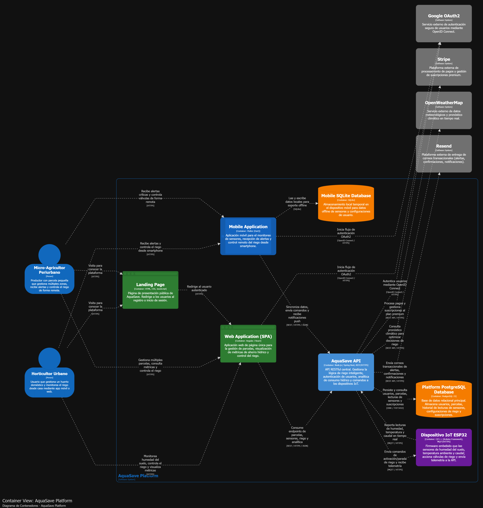
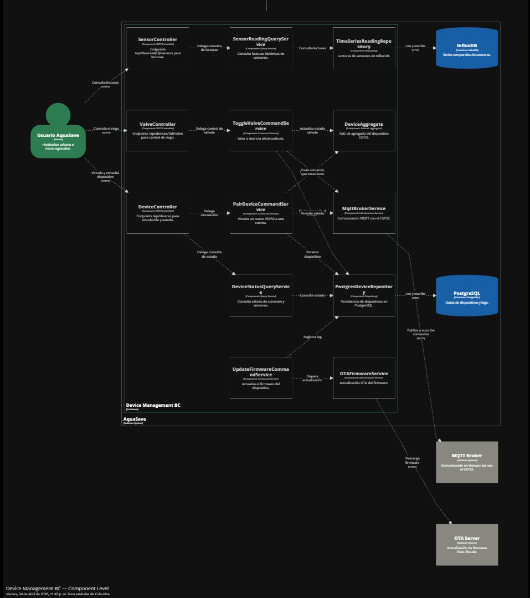
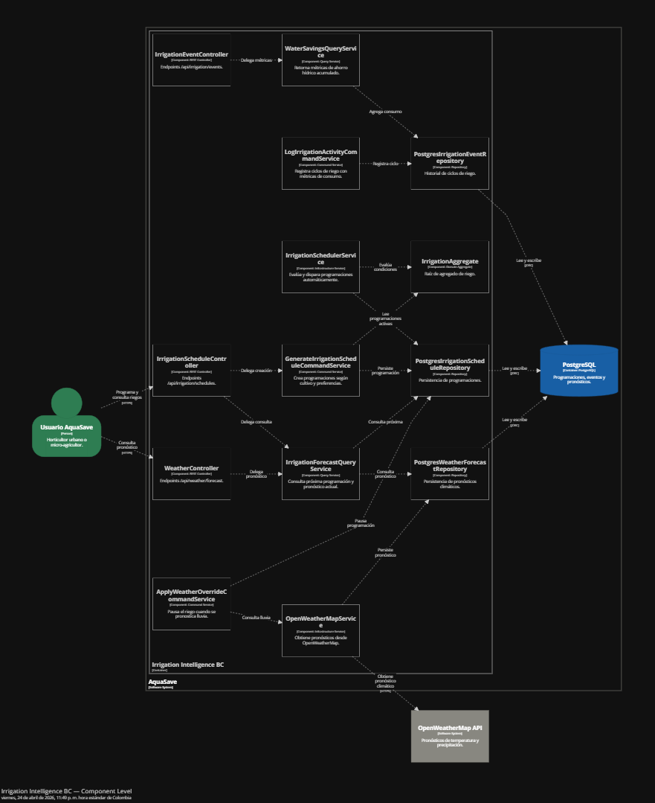
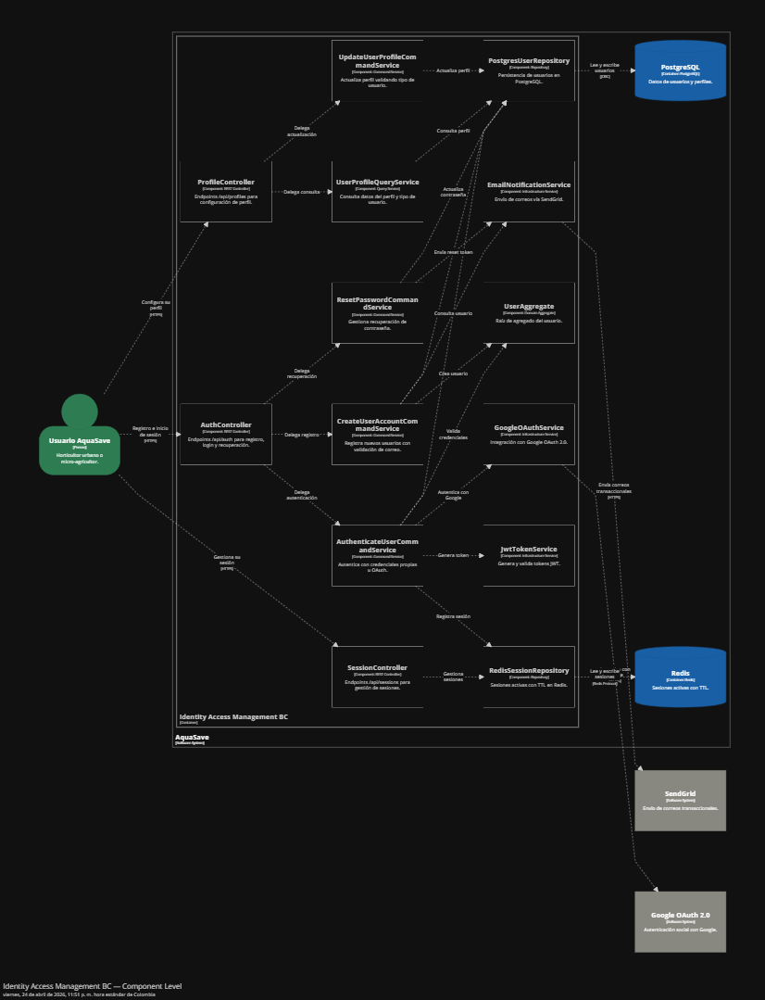
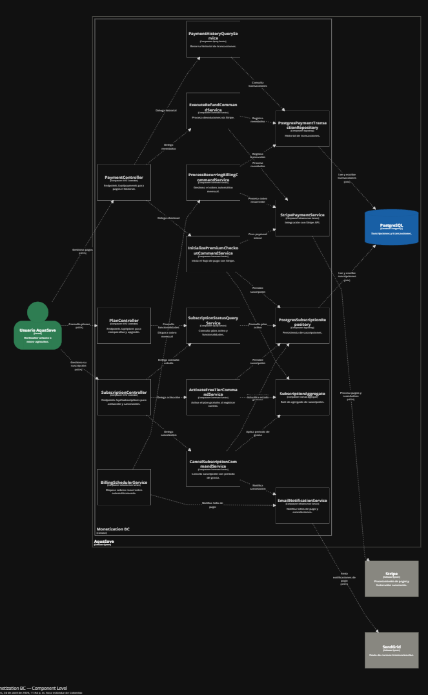
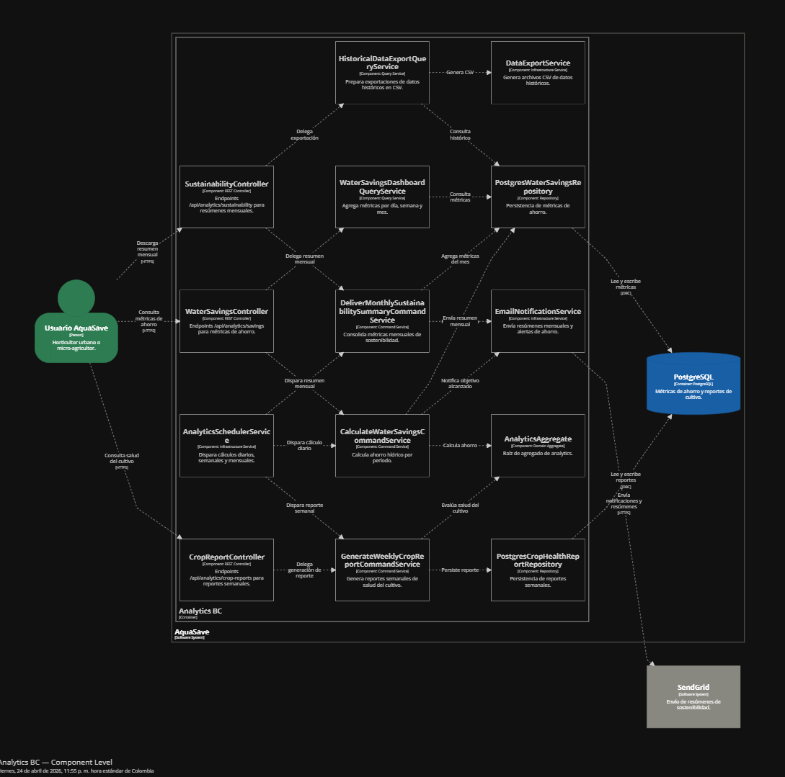

  

    
  

  # 
Universidad Peruana de Ciencias Aplicadas

  ## 
Ingeniería de Software

  
Periodo: 202610

  
Arquitecturas De Software Emergentes

  
NRC: 16365

  
Docente: Enrique Alejandro Valdivia Verde

  ---
  
   
  
  ## 
Informe del Trabajo Final

  
  
Startup: EcoDrop

  
Producto: AquaSave

  
   
  
  
Integrantes:

  
<code>U202311220</code> - Gutierrez Condo, Maylhy Olinda

  
<code>U202311361</code> - Roca Tineo, Steven Mathew

  
<code>U202311334</code> - Rodríguez Rodríguez, Luis Piero

  
<code>U202123373</code> - Román Pajuelo, Luis Gustavo

  
<code>U20221C362</code> - Luyo Correa, Sandra Luyo

    
   
  
  
<i>Ciclo 202620</i>

 

# Registro de Versiones del Informe

| Versión | Fecha      | Autor                                                                                                                                                         | Descripción de modificación |
|---------|------------|---------------------------------------------------------------------------------------------------------------------------------------------------------------|-----------------------------|
| AV1     | 26/04/2026 | - Gutiérrez Condo, Maylhy Olinda - Roca Tineo, Steven Mathew - Rodríguez Rodríguez, Luis Piero - Román Pajuelo, Luis Gustavo - Luyo Correa, Sandra Luyo | En la primera entrega del informe de nuestro proyecto, hemos realizado los primeros capítulos del informe y definimos todas las entidades que emplearemos en AquaSave. |

# Project Report Collaboration Insights

# Contenido

# Tabla de contenidos

<a href="#student-outcome">Student Outcome</a>

<a href="#capítulo-i-introducción">Capítulo I: Introducción</a>
    <ul>
        <a href="#11-startup-profile">1.1. Startup Profile</a> 
        <ul>
            <a href="#111-descripción-de-la-startup">1.1.1. Descripción de la Startup</a> 
            <a href="#112-perfiles-de-integrantes-del-equipo">1.1.2. Perfiles de integrantes del equipo</a> 
        </ul>
        <a href="#12-solution-profile">1.2. Solution Profile</a> 
        <ul>
            <a href="#121-antecedentes-y-problemática">1.2.1. Antecedentes y problemática</a> 
            <a href="#122-lean-ux-process">1.2.2. Lean UX Process</a> 
            <ul>
                <a href="#1221-lean-ux-problem-statements">1.2.2.1. Lean UX Problem Statements</a> 
                <a href="#1222-lean-ux-assumptions">1.2.2.2. Lean UX Assumptions</a> 
                <a href="#1223-lean-ux-hypothesis-statements">1.2.2.3. Lean UX Hypothesis Statements</a> 
                <a href="#1224-lean-ux-canvas">1.2.2.4. Lean UX Canvas</a> 
            </ul>
        </ul>
        <a href="#13-segmentos-objetivo">1.3. Segmentos objetivo</a> 
    </ul>

<a href="#capítulo-ii-requirements-elicitation--analysis">Capítulo II: Requirements Elicitation & Analysis</a>
    <ul>
        <a href="#21-competidores">2.1. Competidores</a> 
        <ul>
            <a href="#211-análisis-competitivo">2.1.1. Análisis competitivo</a> 
            <a href="#212-estrategias-y-tácticas-frente-a-competidores">2.1.2. Estrategias y tácticas frente a competidores</a> 
        </ul>
        <a href="#22-entrevistas">2.2. Entrevistas</a> 
        <ul>
            <a href="#221-diseño-de-entrevistas">2.2.1. Diseño de entrevistas</a> 
            <a href="#222-registro-de-entrevistas">2.2.2. Registro de entrevistas</a> 
            <a href="#223-análisis-de-entrevistas">2.2.3. Análisis de entrevistas</a> 
        </ul>
        <a href="#23-needfinding">2.3. Needfinding</a> 
        <ul>
            <a href="#231-user-personas">2.3.1. User Personas</a> 
            <a href="#232-user-task-matrix">2.3.2. User Task Matrix</a> 
            <a href="#233-empathy-mapping">2.3.3. Empathy Mapping</a> 
            <a href="#234-as-is-scenario-mapping">2.3.4. As-Is Scenario Mapping</a> 
        </ul>
        <a href="#24-ubiquitous-language">2.4. Ubiquitous Language</a> 
    </ul>

<a href="#capítulo-iii-requirements-specification">Capítulo III: Requirements Specification</a>
    <ul>
        <a href="#31-to-be-scenario-mapping">3.1. To-Be Scenario Mapping</a> 
        <a href="#32-user-stories">3.2. User Stories</a> 
        <a href="#33-impact-mapping">3.3. Impact Mapping</a> 
        <a href="#34-product-backlog">3.4. Product Backlog</a> 
    </ul>

<a href="#capítulo-iv-strategic-level-software-design">Capítulo IV: Strategic-Level Software Design</a>
    <ul>
        <a href="#41-strategic-level-attribute-driven-design">4.1. Strategic-Level Attribute-Driven Design</a> 
        <ul>
            <a href="#411-design-purpose">4.1.1. Design Purpose</a> 
            <a href="#412-attribute-driven-design-inputs">4.1.2. Attribute-Driven Design Inputs</a> 
            <ul>
                <a href="#4121-primary-functionality-primary-user-stories">4.1.2.1. Primary Functionality (Primary User Stories)</a> 
                <a href="#4122-quality-attribute-scenarios">4.1.2.2. Quality Attribute Scenarios</a> 
                <a href="#4123-constraints">4.1.2.3. Constraints</a> 
            </ul>
            <a href="#413-architectural-drivers-backlog">4.1.3. Architectural Drivers Backlog</a> 
            <a href="#414-architectural-design-decisions">4.1.4. Architectural Design Decisions</a> 
            <a href="#415-quality-attribute-scenario-refinements">4.1.5. Quality Attribute Scenario Refinements</a> 
        </ul>
        <a href="#42-strategic-level-domain-driven-design">4.2. Strategic-Level Domain-Driven Design</a> 
        <ul>
            <a href="#421-eventstorming">4.2.1. EventStorming</a> 
            <a href="#422-candidate-context-discovery">4.2.2. Candidate Context Discovery</a> 
            <a href="#423-domain-message-flows-modeling">4.2.3. Domain Message Flows Modeling</a> 
            <a href="#424-bounded-context-canvases">4.2.4. Bounded Context Canvases</a> 
            <a href="#425-context-mapping">4.2.5. Context Mapping</a> 
        </ul>
        <a href="#43-software-architecture">4.3. Software Architecture</a> 
        <ul>
            <a href="#431-software-architecture-system-landscape-diagram">4.3.1. Software Architecture System Landscape Diagram</a> 
            <a href="#432-software-architecture-context-level-diagrams">4.3.2. Software Architecture Context Level Diagrams</a> 
            <a href="#433-software-architecture-container-level-diagrams">4.3.3. Software Architecture Container Level Diagrams</a> 
            <a href="#434-software-architecture-deployment-diagrams">4.3.4. Software Architecture Deployment Diagrams</a> 
        </ul>
    </ul>
    
<a href="#conclusiones">Conclusiones</a>
    <ul>
        <a href="#conclusiones-y-recomendaciones">Conclusiones y recomendaciones</a> 
        <a href="#video-about-the-team">Video About-the-Team</a> 
    </ul>

<a href="#bibliografía">Bibliografía</a>

<a href="#anexos">Anexos</a>

---

# Student Outcome

El curso contribuye al cumplimiento del Student Outcome ABET:

ABET – EAC - Student Outcome 3

Criterio: Capacidad de comunicarse efectivamente con un rango de audiencias.

En el siguiente cuadro se describe las acciones realizadas y enunciados de conclusiones por parte del grupo, que permiten sustentar el haber alcanzado el logro del ABET – EAC - Student Outcome 3.

| Criterio específico | Acciones y responsabilidades de TB1 | Conclusiones |
| :--- | :--- | :--- |
| Comunica oralmente sus ideas y/o resultados con objetividad a público de diferentes especialidades y niveles jerárquicos, en el marco del desarrollo de un proyecto en ingeniería. | **Gutierrez Condo, Maylhy Olinda:** Explicar la propuesta de EcoDrop, la problemática del riego doméstico y las características de los usuarios principiantes y expertos, utilizando ejemplos de su rutina de cuidado.  **Roca Tineo, Steven Mathew:** Presentar los supuestos e hipótesis Lean UX, sustentar la comparación de competidores y conducir las preguntas de investigación con un lenguaje comprensible para los participantes.  **Rodríguez Rodríguez, Luis Piero:** Explicar las necesidades de los usuarios, los escenarios de interacción y la prioridad de las historias, relacionando cada funcionalidad con el beneficio que aporta.  **Román Pajuelo, Luis Gustavo:** Sustentar el propósito del diseño, los escenarios de calidad y la selección de drivers, explicando las decisiones técnicas y sus consecuencias para el usuario.  **Luyo Correa, Sandra Luyo:** Exponer la delimitación de los bounded contexts y las vistas de arquitectura, describiendo las responsabilidades y la comunicación entre los componentes. | **TB1:** La comunicación oral del proyecto requiere relacionar las necesidades domésticas con las decisiones de diseño. La distribución de temas permite abordar el problema, la experiencia de usuario y la arquitectura con un lenguaje adecuado para participantes, equipo técnico y docente. |
| Comunica en forma escrita ideas y/o resultados con objetividad a público de diferentes especialidades y niveles jerárquicos, en el marco del desarrollo de un proyecto en ingeniería. | **Gutierrez Condo, Maylhy Olinda:** Redactar Startup Profile, los antecedentes y la problemática, los objetivos y la descripción de los segmentos, manteniendo coherencia entre el problema y la propuesta de valor.  **Roca Tineo, Steven Mathew:** Desarrollar los Problem Statements, Assumptions e Hypothesis Statements, el análisis competitivo y el diseño de entrevistas, empleando preguntas y criterios vinculados con el cuidado doméstico.  **Rodríguez Rodríguez, Luis Piero:** Documentar las necesidades y tareas de los usuarios, redactar historias y criterios de aceptación y organizar el Product Backlog según el valor del producto.  **Román Pajuelo, Luis Gustavo:** Elaborar Design Purpose, los inputs de ADD, los escenarios de calidad, las restricciones y el Architectural Drivers Backlog, justificando las decisiones mediante criterios verificables.  **Luyo Correa, Sandra Luyo:** Documentar EventStorming, el descubrimiento de contextos, los flujos del dominio y las descripciones de arquitectura, revisando la consistencia de términos, límites y responsabilidades. | **TB1:** La documentación escrita necesita conectar problema, necesidades, requisitos y arquitectura. Una terminología común, criterios de aceptación claros y decisiones justificadas permiten que diferentes audiencias comprendan el alcance de AquaSave y revisen su diseño. |

## Capítulo I: Introducción

### 1.1. Startup Profile

#### 1.1.1. Descripción de la Startup
EcoDrop es una iniciativa tecnológica formada por estudiantes de Ingeniería de Software de la Universidad Peruana de Ciencias Aplicadas. Su propósito es desarrollar productos digitales que ayuden a las personas a comprender las condiciones de sus plantas y a organizar el riego en espacios domésticos mediante información verificable y herramientas accesibles.

EcoDrop orienta su propuesta a viviendas con plantas ornamentales, aromáticas o pequeños espacios de cultivo para autoconsumo. AquaSave adaptará la orientación al conocimiento práctico de cada usuario y ofrecerá información que facilite el cuidado cotidiano, la supervisión durante ausencias y el uso responsable del agua.

**Producto principal**

AquaSave propone combinar un kit doméstico basado en ESP32, sensores compatibles, un actuador de riego, servicios internos y aplicaciones de acceso. La lectura de humedad se interpreta según la calibración disponible; la temperatura corresponde al ambiente cuando se utiliza DHT22. El kit se asocia a una unidad de riego, entendida como una planta o conjunto compatible que recibe la misma acción de suministro.

El producto permitirá consultar lecturas e historial, configurar umbrales, iniciar o detener ciclos y recibir alertas. La inteligencia artificial se plantea como apoyo para contextualizar recomendaciones y explicar los datos disponibles. La decisión automática por umbrales seguirá una política determinista validada, independiente del modelo de IA.

  

**Misión**

Brindar herramientas de monitoreo, orientación y control que ayuden a usuarios domésticos con diferentes niveles de experiencia a cuidar sus plantas, comprender sus necesidades de riego y utilizar el agua de manera informada.

**Visión**

Ser una solución de referencia para el cuidado doméstico de plantas en el mercado peruano, reconocida por su facilidad de uso, transparencia de la información y capacidad de acompañar el aprendizaje de sus usuarios.

**Valores**

- **Claridad:** comunicar lecturas, recomendaciones y limitaciones con términos comprensibles.
- **Confiabilidad:** mantener límites locales de operación y mostrar el estado confirmado del dispositivo.
- **Inclusión:** permitir distintos niveles de ayuda sin exigir formación técnica o profesional.
- **Sostenibilidad:** evaluar el uso del agua mediante mediciones o estimaciones identificadas.
- **Autonomía:** conservar el control del usuario sobre sus configuraciones y decisiones.

**Modelo de negocio propuesto**

Se plantea evaluar la venta del kit y servicios opcionales de seguimiento avanzado. La disposición de pago, el costo de soporte, la instalación y el mantenimiento se investigarán antes de definir precios. La condición de principiante o experto no equivale a un plan comercial. El monitoreo básico, la detención y las protecciones locales no deben depender de una suscripción activa.

#### 1.1.2. Perfiles de integrantes del equipo

  

  

  

  

  

### 1.2. Solution Profile

#### 1.2.1. Antecedentes y problemática

El cuidado de plantas en viviendas requiere adaptar el riego a las condiciones de cada planta. La University of Maryland Extension (2023) señala que regar siguiendo únicamente un calendario puede proporcionar agua en exceso o en cantidad insuficiente, debido a las diferencias entre sustratos y condiciones ambientales. Por ello, el seguimiento de la humedad constituye un aspecto relevante para orientar el cuidado doméstico.

Las tecnologías de monitoreo ofrecen alternativas para apoyar esta actividad. Rojas-Rengifo et al. (2025) desarrollaron un sistema para plantas de interior que integra sensores y una aplicación móvil para consultar condiciones ambientales y recibir notificaciones. Su investigación, realizada durante diez semanas, constituye un antecedente del uso de dispositivos conectados para facilitar el seguimiento de plantas en espacios domésticos.

En este contexto, AquaSave se plantea como una solución dirigida a usuarios principiantes y expertos que necesitan orientación, monitoreo y control del riego de sus plantas.

**What — ¿Cuál es el problema?**

El problema consiste en decidir cuándo regar sin contar con información suficiente sobre las condiciones del sustrato y las necesidades de la planta. Shaughnessy y Pertuit (2024) explican que tanto el exceso como la falta de agua pueden deteriorar las raíces y producir síntomas similares, lo que dificulta interpretar correctamente el estado de una planta mediante observaciones aisladas.

Para AquaSave, esta problemática comprende dos necesidades: facilitar la interpretación del riego a quienes están aprendiendo y proporcionar seguimiento a quienes desean gestionar el cuidado con mayor detalle.

**When — ¿Cuándo sucede el problema?**

La necesidad de ajustar el riego aparece durante el cuidado cotidiano y cuando cambian las condiciones de crecimiento. Según Shaughnessy y Pertuit (2024), una ubicación cálida, seca y soleada requiere una frecuencia de riego diferente de un ambiente fresco y con poca luz.

También pueden producirse interrupciones en la rutina de cuidado. Killough et al. (2024) identifican el olvido del riego como una dificultad que motiva el desarrollo de sistemas de asistencia para plantas de interior. AquaSave considerará situaciones como viajes, jornadas prolongadas fuera de casa y cambios en la persona encargada del cuidado.

**Where — ¿Dónde ocurre el problema?**

El proyecto se enfocará inicialmente en viviendas de Lima Metropolitana que cuenten con plantas en interiores, balcones, patios, terrazas o jardines pequeños. Se contemplarán plantas en macetas y unidades de riego domésticas.

La configuración de cada unidad considerará su ubicación y exposición al entorno. Esta decisión responde a que las necesidades de riego dependen, entre otros factores, de la localización de la planta, el recipiente y las características del sustrato (Shaughnessy & Pertuit, 2024).

**Who — ¿Quiénes están involucrados?**

AquaSave atenderá a dos segmentos:

- **Usuarios principiantes:** personas que están iniciándose en el cuidado de plantas y buscan orientación para interpretar las condiciones del sustrato y decidir cuándo regar.
- **Usuarios expertos:** personas con experiencia en el cuidado doméstico que buscan consultar registros, ajustar configuraciones y supervisar sus plantas durante ausencias.

La segmentación orientará la investigación y el diseño de la experiencia. El monitoreo mediante aplicaciones móviles, como el desarrollado por Rojas-Rengifo et al. (2025), ofrece un antecedente tecnológico para acercar información sobre las plantas a sus cuidadores. AquaSave explorará cómo presentar esa información según las necesidades de cada segmento.

**Why — ¿Por qué ocurre esta situación?**

Una causa es la aplicación de rutinas generales a plantas con condiciones diferentes. La University of Maryland Extension (2023) recomienda determinar la necesidad de agua mediante la evaluación del sustrato, en lugar de depender exclusivamente de una frecuencia fija.

Otra dificultad es la interpretación de síntomas: una planta marchita no necesariamente necesita más agua, porque el daño radicular causado por el exceso también puede impedir su absorción (Shaughnessy & Pertuit, 2024). Estos antecedentes sustentan la necesidad de acompañar las observaciones con información contextualizada.

**How — ¿En qué condiciones usarán el producto?**

Actualmente, el cuidado puede apoyarse en la inspección del sustrato y en la comparación del peso de la maceta, métodos descritos por la University of Maryland Extension (2023). Estas prácticas requieren la participación presencial de la persona encargada.

AquaSave complementará el cuidado mediante un dispositivo IoT y aplicaciones web y móvil. El usuario podrá consultar lecturas de humedad, revisar el historial, recibir alertas y solicitar ciclos de riego. La integración de sensores y visualización móvil tiene antecedentes en la investigación de Rojas-Rengifo et al. (2025).

La solución requerirá energía y conectividad compatibles con el dispositivo para sus funciones remotas. Cada lectura mostrará su fecha de actualización y los ciclos de riego incorporarán límites locales de duración. La interfaz ofrecerá orientación comprensible para principiantes y acceso a configuraciones e historial para usuarios expertos.

**How Much — ¿Cuánto cuesta no resolverlo?**

El costo potencial comprende el agua empleada innecesariamente, el tiempo dedicado a revisar las plantas y los gastos de recuperación o reposición. La University of Maryland Extension (2023) identifica el riego excesivo e insuficiente como causas de pérdida de plantas domésticas.

Respecto al uso del agua, Killough et al. (2024) compararon tres modalidades de cuidado y reportaron resultados preliminares favorables para una modalidad inteligente. Sin embargo, mantener estable la humedad del sustrato continuó siendo un desafío. Estos resultados justifican evaluar el consumo, pero no establecen un porcentaje de ahorro aplicable directamente a AquaSave.

La magnitud del problema se determinará mediante entrevistas y registros del piloto. Se evaluarán el tiempo dedicado al cuidado, la frecuencia de incidentes de riego, el volumen de agua utilizado y los gastos reportados por los participantes. Esta información permitirá establecer una línea base para comparar los resultados de la solución.

**Enunciado del problema**

Los usuarios domésticos con distintos niveles de experiencia necesitan interpretar las condiciones de sus plantas y mantener un seguimiento del riego. La dependencia de rutinas generales, observaciones ocasionales y registros dispersos puede dificultar la adaptación del cuidado a cada unidad, especialmente durante ausencias. AquaSave buscará atender esta necesidad mediante información comprensible, historial y mecanismos de control.

**Objetivo general**

Diseñar y desarrollar una solución de software multicomponente que integre monitoreo IoT, control del riego y recomendaciones apoyadas por inteligencia artificial para facilitar el cuidado de plantas domésticas.

**Objetivos específicos**

1. Identificar las necesidades de orientación, monitoreo y seguimiento mediante entrevistas a usuarios principiantes y expertos.
2. Diseñar una experiencia coherente entre la landing page, la aplicación web y la aplicación móvil.
3. Desarrollar un dispositivo IoT que permita registrar condiciones del entorno y ejecutar ciclos de riego con límites definidos.
4. Implementar mecanismos de vinculación y acceso para proteger los dispositivos y la información de cada usuario.
5. Incorporar recomendaciones comprensibles que consideren los datos disponibles y su vigencia.
6. Evaluar la usabilidad, confiabilidad y trazabilidad de la solución mediante escenarios medibles.
7. Registrar el consumo de agua, diferenciando los valores medidos de los estimados, y compararlo con una línea base.

**Alcance**

La solución atenderá plantas domésticas y contemplará una unidad de riego por dispositivo. Permitirá consultar condiciones, controlar ciclos, configurar rutinas, recibir alertas y revisar el historial. El cuidado de parcelas productivas, la fertilización y el diagnóstico fitosanitario quedan fuera del alcance.

La operación conectada requerirá una red compatible y energía estable. El dispositivo incorporará límites locales de duración para controlar los ciclos ante interrupciones de comunicación.

#### 1.2.2. Lean UX Process

##### 1.2.2.1. Lean UX Problem Statements

**Problem Statement 1 — Usuarios principiantes**

AquaSave se propone ayudar a las personas que están iniciándose en el cuidado de plantas domésticas a comprender cuándo regar y cómo interpretar las condiciones del sustrato mediante monitoreo y orientación accesible.

La información visual puede resultar ambigua: Shaughnessy y Pertuit (2024) señalan que el exceso y la falta de agua pueden producir síntomas similares. Asimismo, la University of Maryland Extension (2023) explica que una rutina fija puede suministrar cantidades inadecuadas de agua y recomienda evaluar la necesidad de riego de cada planta.

A partir de estos antecedentes, planteamos que los principiantes pueden beneficiarse de una experiencia que relacione las lecturas con explicaciones y acciones comprensibles. Esta necesidad se contrastará mediante entrevistas y pruebas de interacción.

**¿Cómo podemos ayudar a los usuarios principiantes a interpretar las condiciones de sus plantas y tomar decisiones de riego informadas mediante una herramienta accesible que no requiera conocimientos técnicos especializados?**

**Problem Statement 2 — Usuarios expertos**

AquaSave se propone brindar a las personas con experiencia en el cuidado de plantas domésticas herramientas para consultar registros, supervisar sus unidades de riego y ajustar sus configuraciones desde una aplicación.

Rojas-Rengifo et al. (2025) presentan un sistema que permite consultar variables ambientales y recibir notificaciones mediante una aplicación móvil. Por su parte, Killough et al. (2024) muestran que mantener una humedad estable continúa siendo un desafío incluso al incorporar modalidades automatizadas de cuidado. Ambos antecedentes sustentan la importancia de combinar monitoreo, seguimiento y capacidad de ajuste.

Para este segmento, planteamos la necesidad de conservar el control sobre las decisiones de riego y disponer de información que permita revisar sus resultados, especialmente durante ausencias. La investigación con usuarios permitirá validar qué registros, alertas y configuraciones aportan mayor utilidad.

**¿Cómo podemos ofrecer a los usuarios expertos una herramienta que les permita supervisar sus plantas a distancia, consultar el historial y ajustar el riego de acuerdo con sus criterios de cuidado y las condiciones registradas?**

##### 1.2.2.2. Lean UX Assumptions

##### 1.2.2.2. Lean UX Assumptions

1. Creo que mis clientes necesitan una forma accesible y comprensible de conocer las condiciones de sus plantas domésticas, decidir cuándo regar y mantener su cuidado durante ausencias. Los principiantes necesitan orientación para interpretar la información, mientras que los expertos buscan registros y opciones de configuración.

2. Estas necesidades se pueden resolver con un sistema IoT compuesto por un dispositivo basado en ESP32, sensores de humedad del sustrato y temperatura ambiental, un mecanismo de riego y aplicaciones web y móvil. La solución permitirá consultar lecturas, recibir alertas, revisar el historial y obtener recomendaciones apoyadas por inteligencia artificial.

3. Mis clientes iniciales serán personas de Lima Metropolitana que cuidan plantas en interiores, balcones, patios, terrazas o jardines pequeños. Se considerarán dos segmentos: usuarios principiantes que buscan aprender a cuidar sus plantas y usuarios expertos que desean supervisar y ajustar el riego con mayor detalle.

4. El valor principal que un cliente quiere de mi servicio es contar con información comprensible y oportuna para tomar decisiones de riego y mantener el seguimiento de sus plantas, incluso cuando se encuentra fuera de casa.

5. El cliente también puede obtener estos beneficios adicionales: mayor organización de sus rutinas, identificación oportuna de condiciones que requieren atención, acceso al historial de riego y mayor autonomía en el cuidado. Se espera que estas funciones contribuyan a reducir el uso innecesario de agua y el tiempo dedicado a revisiones presenciales.

6. Voy a adquirir la mayoría de mis clientes mediante contenido en redes sociales sobre cuidado de plantas, participación en comunidades de jardinería doméstica, demostraciones del producto y alianzas con viveros y tiendas de jardinería.

7. Haré dinero mediante la venta del kit IoT y un modelo de servicios digitales con un plan básico incluido y una suscripción opcional. El plan básico contemplará monitoreo y control del riego; la suscripción ofrecerá funciones adicionales de análisis del historial, reportes y recomendaciones personalizadas.

8. Mi competencia principal estará conformada por aplicaciones de cuidado de plantas, recordatorios de riego, temporizadores y dispositivos domésticos de monitoreo o riego automatizado. También consideraré como alternativas las prácticas habituales de los usuarios, como revisar manualmente el sustrato y pedir a otra persona que cuide sus plantas.

9. Buscaremos diferenciarnos mediante una experiencia que integre lecturas del sustrato, orientación comprensible, historial y control del riego. La propuesta adaptará la presentación de la información a principiantes y expertos, permitiendo que cada usuario consulte el detalle que necesita.

10. Mi mayor riesgo de producto es que los usuarios no perciban suficiente utilidad para justificar la compra, instalación y mantenimiento del kit, o que no encuentren valor adicional en la suscripción después de utilizar las funciones básicas.

11. Abordaremos este riesgo mediante una instalación guiada, instrucciones de mantenimiento, demostraciones y pruebas con usuarios de ambos segmentos. Evaluaremos la comprensión de las lecturas, la facilidad de uso y la utilidad del historial y las recomendaciones para ajustar la propuesta.

12. **¿Quién es el usuario?** Los usuarios son personas que cuidan plantas en sus viviendas. Los principiantes buscan aprender a interpretar sus necesidades y establecer rutinas; los expertos desean supervisar sus plantas, comparar registros y modificar parámetros de riego. La experiencia en jardinería no implica necesariamente dominio de herramientas tecnológicas.

13. **¿Dónde encaja nuestro producto en su trabajo o vida?** AquaSave encajará en la rutina de cuidado doméstico al facilitar la consulta del estado de las plantas y el seguimiento del riego. También apoyará la supervisión durante viajes o jornadas fuera de casa, manteniendo al usuario informado sobre las condiciones registradas y las acciones ejecutadas.

14. **¿Qué problemas tiene nuestro producto que resolver?** La incertidumbre al decidir cuándo regar, la dificultad para interpretar las lecturas, la falta de registros organizados y la necesidad de supervisar el cuidado durante ausencias. También deberá facilitar la identificación de datos desactualizados para evitar decisiones basadas en información que ya no representa las condiciones actuales.

15. **¿Cuándo y cómo es nuestro producto usado?** El dispositivo registrará periódicamente las condiciones de la unidad de riego. El usuario accederá a la aplicación para consultar lecturas, revisar alertas, solicitar o detener ciclos y modificar configuraciones. El historial se utilizará para revisar las acciones realizadas y evaluar ajustes en la rutina.

16. **¿Qué características son importantes?** Monitoreo de humedad del sustrato y temperatura ambiental, lecturas con fecha de actualización, instalación guiada, control remoto, riego automático con límites definidos, alertas, historial y recomendaciones explicadas. También será importante distinguir el consumo de agua estimado del medido y permitir la detención de un ciclo de forma sencilla.

17. **¿Cómo debe verse nuestro producto y cómo comportarse?** Deberá presentar una interfaz limpia, legible y relacionada visualmente con el cuidado de plantas, utilizando colores verdes y tonos neutros. La información principal deberá comprenderse de un vistazo, con explicaciones accesibles para principiantes y opciones de detalle para expertos. Las acciones de riego deberán mostrar claramente si están pendientes, en ejecución, completadas o interrumpidas.

##### 1.2.2.3. Lean UX Hypothesis Statements

  Las metas siguientes son propuestas experimentales. Con muestras pequeñas se informará el conteo además del porcentaje y no se extrapolarán resultados al conjunto de hogares.

  | ID | Hipótesis | Experimento y medida de aceptación propuesta |
  | :--- | :--- | :--- |
  | H01 | Creemos que una configuración guiada permitirá a los principiantes iniciar el monitoreo con mayor autonomía. | En una prueba con cinco principiantes y kit preparado, al menos cuatro completan registro de planta y vinculación en diez minutos sin intervención del facilitador. |
  | H02 | Creemos que el historial por unidad permitirá a expertos justificar ajustes con mayor claridad. | En cinco tareas con expertos, al menos cuatro participantes identifican un cambio entre periodos y explican un ajuste usando los registros entregados. |
  | H03 | Creemos que explicar el fundamento y la vigencia de una recomendación apoyará decisiones informadas. | Al menos cuatro de cinco participantes por segmento reconocen el motivo y una limitación; todos los casos con datos vencidos impiden aplicar la recomendación. |
  | H04 | Creemos que el control local acotado evitará que una pérdida de red extienda el ciclo más allá del límite configurado. | En treinta pruebas de desconexión, la salida del actuador se desactiva dentro del límite más un segundo; se observa separadamente el cese del flujo. |
  | H05 | Creemos que una explicación asistida por IA puede ser más comprensible que una explicación fija. | Comparación contrabalanceada con diez participantes: al menos seis prefieren la explicación asistida y no se reduce la comprensión de límites ni la detección de datos insuficientes. |
  | H06 | Creemos que el seguimiento puede identificar oportunidades de menor consumo. | Registrar catorce días de línea base y catorce de piloto por unidad comparable; calcular la variación con método y cobertura explícitos, sin imponer un ahorro mínimo antes de conocer los datos. |

  Una hipótesis rechazada orientará cambios de diseño. Si la IA no mejora la comprensión o introduce afirmaciones sin sustento, se conservará el sistema de reglas y se limitará el componente de explicación hasta corregirlo.

##### 1.2.2.4. Lean UX Canvas

  

### 1.3. Segmentos objetivo

**Segmento Objetivo 1: Usuarios principiantes en el cuidado de plantas**

Este segmento está conformado por personas que están iniciándose en el cuidado de plantas domésticas o que necesitan orientación frecuente para mantenerlas. Incluye a quienes tienen plantas ornamentales, hierbas aromáticas u otras especies en interiores, balcones, patios, terrazas o jardines pequeños, y todavía no cuentan con criterios claros para decidir cuándo y cuánto regar.

**Características demográficas:**

Ubicación: Principalmente en Lima Metropolitana, en viviendas que dispongan de espacios interiores o exteriores adecuados para el cuidado de plantas.

Edad: Personas mayores de 18 años interesadas en aprender sobre el cuidado de plantas y organizar esta actividad dentro de su rutina.

Nivel socioeconómico: Sin una categoría socioeconómica exclusiva. Se considera a personas con acceso a un teléfono inteligente, conexión Wi-Fi doméstica y disposición para evaluar la adquisición de un kit de cuidado de plantas.

**Necesidades principales:**

Comprender cuándo sus plantas necesitan agua y cómo interpretar las lecturas de humedad. Recibir recomendaciones claras y alertas que indiquen qué condición requiere atención. Contar con una instalación guiada y herramientas que les permitan supervisar el cuidado durante ausencias.

**Desafíos:**

Dificultad para distinguir entre falta y exceso de riego. Dependencia de consejos generales o rutinas fijas que no siempre se ajustan a cada planta. Olvidos y dudas al modificar el cuidado. Posible falta de familiaridad con la instalación y configuración de dispositivos conectados.

**Segmento Objetivo 2: Usuarios expertos en el cuidado de plantas**

Este segmento está integrado por personas con experiencia práctica en el cuidado de plantas domésticas, capaces de adaptar sus rutinas según la especie, el sustrato, el recipiente y las condiciones del entorno. Buscan complementar su conocimiento con información organizada, registros y herramientas de supervisión remota. La experiencia no requiere una certificación profesional ni implica necesariamente conocimientos tecnológicos avanzados.

**Características demográficas:**

Ubicación: Principalmente en Lima Metropolitana, en viviendas con plantas distribuidas en interiores, balcones, patios, terrazas o jardines pequeños.

Edad: Personas mayores de 18 años que hayan desarrollado experiencia y autonomía en el cuidado de plantas, independientemente de su ocupación.

Nivel socioeconómico: Sin una categoría socioeconómica exclusiva. Se considera a personas con acceso a un teléfono inteligente, conexión Wi-Fi doméstica e interés en invertir en herramientas que complementen sus prácticas de cuidado.

**Necesidades principales:**

Consultar el historial de lecturas y acciones de riego por unidad. Comparar registros entre periodos para evaluar ajustes. Configurar parámetros dentro de límites definidos y mantener el control sobre las decisiones. Supervisar sus plantas a distancia y recibir alertas relevantes.

**Desafíos:**

Mantener registros consistentes cuando cuidan varias plantas. Supervisar las condiciones durante viajes o jornadas fuera de casa. Identificar si los ajustes de riego producen los resultados esperados. Evaluar la confiabilidad de las lecturas y conservar el control al utilizar funciones automatizadas.

---

## Capítulo II: Requirements Elicitation & Analysis

### 2.1. Competidores

#### 2.1.1. Análisis competitivo

El análisis competitivo es una herramienta clave por su importancia en la toma de decisiones estratégicas, así como en la detección de oportunidades y amenazas, y en la generación de ventajas competitivas sostenibles en el mercado. Por ello, permite a las empresas adaptarse con agilidad y tomar decisiones fundamentadas en un entorno empresarial dinámico y en constante evolución. A continuación, se presenta la aplicación de esta herramienta en el desarrollo del proyecto y el análisis de los competidores:

<table style="width: 100%; border-collapse: collapse; margin: 20px 0; font-family: Arial, sans-serif; font-size: 14px;">
  <thead>
    <tr>
      <td colspan="6" style="padding: 12px; border: 1px solid #333; background-color: #404040; color: white; text-align: center; font-weight: bold; font-size: 1.2em;">Competitive Analysis Landscape</td>
    </tr>
    <tr>
      <td colspan="2" style="padding: 10px; border: 1px solid #ddd; background-color: #f7f7f7; font-weight: bold; vertical-align: top;">¿Porqué llevar a cabo este análisis?</td>
      <td colspan="4" style="padding: 10px; border: 1px solid #ddd; background-color: #f7f7f7; vertical-align: top;">Identificar brechas tecnológicas y comerciales frente a soluciones residenciales y agrícolas, con el fin de posicionar a AquaSave como una plataforma integral, eficiente y basada en datos reales de consumo para una gestión hídrica sostenible.</td>
    </tr>
    <tr style="background-color: #eeeeee; font-weight: bold; text-align: center;">
      <td colspan="2" style="padding: 10px; border: 1px solid #ddd;"></td>
      <td style="padding: 10px; border: 1px solid #ddd;">AquaSave</td>
      <td style="padding: 10px; border: 1px solid #ddd;">Rachio</td>
      <td style="padding: 10px; border: 1px solid #ddd;">Orbit B-hyve</td>
      <td style="padding: 10px; border: 1px solid #ddd;">OpenSprinkler</td>
    </tr>
  </thead>
  <tbody>
    <tr>
      <td rowspan="2" style="padding: 10px; border: 1px solid #ddd; background-color: #fafafa; font-weight: bold; vertical-align: top; text-align: center;">Perfil</td>
      <td style="padding: 10px; border: 1px solid #ddd; background-color: #fafafa; font-weight: bold; vertical-align: top;">Overview</td>
      <td style="padding: 10px; border: 1px solid #ddd; vertical-align: top;">Sistema IoT (ESP32) con monitoreo de caudal y app multiplataforma en Flutter.</td>
      <td style="padding: 10px; border: 1px solid #ddd; vertical-align: top;">El líder en software de riego inteligente para el hogar, basado en la nube.</td>
      <td style="padding: 10px; border: 1px solid #ddd; vertical-align: top;">Hardware de riego tradicional adaptado a IoT con gran presencia en retail.</td>
      <td style="padding: 10px; border: 1px solid #ddd; vertical-align: top;">Solución Open Source basada en microcontroladores para control local y total.</td>
    </tr>
    <tr>
      <td style="padding: 10px; border: 1px solid #ddd; background-color: #fafafa; font-weight: bold; vertical-align: top;">Ventaja competitiva. ¿Qué valor ofrece a los clientes?</td>
      <td style="padding: 10px; border: 1px solid #ddd; vertical-align: top;">Datos de caudal y humedad real en tiempo real vs. solo pronóstico.</td>
      <td style="padding: 10px; border: 1px solid #ddd; vertical-align: top;">Inteligencia de software y algoritmos climáticos extremadamente pulidos.</td>
      <td style="padding: 10px; border: 1px solid #ddd; vertical-align: top;">Bajo costo inicial y facilidad de instalación para el usuario no técnico.</td>
      <td style="padding: 10px; border: 1px solid #ddd; vertical-align: top;">Sin dependencia de la nube (privacidad) y personalización total del código.</td>
    </tr>
    <tr>
      <td rowspan="2" style="padding: 10px; border: 1px solid #ddd; background-color: #fafafa; font-weight: bold; vertical-align: top; text-align: center;">Perfil de Marketing</td>
      <td style="padding: 10px; border: 1px solid #ddd; background-color: #fafafa; font-weight: bold; vertical-align: top;">Mercado Objetivo</td>
      <td style="padding: 10px; border: 1px solid #ddd; vertical-align: top;">Usuarios principiantes y expertos en el cuidado de plantas domésticas</td>
      <td style="padding: 10px; border: 1px solid #ddd; vertical-align: top;">Dueños de casas inteligentes de gama alta que buscan estética y facilidad.</td>
      <td style="padding: 10px; border: 1px solid #ddd; vertical-align: top;">Clientes "DIY" (hágalo usted mismo) que compran en ferreterías o Amazon.</td>
      <td style="padding: 10px; border: 1px solid #ddd; vertical-align: top;">Desarrolladores, ingenieros y entusiastas de la domótica y el código abierto.</td>
    </tr>
    <tr>
      <td style="padding: 10px; border: 1px solid #ddd; background-color: #fafafa; font-weight: bold; vertical-align: top;">Estrategias de Marketing</td>
      <td style="padding: 10px; border: 1px solid #ddd; vertical-align: top;">Enfoque en ahorro de costos y retorno de inversión por eficiencia hídrica.</td>
      <td style="padding: 10px; border: 1px solid #ddd; vertical-align: top;">Posicionamiento como el centro del jardín inteligente (Integración con Alexa/Google).</td>
      <td style="padding: 10px; border: 1px solid #ddd; vertical-align: top;">Distribución masiva en grandes superficies y precios de entrada agresivos.</td>
      <td style="padding: 10px; border: 1px solid #ddd; vertical-align: top;">Transparencia tecnológica y apoyo de una comunidad global activa.</td>
    </tr>
    <tr>
      <td rowspan="3" style="padding: 10px; border: 1px solid #ddd; background-color: #fafafa; font-weight: bold; vertical-align: top; text-align: center;">Perfil de Producto</td>
      <td style="padding: 10px; border: 1px solid #ddd; background-color: #fafafa; font-weight: bold; vertical-align: top;">Productos & Servicios</td>
      <td style="padding: 10px; border: 1px solid #ddd; vertical-align: top;">Hardware ESP32 + Sensores + API REST + App Móvil/Web + Landing.</td>
      <td style="padding: 10px; border: 1px solid #ddd; vertical-align: top;">Controladores de zonas, sensores inalámbricos y suscripciones de datos.</td>
      <td style="padding: 10px; border: 1px solid #ddd; vertical-align: top;">Temporizadores de grifo, controladores de pared y sensores de flujo básicos.</td>
      <td style="padding: 10px; border: 1px solid #ddd; vertical-align: top;">Kits de hardware DIY, placas ensambladas y firmware de código abierto.</td>
    </tr>
    <tr>
      <td style="padding: 10px; border: 1px solid #ddd; background-color: #fafafa; font-weight: bold; vertical-align: top;">Precios & Costos</td>
      <td style="padding: 10px; border: 1px solid #ddd; vertical-align: top; text-align: center;">Costo optimizado de hardware + potencial modelo SaaS para gestión de datos.</td>
      <td style="padding: 10px; border: 1px solid #ddd; vertical-align: top; text-align: center;">Premium (USD $180 - $250).</td>
      <td style="padding: 10px; border: 1px solid #ddd; vertical-align: top; text-align: center;">Económico/Medio (USD $60 - $130).</td>
      <td style="padding: 10px; border: 1px solid #ddd; vertical-align: top; text-align: center;">Accesible para makers (USD $50 - $150).</td>
    </tr>
    <tr>
      <td style="padding: 10px; border: 1px solid #ddd; background-color: #fafafa; font-weight: bold; vertical-align: top;">Canales de distribución (Web y/o Móvil)</td>
      <td style="padding: 10px; border: 1px solid #ddd; vertical-align: top; text-align: center;">Web y Móvil</td>
      <td style="padding: 10px; border: 1px solid #ddd; vertical-align: top; text-align: center;">Web y Móvil</td>
      <td style="padding: 10px; border: 1px solid #ddd; vertical-align: top; text-align: center;">Web y móvil</td>
      <td style="padding: 10px; border: 1px solid #ddd; vertical-align: top; text-align: center;">Web y Móvil</td>
    </tr>
    <tr>
      <td rowspan="4" style="padding: 10px; border: 1px solid #ddd; background-color: #fafafa; font-weight: bold; vertical-align: top; text-align: center;">Análisis SWOT</td>
      <td style="padding: 10px; border: 1px solid #ddd; background-color: #fafafa; font-weight: bold; vertical-align: top;">Fortalezas</td>
      <td style="padding: 10px; border: 1px solid #ddd; vertical-align: top;">Control total del stack (Flutter/ESP32); medición de caudal real.</td>
      <td style="padding: 10px; border: 1px solid #ddd; vertical-align: top;">Marca reconocida; ecosistema de integraciones muy robusto.</td>
      <td style="padding: 10px; border: 1px solid #ddd; vertical-align: top;">Infraestructura de hardware masiva y red de distribución física.</td>
      <td style="padding: 10px; border: 1px solid #ddd; vertical-align: top;">Flexibilidad de hardware y software; independencia de servidores externos.</td>
    </tr>
    <tr>
      <td style="padding: 10px; border: 1px solid #ddd; background-color: #fafafa; font-weight: bold; vertical-align: top;">Debilidades</td>
      <td style="padding: 10px; border: 1px solid #ddd; vertical-align: top;">Marca nueva en fase de desarrollo; requiere soporte inicial.</td>
      <td style="padding: 10px; border: 1px solid #ddd; vertical-align: top;">Precio elevado; dependencia total de la conexión a internet.</td>
      <td style="padding: 10px; border: 1px solid #ddd; vertical-align: top;">Interfaz de usuario (UI/UX) menos intuitiva que la competencia.</td>
      <td style="padding: 10px; border: 1px solid #ddd; vertical-align: top;">Curva de aprendizaje técnica alta para el usuario promedio.</td>
    </tr>
    <tr>
      <td style="padding: 10px; border: 1px solid #ddd; background-color: #fafafa; font-weight: bold; vertical-align: top;">Oportunidades</td>
      <td style="padding: 10px; border: 1px solid #ddd; vertical-align: top;">Mercado creciente en regiones con crisis hídrica (Perú/Chile/México).</td>
      <td style="padding: 10px; border: 1px solid #ddd; vertical-align: top;">Expansión a gestión de agua en interiores (sensores de fugas).</td>
      <td style="padding: 10px; border: 1px solid #ddd; vertical-align: top;">Dominar el mercado masivo de bajo costo con suscripciones de software.</td>
      <td style="padding: 10px; border: 1px solid #ddd; vertical-align: top;">Convertirse en el estándar para investigación agrícola educativa.</td>
    </tr>
    <tr>
      <td style="padding: 10px; border: 1px solid #ddd; background-color: #fafafa; font-weight: bold; vertical-align: top;">Amenazas</td>
      <td style="padding: 10px; border: 1px solid #ddd; vertical-align: top;">Gigantes tecnológicos lanzando hubs de riego económicos.</td>
      <td style="padding: 10px; border: 1px solid #ddd; vertical-align: top;">Nuevas normativas de agua que exijan hardware certificado.</td>
      <td style="padding: 10px; border: 1px solid #ddd; vertical-align: top;">Startups más rápidas con mejores capacidades de análisis de datos.</td>
      <td style="padding: 10px; border: 1px solid #ddd; vertical-align: top;">Descontinuación de soporte por parte de la comunidad voluntaria.</td>
    </tr>
  </tbody>
</table>

#### 2.1.2. Estrategias y tácticas frente a competidores

**Estrategias generales de AquaSave:**

- Diferenciación por precisión híbrida: Uso de sensores locales (caudal y humedad) cruzados con APIs climáticas para una toma de decisiones superior al promedio del mercado.

- Integración end-to-end simplificada: Ecosistema cerrado pero flexible entre hardware (ESP32), API propietaria y aplicaciones multiplataforma (Móvil/Web).

- Modelo de impacto medible: Enfoque en métricas de ahorro hídrico real y monetización del ahorro para el usuario (sostenibilidad rentable).

- Posicionamiento como experto local: Solución diseñada para enfrentar microclimas y condiciones de estrés hídrico específicas, superando a soluciones genéricas extranjeras.

**Tácticas frente a competidores:**

<table>
  <thead>
    <tr>
      <th align="left">Competidor</th>
      <th align="left">Estrategia</th>
      <th align="left">Táctica</th>
    </tr>
  </thead>
  <tbody>
    <tr>
      <td><b>Rachio</b></td>
      <td>Superar la dependencia de datos meteorológicos externos.</td>
      <td>Posicionar a AquaSave como un sistema de "precisión real" que utiliza sensores de humedad y caudal en sitio, evitando errores de riego basados en estaciones climáticas lejanas o inexactas.</td>
    </tr>
    <tr>
      <td><b>Orbit B-hyve</b></td>
      <td>Diferenciarse mediante UX/UI superior y analítica avanzada.</td>
      <td>Explotar el potencial de Flutter para ofrecer una interfaz móvil moderna, fluida y con dashboards que visualicen el ahorro de agua en litros reales, superando la experiencia de usuario limitada de la competencia.</td>
    </tr>
    <tr>
      <td><b>OpenSprinkler</b></td>
      <td>Competir en confiabilidad y facilidad de despliegue.</td>
      <td>Ofrecer una solución integral lista para usar, con soporte técnico y una API RESTful documentada, eliminando la barrera técnica y la complejidad de configuración del hardware DIY.</td>
    </tr>
  </tbody>
</table>

### 2.2. Entrevistas

Esta sección describe el proceso de investigación de los segmentos objetivo, basado en la recopilación de información a través de entrevistas.

#### 2.2.1. Diseño de entrevistas

Las entrevistas se organizarán según los dos segmentos objetivo de AquaSave para conocer sus hábitos, dificultades y expectativas respecto al cuidado de plantas domésticas. Se iniciará con preguntas de caracterización, seguidas de preguntas sobre las prácticas actuales. Finalmente, se presentará brevemente la propuesta para recoger opiniones sobre su utilidad y las funciones que cada participante considera necesarias.

***Segmento objetivo #1: Usuarios principiantes en el cuidado de plantas***

***Características demográficas:***

* ¿Cuál es tu nombre y edad?
* ¿En qué ciudad y distrito vives actualmente?
* ¿A qué te dedicas y cómo encaja el cuidado de tus plantas en tu rutina?
* ¿Qué plantas tienes, dónde están ubicadas y desde cuándo las cuidas?

***Preguntas principales:***

1. ¿Cómo aprendiste a cuidar tus plantas y a quién recurres cuando tienes dudas?
2. ¿Cómo decides actualmente cuándo regar y qué cantidad de agua utilizar?
3. ¿Utilizas recordatorios, aplicaciones o alguna otra herramienta para organizar el cuidado de tus plantas?
4. ¿Qué dificultades has tenido con el riego y qué ocurrió la última vez que se presentó alguna?
5. ¿Cómo organizas el cuidado de tus plantas cuando pasas varios días fuera de casa?

***Preguntas sobre el proyecto:***

6. ¿En qué situaciones te resultaría útil consultar desde tu celular la humedad del sustrato de tus plantas?
7. ¿Qué información necesitarías para comprender una alerta o recomendación de riego?
8. ¿Qué funciones considerarías más útiles: consultar lecturas, recibir alertas, revisar el historial, obtener recomendaciones o controlar el riego desde el celular?
9. ¿Cómo te sentirías utilizando riego automático y qué necesitarías para confiar en su funcionamiento?
10. ¿Qué ayuda necesitarías para instalar un sensor y un sistema de riego en una maceta y configurarlos desde una aplicación?

***Segmento objetivo #2: Usuarios expertos en el cuidado de plantas***

***Características demográficas:***

* ¿Cuál es tu nombre y edad?
* ¿En qué ciudad y distrito vives actualmente?
* ¿A qué te dedicas y cuánto tiempo llevas cuidando plantas?
* ¿Qué tipos de plantas cuidas y cómo están distribuidas en tu vivienda?

***Preguntas principales:***

1. ¿Qué factores consideras para decidir cuándo regar y cuánta agua necesita cada planta?
2. ¿Qué ajuste reciente realizaste en tu rutina de riego y cómo evaluaste su resultado?
3. ¿Llevas registros de riego o utilizas sensores, aplicaciones u otras herramientas para apoyar el cuidado?
4. ¿Cuáles son las principales dificultades que encuentras al supervisar tus plantas y mantener sus rutinas?
5. ¿Cómo organizas el cuidado durante una ausencia y qué información necesitas para supervisarlo?

***Preguntas sobre el proyecto:***

6. ¿En qué situaciones te sería útil consultar las lecturas y el historial de riego desde una aplicación?
7. ¿Qué parámetros te gustaría configurar y qué decisiones preferirías mantener bajo tu control?
8. ¿Qué información necesitarías para evaluar una recomendación de riego generada con apoyo de inteligencia artificial?
9. ¿Qué alertas considerarías necesarias para intervenir oportunamente en el cuidado de tus plantas?
10. ¿Qué tendría que ofrecer AquaSave para que consideres incorporarlo a tu rutina y adquirir el kit?

#### 2.2.2. Registro de entrevistas

Las entrevistas están en un video en el siguiente URL: https://upcedupe-my.sharepoint.com/:v:/g/personal/u202311334_upc_edu_pe/IQDzK0EKnZzBRI0KipOh-3IfASO4awboHbeUGCySeQEBNEw?e=T6AHSh&nav=eyJyZWZlcnJhbEluZm8iOnsicmVmZXJyYWxBcHAiOiJTdHJlYW1XZWJBcHAiLCJyZWZlcnJhbFZpZXciOiJTaGFyZURpYWxvZy1MaW5rIiwicmVmZXJyYWxBcHBQbGF0Zm9ybSI6IldlYiIsInJlZmVycmFsTW9kZSI6InZpZXcifX0%3D

***Segmento 1: Usuarios principiantes:*** 

Nombre: Gabriel Borja  
Edad: 32  
Ocupación: Diseñador gráfico  
Distrito: Santiago de Surco, Lima  
Timing: 0:00

  

Gabriel es un diseñador gráfico de 32 años que trabaja desde casa y utiliza el cuidado de su huerto como una actividad de relajo dentro de su rutina diaria. En su experiencia, dedica tiempo constante al mantenimiento de sus plantas, realizando tareas como riego, poda y control de plagas. Sin embargo, menciona que actualmente gestiona el riego de manera intuitiva, lo que le genera incertidumbre sobre si está aplicando la cantidad correcta de agua. Además, ha tenido problemas como el deterioro de sus plantas y un posible desperdicio de agua. Utiliza herramientas simples como alarmas en el celular, pero no ha encontrado una solución digital que realmente se adapte a sus necesidades. Muestra un alto interés en una solución que le permita monitorear la humedad del suelo en tiempo real y automatizar el riego, destacando la importancia de recibir alertas y contar con un historial para entender mejor el comportamiento de sus cultivos. También valora que el sistema sea fácil de instalar mediante guías claras.

Nombre: Lukas Coronado  
Edad: 28  
Ocupación: Especialista en marketing digital  
Distrito: Miraflores, Lima  
Timing: 4:29  

  

Lukas es un profesional de marketing digital de 28 años que mantiene un huerto pequeño en el balcón de su departamento como hobby para desconectarse del trabajo. Su rutina de cuidado es sencilla pero constante, centrada en el riego y mantenimiento básico. Actualmente, gestiona el riego por rutina o intuición, sin contar con datos precisos, lo que le ha generado problemas como el crecimiento deficiente de sus plantas y desperdicio de agua. Aunque utiliza recordatorios en el celular, considera que las aplicaciones existentes no son suficientemente útiles ni personalizadas. Expresa interés en una solución que le brinde información real sobre el estado de sus plantas y que facilite la automatización del riego, especialmente en situaciones donde no se encuentra en casa. Valora la simplicidad, la facilidad de uso y la claridad de las alertas como factores clave para adoptar una nueva herramienta.

Nombre: Santiago Cárdenas  
Edad: 22 
Ocupación: Profesor  
Distrito: Arequipa  
Timing: 7:03

  

Santiago es una profesor de 22 años que mantiene un huerto en su jardín como actividad complementaria en su tiempo libre. Cuenta con experiencia en el cuidado de plantas y realiza tareas diarias como riego, abonado y control de plagas. Sin embargo, su gestión del riego se basa completamente en la experiencia, lo que en ocasiones genera errores debido a cambios climáticos o falta de información precisa. Ha enfrentado pérdidas de plantas tanto por exceso como por falta de agua. No utiliza herramientas tecnológicas para el cuidado de su huerto, lo que evidencia una oportunidad para soluciones intuitivas y accesibles. Muestra interés en una plataforma que le permita visualizar datos claros y recibir alertas que mejoren la toma de decisiones. También considera importante contar con apoyo en la instalación del sistema, lo que sugiere la necesidad de procesos guiados y simples.

***Segmento 2: Usuarios expertos:*** 

Nombre: Raul Bellido  
Edad: 42  
Ocupación: Agricultor y propietario  
Distrito: Lurín, Lima  
Timing: 9:52  

  

Raul es un agricultor de 42 años que gestiona una parcela de aproximadamente 3 hectáreas en Lurín, donde asume múltiples responsabilidades, incluyendo el riego y la supervisión del cultivo. Su jornada diaria está fuertemente influenciada por las labores de riego, las cuales consumen una gran cantidad de tiempo. Actualmente utiliza métodos tradicionales como riego por gravedad y toma decisiones basadas en la experiencia y observación directa del cultivo. Identifica como principales problemas la dificultad para optimizar el uso del agua y la necesidad de estar físicamente presente en la parcela para supervisar el riego. Aunque lleva algunos registros manuales, no cuenta con información precisa sobre el consumo hídrico. Muestra un alto interés en soluciones tecnológicas que le permitan monitorear el estado del suelo en tiempo real, recibir alertas y mejorar la eficiencia del riego, siempre que estas sean fáciles de usar e interpretar.

Nombre: Santiago Suarez  
Edad: 30  
Ocupación: Encargado de cultivo  
Distrito: Cusco  
Timing: 13:32  

  

Santiago es un agricultor de 30 años que trabaja en una parcela de aproximadamente 2 hectáreas en Cusco, donde se encarga tanto del cultivo como del riego. Su trabajo es completamente manual y demanda gran parte de su tiempo diario. Gestiona el riego utilizando métodos tradicionales y toma decisiones basadas en su experiencia y observación del suelo. Ha enfrentado problemas relacionados con la pérdida o escasez de agua, lo que impacta directamente en la productividad de sus cultivos. No lleva registros detallados, lo que limita su capacidad de análisis y mejora continua. Muestra interés en una solución tecnológica que le permita acceder a información sin necesidad de estar físicamente en el campo, destacando la importancia de la simplicidad, la claridad de los datos y las alertas como elementos clave para su adopción.

Nombre: Werner Lang  
Edad: 48  
Ocupación: Agricultor  
Distrito: Arequipa  
Timing: 16:02  

  

Werner es un agricultor de 48 años que trabaja en una parcela de aproximadamente 4 hectáreas en Arequipa, donde se encarga de todas las actividades relacionadas con el cultivo. Su rutina es intensiva y está centrada en el trabajo manual, incluyendo el riego por gravedad. Su toma de decisiones se basa principalmente en la experiencia, lo que en ocasiones genera problemas debido a la falta de información precisa sobre las condiciones del suelo. Identifica como principal desafío la gestión eficiente del agua, ya que puede haber tanto escasez como exceso. No cuenta con registros formales ni herramientas tecnológicas que apoyen su trabajo. A pesar de ello, muestra apertura hacia una solución que sea simple, clara y fácil de usar, valorando especialmente la posibilidad de recibir alertas que le permitan tomar decisiones rápidas y mejorar la gestión del riego.

#### 2.2.3. Análisis de entrevistas

En base en las entrevistas recopiladas para cada segmento, se llevó a cabo un análisis, el cual destaca los principales hallazgos y las conclusiones derivadas.

***Segmento objetivo #1: Usuarios principiantes en el cuidado de plantas***

**Hallazgos:**

| Característica | Hallazgos | Porcentaje |
| :---- | :---- | :---- |
| Gestión del Riego | El riego se realiza principalmente por intuición o rutinas fijas sin datos objetivos. | 100% |
| Uso de Tecnología | Uso limitado de herramientas digitales; solo recordatorios básicos o ninguno. | 100% |
| Problema Principal | Incertidumbre sobre la cantidad correcta de agua (exceso o falta). | 100% |
| Consecuencias | Deterioro o pérdida de plantas y posible desperdicio de agua. | 100% |
| Frecuencia de Cuidado | Dedicación constante pero no siempre suficiente o precisa. | 100% |
| Interés en Automatización | Alta disposición a automatizar el riego para mayor control. | 100% |
| Interés en Datos en Tiempo Real | Gran interés en conocer la humedad real del suelo. | 100% |
| Barrera de Entrada | Temor o dificultad inicial en la instalación de tecnología. | 66% |
| Valor Percibido | Buscan control, tranquilidad y mejor salud de sus plantas. | 100% |
| Frecuencia de Uso Esperada | Revisarían la app constantemente o varias veces por semana. | 100% |

| Insights | Respaldo |
| :---- | :---- |
| El riego se basa en la intuición, no en datos. Esto genera errores constantes. | 100% menciona regar por intuición o rutina. |
| Existe una necesidad clara de certeza y control sobre el estado del suelo. | Todos expresan inseguridad sobre si riegan bien. |
| La tecnología es aceptada, pero debe ser simple y guiada. | 66% menciona necesidad de guía para instalación. |
| El valor principal es reducir errores y mejorar el cuidado de las plantas. | Todos mencionan pérdidas o problemas por riego. |

**Conclusiones:**

Los horticultores urbanos gestionan el riego de sus plantas de manera empírica, basándose en la observación y la rutina, lo que genera incertidumbre y errores frecuentes. Aunque dedican tiempo al cuidado de sus cultivos, la falta de información objetiva limita su efectividad, provocando problemas como el deterioro de plantas y el desperdicio de agua.

Este segmento muestra una alta apertura hacia soluciones tecnológicas, siempre que estas sean simples, intuitivas y no requieran conocimientos técnicos avanzados. El principal valor que buscan es el control y la tranquilidad de saber que están regando correctamente. Por ello, una solución como AquaSave debe enfocarse en ofrecer monitoreo en tiempo real, alertas claras y automatización del riego, junto con una experiencia de instalación guiada y accesible que reduzca la fricción inicial.

***Segmento objetivo #2: Usuarios expertos en el cuidado de plantas***

**Hallazgos:**

| Característica | Hallazgos | Porcentaje |
| :---- | :---- | :---- |
| Método de Riego | Uso predominante de métodos tradicionales (gravedad, manguera). | 100% |
| Toma de Decisiones | Basada en experiencia, observación del suelo y clima. | 100% |
| Problema Principal | Dificultad para optimizar el uso del agua (exceso o escasez). | 100% |
| Tiempo de Trabajo | El riego consume gran parte de la jornada diaria. | 100% |
| Necesidad de Presencia | Requiere estar físicamente en la parcela para supervisar. | 100% |
| Uso de Tecnología | Uso limitado o básico de tecnología (smartphone con conectividad irregular). | 100% |
| Registro de Información | Registros manuales o inexistentes sobre riego y consumo. | 100% |
| Interés en Monitoreo Remoto | Alto interés en controlar el riego sin estar en campo. | 100% |
| Valor de Alertas | Necesidad de alertas simples y claras para decisiones rápidas. | 100% |
| Preferencia de Solución | Debe ser económica, simple y fácil de usar. | 100% |

| Insights | Respaldo |
| :---- | :---- |
| La experiencia reemplaza a los datos, pero no es suficiente para optimizar el riego. | 100% decide en base a experiencia. |
| El riego es una actividad costosa en tiempo y esfuerzo. | Todos mencionan que consume varias horas diarias. |
| La falta de monitoreo remoto limita la eficiencia operativa. | 100% necesita estar presente en la parcela. |
| La simplicidad es clave para la adopción tecnológica. | Todos enfatizan facilidad de uso y claridad. |

**Conclusiones:**

Los micro-agricultores periurbanos dependen completamente de métodos tradicionales y de su experiencia para gestionar el riego, lo que genera ineficiencias en el uso del agua y un alto consumo de tiempo. La necesidad de supervisión constante limita su productividad y dificulta la toma de decisiones informadas.

Este segmento muestra una clara necesidad de tecnificación, pero enfrenta barreras relacionadas con el acceso, la simplicidad y la conectividad. Para que una solución como AquaSave sea viable, debe centrarse en ofrecer una experiencia extremadamente simple, con datos claros y accionables, alertas directas y una instalación sencilla. El valor principal radica en permitir el monitoreo remoto, reducir el esfuerzo operativo y mejorar la eficiencia del uso del agua sin requerir conocimientos técnicos avanzados.

### 2.3. Needfinding

#### 2.3.1. User Personas

***Segmento objetivo #1: Usuarios principiantes en el cuidado de plantas:***

  

***Segmento objetivo #2: Usuarios expertos en el cuidado de plantas:***

  

#### 2.3.2. User Task Matrix

Las tareas describen actividades de cuidado que existen independientemente de AquaSave. Las frecuencias e importancias son hipótesis iniciales: alta implica relación directa con el objetivo; media representa apoyo o una tarea ocasional.

| Tarea | Principiante: frecuencia propuesta | Principiante: importancia | Experto: frecuencia propuesta | Experto: importancia |
| :--- | :--- | :--- | :--- | :--- |
| Observar la planta y el sustrato | En cada evaluación | Alta | En cada evaluación | Alta |
| Decidir si corresponde regar | En cada evaluación | Alta | En cada evaluación | Alta |
| Determinar cuánto regar | En cada riego | Alta | En cada riego | Alta |
| Buscar orientación | Frecuente | Alta | Ocasional | Media |
| Ajustar rutinas ante cambios | Ocasional | Alta | Recurrente | Alta |
| Registrar acciones y resultados | Ocasional | Media | Recurrente | Alta |
| Comparar periodos de cuidado | Ocasional | Media | Recurrente | Alta |
| Organizar el cuidado durante ausencias | Según necesidad | Alta | Según necesidad | Alta |
| Revisar el suministro disponible | Antes del riego | Alta | Antes del riego | Alta |

Ambos segmentos necesitan decidir cuándo y cuánto regar. El principiante requiere mayor orientación para interpretar las condiciones, mientras que el experto busca comparar registros y ajustar sus rutinas.

#### 2.3.3. Empathy Mapping

***Segmento objetivo #1: Usuarios principiantes en el cuidado de plantas:***

  

***Segmento 2: Usuarios expertos en el cuidado de plantas:***

  

#### 2.3.4. As-Is Scenario Mapping

Los As-Is Scenario Maps describirán la experiencia actual de los usuarios al evaluar sus plantas, decidir el riego y verificar los resultados. Cada escenario organizará las acciones, pensamientos y emociones del segmento para reconocer sus dificultades de cuidado.

**Usuarios principiantes en el cuidado de plantas**

  

**Usuarios expertos en el cuidado de plantas**

  

### 2.4. Ubiquitous Language

El glosario establece significados comunes entre usuarios, equipo y otras personas interesadas. Incluye conceptos del cuidado doméstico; los protocolos, frameworks y patrones técnicos se describen en arquitectura.

| Término | Definición |
| :--- | :--- |
| Beginner Plant Care User (Usuario principiante) | Persona que requiere orientación frecuente para interpretar necesidades y decidir el cuidado. |
| Experienced Plant Care User (Usuario experto) | Persona con autonomía práctica para explicar y adaptar el cuidado de sus plantas domésticas. |
| Experience Level (Nivel de experiencia) | Preferencia que adapta la orientación; no constituye permiso ni plan comercial. |
| Domestic Growing Space (Espacio doméstico de cultivo) | Área de la vivienda donde se cuidan plantas. |
| Plant Profile (Perfil de planta) | Información conocida de la planta, recipiente, sustrato y condiciones de cuidado. |
| Irrigation Unit (Unidad de riego) | Planta o conjunto compatible que recibe una misma acción de suministro. |
| Substrate (Sustrato) | Medio donde crece la planta y se conserva parte del agua disponible. |
| Substrate Moisture (Humedad del sustrato) | Condición de humedad interpretada según la lectura y calibración disponibles. |
| Moisture Reading (Lectura de humedad) | Observación identificada y fechada de la condición del sustrato. |
| Reading Freshness (Vigencia de lectura) | Condición temporal que determina si una observación puede usarse para una decisión. |
| Rain Exposure (Exposición a lluvia) | Posibilidad de que una unidad reciba directamente agua de precipitación. |
| Irrigation Threshold (Umbral de riego) | Valor aprobado que interviene en el inicio o detención del riego automático. |
| Irrigation Policy (Política de riego) | Conjunto de límites y condiciones autorizadas para una unidad. |
| Irrigation Recommendation (Recomendación de riego) | Sugerencia contextualizada cuyo fundamento, vigencia y limitaciones pueden revisarse. |
| Irrigation Cycle (Ciclo de riego) | Intervalo delimitado de funcionamiento del suministro a una unidad. |
| Manual Irrigation (Riego manual) | Ciclo solicitado expresamente por el usuario y sujeto a límites. |
| Automatic Irrigation (Riego automático) | Ciclo iniciado por una política aprobada al cumplirse sus condiciones. |
| Irrigation Schedule (Horario de riego) | Momento programado para evaluar un riego, sin omitir las demás condiciones. |
| Irrigation History (Historial de riego) | Registro de ciclos y resultados confirmados, incluyendo interrupciones. |
| Water Consumption (Consumo de agua) | Volumen utilizado, identificado como medido o estimado según su obtención. |
| Consumption Baseline (Línea base de consumo) | Referencia documentada de volumen y condiciones para comparar periodos. |
| Water Savings (Ahorro de agua) | Reducción respecto de una línea base comparable, calculada con método explícito. |
| Critical Moisture Alert (Alerta de humedad crítica) | Aviso de una condición que supera los límites de atención configurados. |
| Care Plan (Plan de cuidado) | Organización del seguimiento y riego de una planta según sus condiciones. |
| Service Plan (Plan de servicio) | Conjunto de prestaciones comerciales contratado; independiente de la experiencia. |

## Capítulo III: Requirements Specification

### 3.1. To-Be Scenario Mapping

Los To-Be Scenario Maps presentarán la experiencia que AquaSave ofrecerá a los usuarios principiantes y expertos. Los escenarios abarcarán la configuración de una unidad, la consulta de sus condiciones, la decisión de riego y la revisión de los resultados, mostrando las mejoras esperadas en cada etapa.

**Usuarios principiantes en cuidado de plantas**

  

**Usuarios expertos en cuidado de plantas**

  

### 3.2. User Stories

## EPICS

| Epic ID | Título | Descripción |
|:-------:|--------|-------------|
| EP01 | Autenticación y Registro | Registro, inicio de sesión, acceso con Google y recuperación de cuentas para usuarios principiantes y expertos. |
| EP02 | Gestión de Perfiles y Plantas Domésticas | Configuración de perfiles, registro de plantas y personalización de la orientación según el nivel de experiencia. |
| EP03 | Monitoreo y Gestión de Dispositivos IoT | Vinculación de dispositivos ESP32, consulta de humedad del sustrato y temperatura ambiental, configuración y seguimiento de la conexión. |
| EP04 | Control y Automatización del Riego | Activación y detención del riego, configuración de umbrales y programación de ciclos con límites de duración. |
| EP05 | Integración con Pronóstico Climático | Consulta del pronóstico y configuración de aplazamientos de riego para plantas expuestas a la lluvia. |
| EP06 | Alertas y Notificaciones | Avisos sobre humedad, temperatura y condiciones que impiden o modifican un riego previsto. |
| EP07 | Historial y Consumo de Agua | Consulta de ciclos, consumo por periodo y comparación con una línea base, diferenciando mediciones y estimaciones. |
| EP08 | Dashboard Principal | Panel con el estado de las plantas, alertas recientes, resumen de consumo y accesos al control del riego. |
| EP09 | Recomendaciones Apoyadas por IA | Recomendaciones explicadas a partir de las condiciones de cada unidad, con aceptación o descarte por parte del usuario. |
| EP10 | Landing Page y Acceso a las Aplicaciones | Presentación de AquaSave, información del kit y acceso a los productos digitales con una experiencia accesible e internacionalizada. |
| EP11 | Planes de Servicio | Consulta de planes y gestión de suscripciones para prestaciones opcionales. |

---

## USER STORIES

| Story ID | Título | Descripción | Criterios de Aceptación | Epic ID |
|:--------:|--------|-------------|-------------------------|:-------:|
| US01 | Registrar cuenta nueva | Como nuevo usuario, quiero crear una cuenta e indicar mi nivel de experiencia, para acceder a una orientación adecuada. | **Escenario 1: Registro exitoso.** Given que el usuario accede al registro, When completa datos válidos y selecciona Principiante o Experto, Then se crea su cuenta y accede a la configuración inicial.  **Escenario 2: Registro inválido.** Given que existen campos incorrectos o el correo ya está registrado, When intenta crear la cuenta, Then el sistema evita el registro duplicado e indica cómo continuar. | EP01 |
| US02 | Iniciar sesión con correo y contraseña | Como usuario registrado, quiero iniciar sesión con mis credenciales, para consultar y gestionar mis unidades domésticas. | **Escenario 1: Acceso exitoso.** Given que el usuario tiene una cuenta, When ingresa credenciales válidas, Then accede al dashboard y a los recursos de su cuenta.  **Escenario 2: Credenciales incorrectas.** Given que el usuario ingresa credenciales inválidas, When intenta iniciar sesión, Then el sistema muestra "Correo o contraseña incorrectos" sin identificar cuál dato falló. | EP01 |
| US03 | Iniciar sesión con cuenta de Google | Como usuario, quiero utilizar mi cuenta de Google, para acceder a AquaSave con una identidad existente. | **Escenario 1: Acceso con Google.** Given que el usuario selecciona "Continuar con Google", When autoriza el acceso y se verifica su identidad, Then se reconoce su cuenta vinculada o se crea una nueva.  **Escenario 2: Autorización cancelada.** Given que el usuario cancela el proceso o la identidad no puede verificarse, When regresa a AquaSave, Then permanece sin autenticar y no se vinculan cuentas únicamente por coincidencia de correo. | EP01 |
| US04 | Recuperar contraseña olvidada | Como usuario registrado, quiero restablecer mi contraseña, para recuperar acceso sin perder mis registros. | **Escenario 1: Restablecimiento exitoso.** Given que el usuario dispone de un enlace válido y no utilizado, When registra una nueva contraseña, Then se actualiza la contraseña y el enlace queda invalidado.  **Escenario 2: Enlace inválido.** Given que el enlace venció o ya fue utilizado, When intenta restablecer la contraseña, Then se rechaza la operación y se ofrece solicitar otro enlace. La solicitud inicial muestra el mismo mensaje exista o no el correo. | EP01 |
| US05 | Cerrar sesión | Como usuario autenticado, quiero cerrar mi sesión, para proteger el acceso desde un equipo compartido. | **Escenario 1: Cierre exitoso.** Given que existe una sesión activa, When el usuario selecciona "Cerrar sesión", Then se eliminan las credenciales locales, se revoca la renovación de esa sesión y se muestra la pantalla de acceso.  **Escenario 2: Sesión vencida.** Given que la sesión ha vencido, When el usuario intenta acceder a una función protegida, Then se solicita iniciar sesión nuevamente. | EP01 |
| US06 | Configurar perfil de usuario principiante | Como usuario principiante, quiero registrar mis plantas con orientación, para preparar su monitoreo y comprender la configuración. | **Escenario 1: Configuración guiada.** Given que el usuario seleccionó el nivel Principiante, When registra su planta, recipiente y ubicación, Then el sistema guarda los datos y explica los pasos para preparar el monitoreo.  **Escenario 2: Información desconocida.** Given que el usuario desconoce un dato de cuidado, When lo indica durante la configuración, Then puede conservarlo como desconocido sin activar automáticamente parámetros de riego que dependan de ese dato. | EP02 |
| US07 | Configurar perfil de usuario experto | Como usuario experto, quiero registrar las condiciones de mis plantas y revisar sus parámetros, para adaptar el seguimiento a mi cuidado doméstico. | **Escenario 1: Configuración guardada.** Given que el usuario configura una unidad, When registra condiciones, exposición y parámetros válidos, Then el sistema guarda la información confirmada.  **Escenario 2: Parámetros inconsistentes.** Given que los límites ingresados son incompatibles, When intenta guardar, Then se explica el error y se mantiene la configuración anterior. | EP02 |
| US08 | Actualizar perfil y nivel de experiencia | Como usuario, quiero modificar mi información y nivel de experiencia, para adaptar la orientación sin perder mis registros. | **Escenario 1: Perfil actualizado.** Given que el usuario accede a su perfil, When modifica datos válidos y confirma, Then los cambios se guardan y la orientación corresponde al nivel elegido.  **Escenario 2: Conservación de información.** Given que la cuenta tiene plantas y dispositivos, When cambia de Principiante a Experto o viceversa, Then se conservan sus dispositivos, permisos, plan, umbrales e historial. | EP02 |
| US09 | Consultar humedad del sustrato | Como usuario, quiero consultar la humedad y su vigencia, para evaluar las condiciones de mis plantas antes de regar. | **Escenario 1: Lectura disponible.** Given que existe una lectura válida y calibrada, When el usuario consulta su unidad, Then ve el porcentaje normalizado de humedad, su escala y la fecha de medición.  **Escenario 2: Lectura desactualizada.** Given que la lectura es inválida o tiene más de sesenta segundos, When se muestra, Then se identifica como inválida o desactualizada y no se presenta como una medición actual. | EP03 |
| US10 | Consultar temperatura ambiente | Como usuario, quiero consultar la temperatura ambiente disponible, para interpretar el entorno de mis plantas. | **Escenario 1: Temperatura disponible.** Given que el sensor ambiental registra una medición válida, When el usuario consulta su unidad, Then ve la temperatura en grados Celsius y su fecha de medición.  **Escenario 2: Fallo de lectura.** Given que el sensor no proporciona un dato válido, When se consulta la temperatura, Then se informa que no está disponible, sin sustituirla por una temperatura del sustrato inferida. | EP03 |
| US11 | Consultar el método de cálculo del consumo | Como usuario, quiero conocer cómo se obtiene el consumo del riego, para distinguir mediciones de estimaciones. | **Escenario 1: Consumo estimado.** Given que existe un caudal calibrado y una duración confirmada, When se consulta el volumen, Then se muestra como estimado y se explica que se calculó mediante caudal y duración.  **Escenario 2: Información insuficiente.** Given que no existe una medición ni una calibración suficiente, When se consulta el consumo, Then se muestra "No disponible" en lugar de cero litros. | EP03 |
| US12 | Consultar conexión del dispositivo | Como usuario, quiero conocer el estado y último contacto de mi dispositivo, para interpretar la actualidad de los datos. | **Escenario 1: Dispositivo conectado.** Given que el dispositivo tuvo un contacto autenticado durante los últimos sesenta segundos, When el usuario consulta su estado, Then se muestra "En línea" y la fecha del último contacto.  **Escenario 2: Contacto interrumpido.** Given que transcurren más de sesenta segundos sin contacto, When se actualiza el estado, Then se indica "Sin conexión" y se conservan los registros anteriores. | EP03 |
| US13 | Activar el riego de una unidad doméstica | Como usuario, quiero iniciar un ciclo de mi unidad doméstica, para atenderla cuando lo necesite. | **Escenario 1: Activación confirmada.** Given que la unidad pertenece al usuario, está conectada y cumple los límites de operación, When solicita iniciar el riego con una duración válida, Then la orden aparece pendiente y cambia a activa después de la confirmación del dispositivo.  **Escenario 2: Activación no confirmada.** Given que el dispositivo está desconectado o no confirma dentro de cinco segundos, When se solicita el riego, Then no se muestra como activo y la orden vence sin ejecutarse al reconectar. | EP04 |
| US14 | Detener el riego de una unidad doméstica | Como usuario, quiero detener un ciclo activo, para interrumpir el suministro cuando lo considere necesario. | **Escenario 1: Detención solicitada.** Given que existe un ciclo activo, When el usuario selecciona "Detener riego", Then se envía una orden prioritaria sin pedir otra confirmación al usuario y se muestra la detención cuando el dispositivo la confirma.  **Escenario 2: Pérdida de comunicación.** Given que el dispositivo no responde, When se solicita detener, Then se informa que la detención remota no está confirmada y el dispositivo conserva su límite local de duración. | EP04 |
| US15 | Configurar el riego automático | Como usuario, quiero revisar y aprobar umbrales y límites de riego, para automatizar el cuidado de una unidad. | **Escenario 1: Automatización configurada.** Given que los umbrales, la duración máxima y la pausa entre ciclos son válidos, When el usuario confirma y el dispositivo acepta la configuración, Then se habilita el riego automático con esos límites.  **Escenario 2: Condiciones insuficientes.** Given que la configuración no fue confirmada o la lectura es inválida, When se evalúa iniciar un ciclo automático, Then el ciclo no comienza y se registra el motivo. | EP04 |
| US16 | Programar evaluaciones de riego | Como usuario, quiero programar momentos de evaluación, para organizar el cuidado sin omitir las condiciones de la planta. | **Escenario 1: Evaluación programada.** Given que existe un horario válido y el reloj del dispositivo es confiable, When llega la hora, Then se revisan humedad, pausas y límites de duración y consumo antes de iniciar el riego.  **Escenario 2: Ciclo omitido.** Given que hay un ciclo activo, humedad suficiente o un horario que ya pasó, When se procesa la programación, Then no se duplica ni se recupera automáticamente el ciclo omitido. | EP04 |
| US17 | Consultar pronóstico climático | Como usuario con plantas exteriores, quiero consultar el pronóstico de mi ubicación, para anticipar condiciones relevantes. | **Escenario 1: Pronóstico disponible.** Given que el proveedor devuelve información válida, When el usuario consulta el clima, Then ve la ubicación, el periodo previsto y la hora de actualización.  **Escenario 2: Pronóstico no disponible.** Given que el servicio falla o el pronóstico está vencido, When se consulta, Then se informa la condición sin bloquear el monitoreo ni la detención del riego. | EP05 |
| US18 | Considerar lluvia para plantas expuestas | Como usuario con plantas expuestas a lluvia, quiero que se evalúe el pronóstico junto con la humedad, para evitar riegos innecesarios. | **Escenario 1: Aplazamiento por lluvia.** Given que la unidad está expuesta y cumple las condiciones configuradas de pronóstico y humedad, When se evalúa un riego, Then se aplaza dentro del límite permitido y se registra el motivo.  **Escenario 2: Pronóstico no aplicable.** Given que la planta está protegida de la lluvia o el pronóstico está vencido, When se evalúa el riego, Then se utiliza la configuración local aprobada sin aplicar un aplazamiento climático. | EP05 |
| US19 | Configurar la consideración de lluvia | Como usuario, quiero registrar exposición a lluvia y límites de aplazamiento, para adaptar la política a la ubicación real. | **Escenario 1: Configuración climática válida.** Given que la planta está expuesta a lluvia, When el usuario define una probabilidad entre cero y cien por ciento y un periodo de aplazamiento válido, Then se guarda la configuración aprobada.  **Escenario 2: Configuración no aplicable.** Given que la planta está protegida o el porcentaje está fuera de rango, When intenta activar el aplazamiento, Then se deshabilita esa opción o se solicita corregir el valor, según corresponda. | EP05 |
| US20 | Recibir alerta de humedad baja | Como usuario, quiero recibir un aviso de humedad baja, para revisar oportunamente mis plantas. | **Escenario 1: Alerta registrada.** Given que una lectura válida está por debajo del límite configurado, When se confirma la condición, Then se genera una alerta con la unidad afectada, la fecha y una orientación de revisión.  **Escenario 2: Control de repetición.** Given que la misma alerta continúa abierta, When llegan lecturas equivalentes durante las siguientes dos horas, Then no se repite la notificación salvo que se cumpla una condición de agravamiento configurada. | EP06 |
| US21 | Recibir alerta de humedad excesiva | Como usuario, quiero recibir un aviso de humedad elevada, para revisar el riego y el drenaje. | **Escenario 1: Humedad elevada.** Given que una lectura válida supera el límite superior, When se procesa, Then se genera una alerta y se interrumpe el ciclo si se cumple su condición de corte.  **Escenario 2: Lectura inválida.** Given que el sensor entrega una lectura inválida, When se evalúa la humedad, Then se informa el problema de lectura sin afirmar que el sustrato está saturado. | EP06 |
| US22 | Recibir alerta de temperatura extrema | Como usuario, quiero conocer condiciones ambientales fuera de mis límites configurados, para evaluar medidas de cuidado. | **Escenario 1: Temperatura fuera de rango.** Given que una lectura ambiental válida supera el máximo o está por debajo del mínimo configurado, When se procesa, Then se genera una alerta con el valor, la unidad y la fecha.  **Escenario 2: Temperatura no disponible.** Given que no existe una lectura válida, When se evalúa la condición, Then se informa la falta de datos sin atribuir una temperatura extrema a la planta. | EP06 |
| US23 | Conocer riegos omitidos por las condiciones | Como usuario, quiero conocer por qué se omite un riego previsto, para revisar mi configuración con información. | **Escenario 1: Motivo registrado.** Given que un horario coincide con humedad suficiente o una pausa activa, When se evalúa el riego, Then se omite el ciclo y se registra su motivo.  **Escenario 2: Omisiones recurrentes.** Given que existen varias omisiones, When el usuario consulta el resumen, Then se presentan agrupadas y diferenciadas de los ciclos ejecutados. | EP06 |
| US24 | Consultar historial de riego | Como usuario, quiero consultar ciclos y resultados por unidad, para revisar qué ocurrió durante el cuidado. | **Escenario 1: Historial disponible.** Given que existen ciclos registrados, When el usuario selecciona una unidad y un periodo, Then ve inicio, fin, origen, resultado y volumen disponible de cada ciclo.  **Escenario 2: Ciclo incompleto.** Given que un ciclo no tiene cierre confirmado, When se consulta, Then aparece como incompleto sin asignarle una duración final inventada. | EP07 |
| US25 | Consultar consumo por periodo | Como usuario, quiero consultar consumo diario, semanal y mensual, para comparar patrones de uso del agua. | **Escenario 1: Consumo agrupado.** Given que existen registros compatibles, When el usuario selecciona una vista diaria, semanal o mensual, Then ve el volumen, el método de obtención y la cobertura de datos del periodo.  **Escenario 2: Datos incompletos.** Given que faltan registros o existen métodos diferentes, When se calcula el consumo, Then se muestran las diferencias y los vacíos sin tratarlos como consumo cero. | EP07 |
| US26 | Comparar consumo con una línea base | Como usuario, quiero comparar el consumo con una referencia documentada, para evaluar posibles reducciones. | **Escenario 1: Comparación válida.** Given que existe una línea base positiva con condiciones y periodos comparables, When se solicita la comparación, Then se muestra la variación en litros y porcentaje junto con el método utilizado.  **Escenario 2: Referencia insuficiente.** Given que la línea base no existe, es cero o no es comparable, When se solicita calcular una reducción, Then se informa que no puede determinarse. Un aumento de consumo se presenta como aumento. | EP07 |
| US27 | Consultar el estado de mis plantas | Como usuario, quiero consultar un resumen por unidad, para reconocer cuáles requieren atención. | **Escenario 1: Dashboard actualizado.** Given que existen lecturas vigentes y estados confirmados, When el usuario abre el dashboard, Then ve humedad, temperatura disponible, estado del riego y alertas de cada unidad.  **Escenario 2: Datos antiguos.** Given que hay lecturas desactualizadas o dispositivos desconectados, When se muestra el resumen, Then se indican las fechas y la falta de información sin presentar las unidades como normales. | EP08 |
| US28 | Acceder al control de la unidad consultada | Como usuario, quiero actuar sobre la unidad que estoy revisando, para controlar el riego sin confundir dispositivos. | **Escenario 1: Control de la unidad seleccionada.** Given que el usuario consulta una unidad de su cuenta, When solicita iniciar o detener el riego, Then la orden corresponde al identificador de esa unidad.  **Escenario 2: Cambio de selección.** Given que el usuario cambia de unidad mientras una orden está pendiente, When llega la respuesta, Then el resultado se asocia a la unidad original. | EP08 |
| US29 | Consultar alertas recientes | Como usuario, quiero revisar alertas recientes por unidad, para priorizar mi atención. | **Escenario 1: Alertas visibles.** Given que existen alertas, When el usuario abre el panel, Then aparecen ordenadas por fecha e identifican la unidad y su estado abierto o resuelto.  **Escenario 2: Ausencia de lecturas.** Given que no hay alertas recientes pero faltan lecturas vigentes, When se consulta el panel, Then se informa la falta de datos sin afirmar que todas las plantas están en condiciones normales. | EP08 |
| US30 | Consultar un resumen de consumo | Como usuario, quiero revisar un resumen de consumo y cobertura, para interpretar rápidamente mis registros. | **Escenario 1: Resumen disponible.** Given que existen datos del periodo seleccionado, When el usuario consulta el dashboard, Then ve el volumen registrado, su método de obtención y la cobertura.  **Escenario 2: Sin línea base.** Given que no existe una referencia válida para comparar, When se muestra el resumen, Then se presenta el consumo disponible sin atribuirle un ahorro. | EP08 |
| US31 | Vincular un dispositivo doméstico | Como usuario, quiero vincular un kit mediante pasos guiados, para comenzar a monitorear mi unidad de riego. | **Escenario 1: Vinculación exitosa.** Given que el dispositivo está disponible y su código es válido, When el usuario completa la guía y acredita su posesión, Then el kit queda asociado de forma única a su cuenta y unidad.  **Escenario 2: Vinculación rechazada.** Given que el código fue utilizado o el dispositivo pertenece a otra cuenta, When intenta vincularlo, Then se rechaza la asociación sin revelar información del propietario. | EP03 |
| US32 | Ajustar parámetros de interpretación | Como usuario, quiero revisar límites de interpretación y calibración, para comprender el significado de las lecturas. | **Escenario 1: Ajuste válido.** Given que existe una calibración verificada, When el usuario confirma límites ordenados, Then se guarda la versión del ajuste y se aplica a las siguientes lecturas.  **Escenario 2: Independencia del control.** Given que el usuario cambia la interpretación de las lecturas, When guarda el ajuste, Then los umbrales del riego automático se mantienen hasta que apruebe expresamente su modificación. | EP03 |
| US33 | Gestionar múltiples dispositivos domésticos | Como usuario, quiero identificar y consultar mis distintos kits, para supervisar varias unidades desde una cuenta. | **Escenario 1: Dispositivo adicional.** Given que el usuario tiene un kit vinculado, When incorpora otro dispositivo autorizado, Then aparece como una unidad adicional con un nombre identificador.  **Escenario 2: Consulta independiente.** Given que existen varias unidades, When selecciona una, Then se muestran únicamente sus lecturas, configuración e historial. | EP03 |
| US34 | Consultar una recomendación de riego | Como usuario, quiero recibir una recomendación apoyada por IA con explicación, para evaluar el cuidado de mi unidad. | **Escenario 1: Recomendación disponible.** Given que hay un perfil suficiente, una lectura de hasta sesenta segundos y una configuración válida, When se solicita una recomendación, Then se muestra la propuesta, su fundamento, los datos utilizados y una vigencia máxima de cinco minutos.  **Escenario 2: Recomendación no disponible.** Given que faltan datos o la respuesta de IA no es válida, When se solicita orientación, Then se informa la limitación sin generar una orden de riego. | EP09 |
| US35 | Decidir sobre una recomendación | Como usuario, quiero aceptar o descartar una recomendación, para conservar el control de mis decisiones. | **Escenario 1: Recomendación aceptada.** Given que la recomendación está vigente, When el usuario la acepta, Then se verifican nuevamente propiedad, lecturas, configuración y límites antes de emitir una única orden, si corresponde.  **Escenario 2: Recomendación no ejecutable.** Given que la propuesta fue descartada, venció o ya no corresponde al estado actual, When se procesa la decisión, Then no se inicia el riego y se registra el motivo. | EP09 |
| US36 | Conocer AquaSave desde la landing page | Como visitante, quiero conocer el problema y la propuesta de AquaSave, para evaluar su utilidad en mi hogar. | **Escenario 1: Propuesta visible.** Given que una persona visita la landing page, When revisa su contenido, Then encuentra el propósito doméstico, los productos y las condiciones de instalación.  **Escenario 2: Función prevista.** Given que una función todavía no está disponible, When se presenta en la página, Then se identifica como prevista. | EP10 |
| US37 | Acceder a orientación según mi experiencia | Como visitante principiante o experto, quiero encontrar información relevante para mi experiencia, para comprender cómo AquaSave me ayudaría. | **Escenario 1: Orientación para principiantes.** Given que el visitante consulta la información para principiantes, When revisa la propuesta, Then encuentra explicaciones sobre instalación, interpretación de lecturas y aprendizaje del cuidado.  **Escenario 2: Orientación para expertos.** Given que consulta la información para expertos, When revisa la propuesta, Then encuentra funciones de seguimiento, comparación y configuración. | EP10 |
| US38 | Acceder a las aplicaciones | Como visitante, quiero acceder a la aplicación web o al punto de descarga móvil, para continuar la experiencia de AquaSave. | **Escenario 1: Acceso disponible.** Given que la aplicación está publicada, When el visitante selecciona el acceso web o móvil, Then llega a la aplicación o al punto de distribución correspondiente.  **Escenario 2: Acceso pendiente.** Given que una aplicación todavía no está publicada, When se presenta su acceso, Then se informa que no está disponible y no se utiliza un enlace ficticio. | EP10 |
| US39 | Consultar requisitos y soporte del kit | Como visitante, quiero conocer requisitos, mantenimiento y soporte, para decidir si puedo utilizar AquaSave. | **Escenario 1: Requisitos disponibles.** Given que el visitante consulta la información del kit, When revisa sus condiciones, Then identifica requisitos de red, energía, instalación, mantenimiento y el canal de soporte.  **Escenario 2: Condiciones pendientes.** Given que un costo o prestación aún no está definido, When se consulta, Then se indica que está pendiente de definición sin mostrar un valor inventado. | EP10 |
| US40 | Consultar planes de servicio | Como usuario, quiero comparar las condiciones de los planes, para elegir prestaciones según mis necesidades. | **Escenario 1: Comparación de planes.** Given que existen planes publicados, When el usuario los consulta, Then identifica precio, vigencia y funciones incluidas.  **Escenario 2: Elección independiente.** Given que el usuario tiene nivel Principiante o Experto, When consulta los planes, Then puede compararlos sin recibir una suscripción automática por su nivel. | EP11 |
| US41 | Gestionar la suscripción del servicio | Como usuario, quiero conocer y modificar el estado de mi suscripción, para controlar prestaciones opcionales. | **Escenario 1: Suscripción confirmada.** Given que una operación comercial fue verificada en el entorno de prueba, When se confirma la suscripción, Then su vigencia y prestaciones se aplican una sola vez y se muestran en la cuenta.  **Escenario 2: Cancelación o vencimiento.** Given que el usuario cancela o la suscripción vence, When se actualiza el plan, Then se informa el cambio de prestaciones sin bloquear la detención del riego ni modificar los límites locales. | EP11 |
| TS01 | Recibir telemetría mediante API interna | Como desarrollador, quiero un contrato de telemetría versionado, para integrar dispositivos sin ambigüedad de unidades. | **Escenario 1: Telemetría aceptada.** Given que llega un POST autenticado con identificadores, fecha, unidades y valores válidos, When se procesa, Then se guarda y responde 201; una repetición idéntica responde 200 sin duplicar el registro.  **Escenario 2: Telemetría rechazada.** Given que el contenido es inválido o las credenciales no autorizan el envío, When se recibe, Then responde 422, 401 o 403 según corresponda y los datos no se utilizan para controlar el riego. | EP03 |
| TS02 | Gestionar órdenes idempotentes | Como desarrollador, quiero un contrato de órdenes con confirmación, para evitar ciclos duplicados y estados falsos. | **Escenario 1: Orden aceptada.** Given que una solicitud autorizada contiene un commandId y vencimiento válidos, When se acepta, Then responde 202 y permite consultar el estado de la orden.  **Escenario 2: Orden repetida.** Given que se reenvía el mismo commandId, When el contenido coincide, Then se devuelve su estado sin repetir la acción; si el contenido cambia, se responde 409. | EP04 |
| TS03 | Validar el contrato de recomendaciones | Como desarrollador, quiero validar entradas y salidas del servicio de IA, para integrar recomendaciones sin delegar el control del actuador. | **Escenario 1: Respuesta válida.** Given que el servicio recibe una solicitud válida, When devuelve una propuesta dentro del tiempo permitido, Then se verifican acción, explicación y vigencia antes de guardarla.  **Escenario 2: Respuesta inválida.** Given que la respuesta incumple el contrato o supera el tiempo permitido, When se procesa, Then se registra el fallo y se informa indisponibilidad sin emitir órdenes de riego. | EP09 |
| TS04 | Publicar y consumir eventos persistentes | Como desarrollador, quiero eventos persistentes con consumidores idempotentes, para construir el historial sin perder ni duplicar ciclos. | **Escenario 1: Evento publicado.** Given que una operación y su evento quedan guardados en una transacción, When se publica desde outbox, Then conserva su eventId y el consumidor actualiza el historial una sola vez.  **Escenario 2: Evento repetido.** Given que un reinicio provoca la reentrega del evento, When el consumidor reconoce su identificador, Then evita duplicar los registros. | EP07 |
| TS05 | Integrar los productos digitales del curso | Como desarrollador, quiero integrar landing HTML, web Vue, móvil Android nativo y API NestJS, para entregar una solución multicomponente coherente. | **Escenario 1: Recorrido integrado.** Given que los productos están disponibles, When se recorre la landing, la web y la aplicación móvil, Then mantienen una experiencia coherente y las aplicaciones utilizan los contratos de la API propia.  **Escenario 2: Tecnologías verificadas.** Given que se revisan los productos, When se comprueba su implementación, Then la landing utiliza HTML, CSS y JavaScript; la web utiliza Vue con TypeScript y Material Design; Android utiliza Kotlin; y la API utiliza NestJS con TypeScript. | EP10 |
| TS06 | Consumir un servicio externo con aislamiento | Como desarrollador, quiero consumir un pronóstico externo mediante un adaptador, para incorporar información de terceros sin acoplar el dominio. | **Escenario 1: Pronóstico normalizado.** Given que el proveedor devuelve una respuesta válida, When el adaptador la procesa, Then normaliza ubicación, unidades, hora de obtención y vigencia.  **Escenario 2: Fallo del proveedor.** Given que ocurre un error o se supera el tiempo de espera, When se consulta el servicio, Then se informa indisponibilidad sin bloquear el control local. | EP05 |
| TS07 | Diseñar e implementar el dispositivo IoT | Como desarrollador, quiero diseñar e implementar un dispositivo IoT basado en ESP32, para medir las condiciones de una unidad doméstica y controlar su riego. | **Escenario 1: Dispositivo integrado.** Given que se dispone del controlador, sensores, alimentación y actuador, When se integran y prueban, Then se obtienen lecturas calibradas y se ejecuta un ciclo dentro de los límites definidos.  **Escenario 2: Condiciones insuficientes.** Given que falta un componente necesario o una lectura válida, When se evalúa el riego automático, Then se informa el problema y se impide iniciar el ciclo. | EP03 |
| TS08 | Separar experiencia y autorización | Como desarrollador, quiero verificar propiedad en cada operación, para mantener el acceso independiente del nivel de experiencia. | **Escenario 1: Cambio de experiencia.** Given que una cuenta tiene dispositivos asociados, When cambia su nivel de experiencia, Then conserva los mismos permisos y propiedades.  **Escenario 2: Recurso ajeno.** Given que una solicitud intenta consultar o controlar una unidad de otra cuenta, When se verifica la autorización, Then se rechaza antes de devolver información o publicar una orden. | EP01 |
| TS09 | Conservar procedencia de las mediciones | Como desarrollador, quiero registrar método, tiempo y versión de calibración, para evitar que estimaciones se presenten como mediciones. | **Escenario 1: Procedencia registrada.** Given que se guarda una lectura o un consumo, When se persiste, Then incluye fecha, método y versión de calibración cuando corresponde, junto con los datos necesarios para reproducir el cálculo.  **Escenario 2: Registro ausente.** Given que falta una medición, When se agrega el consumo de un periodo, Then se informa la cobertura incompleta sin sustituir la ausencia por cero. | EP07 |
| TS10 | Aplicar límites locales de riego | Como desarrollador, quiero que el controlador valide y detenga los ciclos localmente, para mantener la operación acotada ante fallos de red. | **Escenario 1: Corte local.** Given que existe un ciclo activo, When alcanza su duración máxima o una condición de corte, Then el controlador desactiva el actuador sin depender de internet.  **Escenario 2: Reinicio o fallo.** Given que ocurre un reinicio, una lectura inválida o falta una configuración válida, When se evalúa la operación, Then el actuador permanece apagado y no se reejecutan órdenes anteriores. | EP04 |
| TS11 | Mantener documentación y versiones trazables | Como desarrollador, quiero mantener contratos y documentación en repositorios versionados, para reproducir y revisar la solución durante el curso. | **Escenario 1: Entrega identificable.** Given que se prepara una entrega, When se revisan sus repositorios, Then existen documentación, contratos, historial de cambios y referencias de versión.  **Escenario 2: Cambio integrado.** Given que se incorpora una modificación, When se registra en el repositorio, Then sigue el flujo GitFlow acordado y utiliza Conventional Commits en inglés. | EP10 |
| TS12 | Aislar IA del control físico | Como desarrollador, quiero que la IA solo produzca propuestas estructuradas, para impedir que una respuesta del modelo active directamente el riego. | **Escenario 1: Propuesta revisada.** Given que la IA genera una propuesta, When se procesa, Then requiere validación, aceptación del usuario y comprobación de límites antes de originar una orden.  **Escenario 2: Acceso restringido.** Given que el servicio de IA intenta publicar una orden directamente, When se verifica su acceso al broker, Then se rechaza porque no dispone de credenciales ni permisos de control. | EP09 |
| TS13 | Internacionalizar y hacer accesible la experiencia | Como desarrollador, quiero ofrecer inglés por defecto y español con una experiencia accesible, para atender de manera inclusiva a los usuarios de los productos. | **Escenario 1: Idioma configurable.** Given que no existe una preferencia guardada, When se utiliza el producto, Then se muestra inglés en_US y se permite seleccionar español es_419 sin modificar identificadores ni unidades; los mensajes y la documentación de API siguen la política de idioma establecida.  **Escenario 2: Interacción accesible.** Given que se utilizan teclado o tecnologías de asistencia, When se recorren los controles, Then existen etiquetas, foco y semántica accesibles, y los estados no dependen únicamente del color. | EP10 |

### 3.3. Impact Mapping

Usuario: Usuario Principiante

  

Usuario: Usuario Experto

  

### 3.4. Product Backlog

| Orden | User Story ID | Título | Descripción | Story Points |
|:-----:|:-------------:|--------|-------------|:------------:|
| 1 | US01 | Registrar cuenta nueva | Como nuevo usuario, quiero crear una cuenta e indicar mi nivel de experiencia, para acceder a una orientación adecuada. | 3 |
| 2 | US02 | Iniciar sesión con correo y contraseña | Como usuario registrado, quiero iniciar sesión con mis credenciales, para consultar y gestionar mis unidades domésticas. | 3 |
| 3 | US03 | Iniciar sesión con cuenta de Google | Como usuario, quiero utilizar mi cuenta de Google, para acceder a AquaSave con una identidad existente. | 5 |
| 4 | US04 | Recuperar contraseña olvidada | Como usuario registrado, quiero restablecer mi contraseña, para recuperar acceso sin perder mis registros. | 3 |
| 5 | US05 | Cerrar sesión | Como usuario autenticado, quiero cerrar mi sesión, para proteger el acceso desde un equipo compartido. | 2 |
| 6 | US06 | Configurar perfil de usuario principiante | Como usuario principiante, quiero registrar mis plantas con orientación, para preparar su monitoreo y comprender la configuración. | 5 |
| 7 | US07 | Configurar perfil de usuario experto | Como usuario experto, quiero registrar las condiciones de mis plantas y revisar sus parámetros, para adaptar el seguimiento a mi cuidado doméstico. | 5 |
| 8 | US08 | Actualizar perfil y nivel de experiencia | Como usuario, quiero modificar mi información y nivel de experiencia, para adaptar la orientación sin perder mis registros. | 3 |
| 9 | TS08 | Separar experiencia y autorización | Como desarrollador, quiero verificar propiedad en cada operación, para mantener el acceso independiente del nivel de experiencia. | 5 |
| 10 | TS07 | Diseñar e implementar el dispositivo IoT | Como desarrollador, quiero diseñar e implementar un dispositivo IoT basado en ESP32, para medir las condiciones de una unidad doméstica y controlar su riego. | 8 |
| 11 | TS01 | Recibir telemetría mediante API interna | Como desarrollador, quiero un contrato de telemetría versionado, para integrar dispositivos sin ambigüedad de unidades. | 5 |
| 12 | US31 | Vincular un dispositivo doméstico | Como usuario, quiero vincular un kit mediante pasos guiados, para comenzar a monitorear mi unidad de riego. | 8 |
| 13 | US32 | Ajustar parámetros de interpretación | Como usuario, quiero revisar límites de interpretación y calibración, para comprender el significado de las lecturas. | 5 |
| 14 | US33 | Gestionar múltiples dispositivos domésticos | Como usuario, quiero identificar y consultar mis distintos kits, para supervisar varias unidades desde una cuenta. | 5 |
| 15 | US09 | Consultar humedad del sustrato | Como usuario, quiero consultar la humedad y su vigencia, para evaluar las condiciones de mis plantas antes de regar. | 5 |
| 16 | US10 | Consultar temperatura ambiente | Como usuario, quiero consultar la temperatura ambiente disponible, para interpretar el entorno de mis plantas. | 3 |
| 17 | US12 | Consultar conexión del dispositivo | Como usuario, quiero conocer el estado y último contacto de mi dispositivo, para interpretar la actualidad de los datos. | 3 |
| 18 | TS09 | Conservar procedencia de las mediciones | Como desarrollador, quiero registrar método, tiempo y versión de calibración, para evitar que estimaciones se presenten como mediciones. | 3 |
| 19 | US11 | Consultar el método de cálculo del consumo | Como usuario, quiero conocer cómo se obtiene el consumo del riego, para distinguir mediciones de estimaciones. | 3 |
| 20 | TS02 | Gestionar órdenes idempotentes | Como desarrollador, quiero un contrato de órdenes con confirmación, para evitar ciclos duplicados y estados falsos. | 8 |
| 21 | TS10 | Aplicar límites locales de riego | Como desarrollador, quiero que el controlador valide y detenga los ciclos localmente, para mantener la operación acotada ante fallos de red. | 8 |
| 22 | US13 | Activar el riego de una unidad doméstica | Como usuario, quiero iniciar un ciclo de mi unidad doméstica, para atenderla cuando lo necesite. | 8 |
| 23 | US14 | Detener el riego de una unidad doméstica | Como usuario, quiero detener un ciclo activo, para interrumpir el suministro cuando lo considere necesario. | 5 |
| 24 | US15 | Configurar el riego automático | Como usuario, quiero revisar y aprobar umbrales y límites de riego, para automatizar el cuidado de una unidad. | 8 |
| 25 | US16 | Programar evaluaciones de riego | Como usuario, quiero programar momentos de evaluación, para organizar el cuidado sin omitir las condiciones de la planta. | 5 |
| 26 | TS06 | Consumir un servicio externo con aislamiento | Como desarrollador, quiero consumir un pronóstico externo mediante un adaptador, para incorporar información de terceros sin acoplar el dominio. | 5 |
| 27 | US17 | Consultar pronóstico climático | Como usuario con plantas exteriores, quiero consultar el pronóstico de mi ubicación, para anticipar condiciones relevantes. | 3 |
| 28 | US19 | Configurar la consideración de lluvia | Como usuario, quiero registrar exposición a lluvia y límites de aplazamiento, para adaptar la política a la ubicación real. | 3 |
| 29 | US18 | Considerar lluvia para plantas expuestas | Como usuario con plantas expuestas a lluvia, quiero que se evalúe el pronóstico junto con la humedad, para evitar riegos innecesarios. | 5 |
| 30 | US20 | Recibir alerta de humedad baja | Como usuario, quiero recibir un aviso de humedad baja, para revisar oportunamente mis plantas. | 3 |
| 31 | US21 | Recibir alerta de humedad excesiva | Como usuario, quiero recibir un aviso de humedad elevada, para revisar el riego y el drenaje. | 3 |
| 32 | US22 | Recibir alerta de temperatura extrema | Como usuario, quiero conocer condiciones ambientales fuera de mis límites configurados, para evaluar medidas de cuidado. | 3 |
| 33 | US23 | Conocer riegos omitidos por las condiciones | Como usuario, quiero conocer por qué se omite un riego previsto, para revisar mi configuración con información. | 3 |
| 34 | US27 | Consultar el estado de mis plantas | Como usuario, quiero consultar un resumen por unidad, para reconocer cuáles requieren atención. | 5 |
| 35 | US28 | Acceder al control de la unidad consultada | Como usuario, quiero actuar sobre la unidad que estoy revisando, para controlar el riego sin confundir dispositivos. | 3 |
| 36 | US29 | Consultar alertas recientes | Como usuario, quiero revisar alertas recientes por unidad, para priorizar mi atención. | 3 |
| 37 | TS04 | Publicar y consumir eventos persistentes | Como desarrollador, quiero eventos persistentes con consumidores idempotentes, para construir el historial sin perder ni duplicar ciclos. | 5 |
| 38 | US24 | Consultar historial de riego | Como usuario, quiero consultar ciclos y resultados por unidad, para revisar qué ocurrió durante el cuidado. | 5 |
| 39 | US25 | Consultar consumo por periodo | Como usuario, quiero consultar consumo diario, semanal y mensual, para comparar patrones de uso del agua. | 5 |
| 40 | US26 | Comparar consumo con una línea base | Como usuario, quiero comparar el consumo con una referencia documentada, para evaluar posibles reducciones. | 5 |
| 41 | US30 | Consultar un resumen de consumo | Como usuario, quiero revisar un resumen de consumo y cobertura, para interpretar rápidamente mis registros. | 3 |
| 42 | TS03 | Validar el contrato de recomendaciones | Como desarrollador, quiero validar entradas y salidas del servicio de IA, para integrar recomendaciones sin delegar el control del actuador. | 8 |
| 43 | TS12 | Aislar IA del control físico | Como desarrollador, quiero que la IA solo produzca propuestas estructuradas, para impedir que una respuesta del modelo active directamente el riego. | 5 |
| 44 | US34 | Consultar una recomendación de riego | Como usuario, quiero recibir una recomendación apoyada por IA con explicación, para evaluar el cuidado de mi unidad. | 8 |
| 45 | US35 | Decidir sobre una recomendación | Como usuario, quiero aceptar o descartar una recomendación, para conservar el control de mis decisiones. | 5 |
| 46 | US36 | Conocer AquaSave desde la landing page | Como visitante, quiero conocer el problema y la propuesta de AquaSave, para evaluar su utilidad en mi hogar. | 3 |
| 47 | US37 | Acceder a orientación según mi experiencia | Como visitante principiante o experto, quiero encontrar información relevante para mi experiencia, para comprender cómo AquaSave me ayudaría. | 3 |
| 48 | US38 | Acceder a las aplicaciones | Como visitante, quiero acceder a la aplicación web o al punto de descarga móvil, para continuar la experiencia de AquaSave. | 2 |
| 49 | US39 | Consultar requisitos y soporte del kit | Como visitante, quiero conocer requisitos, mantenimiento y soporte, para decidir si puedo utilizar AquaSave. | 3 |
| 50 | TS05 | Integrar los productos digitales del curso | Como desarrollador, quiero integrar landing HTML, web Vue, móvil Android nativo y API NestJS, para entregar una solución multicomponente coherente. | 8 |
| 51 | TS13 | Internacionalizar y hacer accesible la experiencia | Como desarrollador, quiero ofrecer inglés por defecto y español con una experiencia accesible, para atender de manera inclusiva a los usuarios de los productos. | 5 |
| 52 | TS11 | Mantener documentación y versiones trazables | Como desarrollador, quiero mantener contratos y documentación en repositorios versionados, para reproducir y revisar la solución durante el curso. | 3 |
| 53 | US40 | Consultar planes de servicio | Como usuario, quiero comparar las condiciones de los planes, para elegir prestaciones según mis necesidades. | 3 |
| 54 | US41 | Gestionar la suscripción del servicio | Como usuario, quiero conocer y modificar el estado de mi suscripción, para controlar prestaciones opcionales. | 5 |

## Capítulo IV: Solution Software Design

### 4.1. Strategic-Level Domain-Driven Design

En esta sección se describe el procedimiento que utilizamos para identificar y definir los bounded contexts de nuestro sistema. Para lograrlo, empleamos las técnicas de EventStorming y el Bounded Context Canvas, herramientas fundamentales que nos ayudaron a mapear los dominios del negocio, reconocer límites naturales entre sus componentes y alinear la arquitectura con la estructura organizacional y los flujos reales de trabajo.

#### 4.1.1. Design-Level EventStorming

Para desarrollar el EventStorming, el equipo se organizó con el objetivo de obtener una primera aproximación al modelado del dominio de nuestro proyecto. Durante este proceso seguimos una secuencia de nueve pasos.

**Paso 1: Collect Domain Events**

En esta etapa inicial, identificamos todos los eventos relevantes del dominio que tienen lugar en nuestro sistema. Estos eventos representan hechos significativos dentro del proceso de negocio y los registramos utilizando post-its de color naranja.

**Paso 2: Timeline**

Ordenamos todos los eventos identificados en una línea de tiempo, ubicándolos de manera cronológica para comprender mejor el flujo del proceso y visualizar la secuencia natural de acciones dentro del sistema.

[.jpg)](https://postimg.cc/RJN90dGK)

**Paso 3: Pain and Pivotal Points**

Detectamos los puntos de dolor (pain points) y los momentos decisivos (pivotal points) dentro del proceso. Estos corresponden a áreas que requieren especial atención o que resultan críticas para el correcto funcionamiento del sistema.

[.jpg)](https://postimg.cc/t7rK28Nc)

[.jpg)](https://postimg.cc/z3XmwqKz)

**Paso 4: Commands**

Incorporamos los comandos (representados con post-its azules) que originan los eventos. Estos comandos corresponden a las acciones que realizan los usuarios o sistemas externos para generar cambios en el sistema.

[.jpg)](https://postimg.cc/3dXq0Rxn)

[.jpg)](https://postimg.cc/624jW6Pd)

[.jpg)](https://postimg.cc/87kZFm3C)

[.jpg)](https://postimg.cc/cg3hq9Kn)

[.jpg)](https://postimg.cc/WFm9FY2P)

**Paso 5: Policies**

Establecimos las políticas o reglas de negocio (con post-its morados) que responden a determinados eventos y producen nuevos eventos como resultado. Estas políticas permiten automatizar decisiones basadas en eventos anteriores.

[.jpg)](https://postimg.cc/0Mf7pLhJ)

[.jpg)](https://postimg.cc/67xZFWXK)

[.jpg)](https://postimg.cc/0rywTXLj)

[.jpg)](https://postimg.cc/rKvRtVzD)

[.jpg)](https://postimg.cc/d79hXG6x)

**Paso 6: Read Models**

Identificamos los modelos de lectura o vistas que los usuarios requieren para la toma de decisiones. Estos representan la información que debe estar disponible en momentos específicos del proceso.

[.jpg)](https://postimg.cc/kVx7h9nz)

[.jpg)](https://postimg.cc/Vdp1f5vV)

[.jpg)](https://postimg.cc/ThHv0hVJ)

[.jpg)](https://postimg.cc/4YpCX5rP)

[.jpg)](https://postimg.cc/vgqk0SVd)

**Paso 7: External Systems**

Señalamos los sistemas externos (con post-its rosados) que interactúan con nuestra solución. Estos son componentes fuera de nuestro control directo, pero que influyen en el proceso.

[.jpg)](https://postimg.cc/TLMKzc5P)

[.jpg)](https://postimg.cc/V5FJhnfM)

[.jpg)](https://postimg.cc/tnR4bvq3)

[.jpg)](https://postimg.cc/BjPQJK02)

[.jpg)](https://postimg.cc/5Ygfs5BW)

**Paso 8: Aggregates**

Organizamos los comandos y eventos relacionados en unidades lógicas llamadas agregados (representados con post-its amarillos). Cada agregado encapsula un conjunto consistente de funcionalidades.

[.jpg)](https://postimg.cc/jw3SsQLF)

[.jpg)](https://postimg.cc/pmMXXdLN)

[.jpg)](https://postimg.cc/0Mj9HMcy)

[.jpg)](https://postimg.cc/jCWsHfDB)

[.jpg)](https://postimg.cc/nsRJ7Vph)

**Paso 9: Bounded Context**

Finalmente, definimos los contextos delimitados o bounded contexts, que representan áreas de responsabilidad claramente diferenciadas dentro del sistema.

[.jpg)](https://postimg.cc/zyDWXpf4)

[.jpg)](https://postimg.cc/T5X58JS9)

[.jpg)](https://postimg.cc/9rCwJ1ym)

[.jpg)](https://postimg.cc/5XkH9VT9)

[.jpg)](https://postimg.cc/Ny35TxgX)

[.jpg)](https://postimg.cc/vxQ9gvzB)

##### 4.1.1.1. Candidate Context Discovery

A partir del EventStorming realizado en Miro, el equipo llevó a cabo una sesión de Candidate Context Discovery con el fin de identificar los bounded contexts de la solución. Durante esta actividad, se utilizó principalmente la técnica look-for-pivotal-events.

Proceso de identificación: se inició revisando el modelo completo previamente construido, poniendo especial énfasis en los eventos clave y en los agregados identificados.

[.jpg)](https://postimg.cc/mtYJGZcJ)

[.jpg)](https://postimg.cc/Y4ZbWTGx)

[.jpg)](https://postimg.cc/dhS9bg9N)

[.jpg)](https://postimg.cc/WhNCTLMp)

[.jpg)](https://postimg.cc/hXw5LXNf)

Detección de agrupaciones naturales: se reconocieron patrones y conjuntos naturales de comandos, eventos y políticas que operaban sobre las mismas entidades o procesos.

[.jpg)](https://postimg.cc/TLMKzc5P)

[.jpg)](https://postimg.cc/V5FJhnfM)

[.jpg)](https://postimg.cc/tnR4bvq3)

[.jpg)](https://postimg.cc/BjPQJK02)

[.jpg)](https://postimg.cc/5Ygfs5BW)

[.jpg)](https://postimg.cc/CBZDj1y9)

Una vez que se establecieron todas las relaciones dentro del Event Storming, se procedió a realizar la agrupación con el fin de identificar y definir el contexto de los bounded contexts.

1. Start-with-Value

Comenzamos identificando las áreas core del dominio, es decir, aquellas con mayor impacto en la propuesta de valor del sistema.

Core: Irrigation Management, Device Management, Analytics

Supporting: IAM, Monetization

2. Start-with-Simple

Para no perdernos en la complejidad, descompusimos el flujo en pasos secuenciales simples, lo que permitió distinguir qué parte del sistema debía encargarse de cada responsabilidad.

3. Look-for-Pivotal-Events

Se identificaron eventos clave que señalaban transiciones entre distintos subsistemas. Algunas son:

- "App session started": frontera entre IAM y Device Management

- "Settings updated": frontera entre IAM y Monetization

- "Water savings metric calculated": frontera entre Irrigation Intelligence y Analytics

[.jpg)](https://postimg.cc/vxQ9gvzB)

**Primer agrupamiento**

Se definieron los contextos iniciales de IAM y Device Management, los cuales responden a responsabilidades diferenciadas, como la autenticación de usuarios y la gestión del hardware.

[.jpg)](https://postimg.cc/TKKvrMN2)

**Segundo agrupamiento**

Se aislaron los contextos centrales de negocio: Irrigation Intelligence, Monetization y Analytics. Aquí ubicamos la lógica principal sobre la riego, monetización y analítica.

[.jpg)](https://postimg.cc/sQ6JP80K)

**Consolidación final** 

Como resultado se obtuvo un mapa compuesto por 5 Bounded Context:

IAM
Device Management
Monetization
Irrigation Intelligence
Analytics

Cada uno cuenta con responsabilidades y límites claramente definidos, lo que contribuye a disminuir su complejidad.

##### 4.1.1.2. Domain Message Flows Modeling

Los Domain Message Flows representan las interacciones entre distintos bounded contexts, evidenciando la forma en que se comunican entre sí. A continuación, se describen los flujos de mensajes correspondientes a tres escenarios principales de nuestra aplicación:

[.jpg)](https://postimg.cc/SjdjGpgJ)

[.jpg)](https://postimg.cc/bDTYLQHC)

Estos flujos de mensaje son pilares fundamentales de la arquitectura del sistema, ya que revelan cómo los distintos Bounded Context se coordinan de forma coherente, asíncrona y bien definida. Al mapear cada evento, comando e intercambio de mensajes entre contextos, no solo visualizamos el flujo de información entre componentes, sino que también identificamos puntos críticos de acoplamiento, posibles cuellos de botella en la comunicación y oportunidades para optimizar la escalabilidad y la resiliencia. Además, garantizan que la arquitectura esté alineada con los casos de uso del negocio, asegurando que cada interacción tenga propósito, trazabilidad y cumplimiento de contratos de dominio fundamentales para construir un sistema robusto, mantenible y adaptativo a largo plazo.

##### 4.1.1.3. Bounded Context Canvases

Los Bounded Context Canvases son herramientas visuales que permiten documentar las características esenciales de cada contexto delimitado, capturando su propósito estratégico, modelo de dominio, lenguaje ubicuo, políticas y relaciones con otros contextos. A continuación, se presentan los canvases de los bounded context identificados, los cuales han servido para definir con claridad sus responsabilidades y límites.

  

  

  

  

#### 4.1.2. Context Mapping
Con el Context Mapping se presentan las relaciones entre los bounded contexts identificados de AquaSave.

  

La relación Partnership entre IAM y Monetization refleja que ambos contextos evolucionan de forma coordinada, ya que el estado de suscripción impacta directamente en los permisos de acceso.

Las relaciones Customer–Supplier (CUS → SUP) se presentan desde IAM y Monetization hacia Irrigation Intelligence, dado que este depende de la identidad del usuario y su plan activo para operar. Asimismo, Device Management actúa como supplier de Irrigation Intelligence, suministrando la telemetría del sensor ESP32 para las decisiones de riego.

La relación Published Language (PL) entre Irrigation Intelligence y Analytics establece que el primero expone eventos estructurados de consumo hídrico que Analytics consume para generar métricas y reportes.

#### 4.1.3. Software Architecture

##### 4.1.3.1. Software Architecture System Landscape Diagram

El System Landscape Diagram presenta la vista más amplia de la solución AquaSave, mostrando cómo se relaciona con sus actores, sistemas externos y hardware IoT en campo. Esta perspectiva permite identificar los límites del sistema, las integraciones críticas y el flujo de valor entre usuarios, servicios cloud y dispositivos físicos.

  

En esta vista se evidencia que AquaSave opera como una arquitectura distribuida donde la experiencia de usuario se articula mediante interfaces web y móviles, la lógica de negocio gestiona el cruce de datos del sensor con pronósticos climáticos, y la operación en campo se sostiene a través del dispositivo IoT ESP32. El landscape deja explícita además la dependencia de servicios externos como Google OAuth2, Stripe y Resend para autenticación, pagos y notificaciones respectivamente.

##### 4.1.3.2. Software Architecture Context Level Diagrams

El diagrama de contexto presenta una vista de alto nivel de AquaSave, identificando a los actores principales y los sistemas externos que interactúan con la solución. Se observa cómo el Horticultor Urbano y el Micro-Agricultor Periurbano utilizan la plataforma para monitorear el suelo y controlar el riego de forma remota, mientras que Google OAuth2, Stripe, Resend y OpenWeatherMap complementan las funciones de autenticación, pagos, notificaciones y datos climáticos. El diagrama delimita claramente la frontera del sistema y sus dependencias estratégicas con proveedores externos y el hardware IoT.

  

##### 4.1.3.2. Software Architecture Container Level Diagrams

El diagrama de contenedores descompone la plataforma AquaSave en sus principales unidades de ejecución y responsabilidades técnicas, permitiendo comprender cómo se distribuyen las funciones entre interfaces de usuario, servicios backend, almacenamiento de datos y componentes IoT. En esta vista se identifican la Landing Page, la Web Application (SPA), la Mobile Application, la Mobile SQLite Database, la AquaSave API, la Platform PostgreSQL Database y el Dispositivo IoT ESP32. Esta representación permite evidenciar la separación entre experiencia de usuario, lógica de negocio, persistencia y procesamiento en campo, mostrando además las principales relaciones de comunicación entre los frontends web y móvil, el backend central y los dispositivos físicos instalados en las parcelas. Se hace visible también la dependencia con sistemas externos como Google OAuth2 para autenticación, Stripe para suscripciones, OpenWeatherMap para datos climáticos y Resend para notificaciones transaccionales, los cuales complementan la lógica central sin formar parte del sistema desplegado.

  

##### 4.1.3.3. Software Architecture Deployment Diagrams

El diagrama de despliegue muestra la distribución física y tecnológica de los principales contenedores del sistema en su entorno operativo de producción. A través de esta vista se observa cómo las aplicaciones frontend web se alojan en Netlify como plataforma de publicación estática con CDN global, mientras que la aplicación móvil se distribuye y gestiona mediante Firebase, aprovechando su infraestructura de hosting y configuración remota sobre Google Cloud. El backend de AquaSave se despliega sobre AWS mediante Elastic Beanstalk o ECS con contenedores Docker, respaldado por Amazon RDS como servidor gestionado de PostgreSQL para la persistencia principal, y AWS IoT Core como broker MQTT para la comunicación bidireccional con los dispositivos de campo. La capa IoT se materializa en el entorno físico de las parcelas a través de la placa ESP32, la cual reporta telemetría de sensores y recibe comandos de riego a través del broker. Esta perspectiva evidencia que AquaSave no opera como un sistema puramente centralizado, sino como una arquitectura distribuida donde servicios cloud, dispositivos de usuario y hardware IoT cooperan para sostener el monitoreo en tiempo real, la automatización del riego y la sincronización continua de datos con la plataforma.

  

## 4.2. Tactical-Level Domain-Driven Design

### 4.2.1. Bounded Context: Device Management

#### 4.2.1.1. Domain Layer

Esta capa encapsula las reglas de negocio para la gestión del dispositivo IoT ESP32, sus sensores y conectividad.

**Entities:**

- `Device`: Entidad principal que representa el dispositivo ESP32 con propiedades como DeviceId, AccountId, DeviceName, FirmwareVersion, IsActive, CreatedAt y UpdatedAt. Define comportamientos para conectar, desconectar y actualizar firmware.
- `SensorReading`: Entidad que registra cada lectura de los sensores con propiedades como ReadingId, DeviceId, SoilMoisture, Temperature, AirHumidity, WaterFlow, Timestamp y IsValid.
- `WaterValve`: Entidad que representa la electroválvula con propiedades como ValveId, DeviceId, IsOpen, LastToggledAt y ToggleCount.

**Value Objects:**

- `SoilMoistureLevel`: Valida y clasifica el porcentaje de humedad del suelo (Seco / Óptimo / Húmedo) según umbrales configurados.
- `WifiCredentials`: Encapsula SSID y contraseña de forma segura para la conexión del dispositivo.
- `FirmwareVersion`: Objeto de valor con formato semántico (major.minor.patch) y lógica de comparación de versiones.
- `DeviceConnectionStatus`: Enumera los estados posibles del dispositivo (Online, Offline, Connecting, Error).

**Aggregates:**

- `DeviceAggregate`: Mantiene consistencia entre el dispositivo, sus lecturas activas y el estado de la válvula, asegurando que no se realicen lecturas si el dispositivo está desconectado.

**Domain Services:**

- `IDeviceConnectionService`: Define el contrato para gestionar la conexión y reconexión automática del dispositivo a la red WiFi.
- `ISensorCalibrationService`: Interface para calibrar sensores y validar lecturas fuera de rango.
- `IFirmwareUpdateService`: Define el contrato para gestionar el ciclo de actualización de firmware del ESP32.

**Repositories (Interfaces):**

- `IDeviceRepository`: Define métodos para persistencia de dispositivos (FindByDeviceId, FindByAccountId, Save, UpdateStatus, etc.).
- `ISensorReadingRepository`: Interface para almacenamiento y consulta de lecturas históricas de sensores.

---

#### 4.2.1.2. Interface Layer

Expone funcionalidades del dispositivo a través de APIs REST y endpoints MQTT.

**Controllers:**

- `DeviceController`: Maneja endpoints `/api/devices` para operaciones de vinculación, configuración y estado del dispositivo.
- `SensorController`: Gestiona endpoints `/api/devices/{id}/sensors` para consulta de lecturas en tiempo real e historial.
- `ValveController`: Maneja endpoints `/api/devices/{id}/valve` para control manual de apertura y cierre del riego.

---

#### 4.2.1.3. Application Layer

Coordina los flujos de negocio relacionados con la gestión del dispositivo IoT.

**Command Services:**

- `PairDeviceCommandService`: Procesa la vinculación de un nuevo dispositivo ESP32 a una cuenta de usuario.
- `UpdateFirmwareCommandService`: Gestiona el proceso de actualización de firmware con validación de versión y rollback ante fallos.
- `ToggleValveCommandService`: Procesa órdenes de apertura y cierre de la electroválvula con confirmación de ejecución.
- `CalibrateDeviceCommandService`: Coordina la calibración de sensores y almacena los factores de corrección.
- `TriggerFactoryResetCommandService`: Gestiona el reseteo de fábrica del dispositivo con limpieza de datos locales.

**Query Services:**

- `DeviceStatusQueryService`: Resuelve consultas sobre el estado actual de conexión, batería y sensores del dispositivo.
- `SensorReadingQueryService`: Maneja consultas de lecturas en tiempo real e historial por rango de fechas.

**Event Handlers:**

- `DevicePairedEventHandler`: Procesa el evento de vinculación exitosa, inicializando configuraciones por defecto.
- `WiFiConnectionLostEventHandler`: Maneja la pérdida de conexión, activando la política de reconexión automática.
- `IrregularFlowDetectedEventHandler`: Procesa detecciones de flujo irregular, disparando alertas de posible fuga.

---

#### 4.2.1.4. Infrastructure Layer

Implementa persistencia y servicios externos para la gestión del dispositivo.

**Persistence/Repositories:**

- `PostgresDeviceRepository`: Implementación de persistencia usando PostgreSQL con índices optimizados para búsquedas por AccountId y DeviceId.
- `TimeSeriesReadingRepository`: Gestiona lecturas de sensores en base de datos de series temporales (InfluxDB) para consultas eficientes por rango de tiempo.

**External Services:**

- `MqttBrokerService`: Integración con broker MQTT para comunicación bidireccional en tiempo real con el dispositivo ESP32.
- `OTAFirmwareService`: Servicio de actualización Over-The-Air que gestiona la descarga y aplicación de firmware en el dispositivo.
- `DeviceHealthMonitorService`: Monitorea métricas de hardware del dispositivo (voltaje, temperatura del chip, calidad de señal WiFi).

---

#### 4.2.1.5. Bounded Context Software Architecture Component Level Diagrams

  

#### 4.2.1.6. Bounded Context Software Architecture Code Level Diagrams

##### 4.2.1.6.1. Bounded Context Domain Layer Class Diagrams

  

##### 4.2.1.6.2. Bounded Context Database Design Diagram

  

---

### 4.2.2. Bounded Context: Irrigation Intelligence

#### 4.2.2.1. Domain Layer

Esta capa encapsula las reglas de negocio para la automatización y toma de decisiones del riego basadas en datos del suelo y clima.

**Entities:**

- `IrrigationSchedule`: Entidad principal con propiedades como ScheduleId, DeviceId, CropType, StartTime, Duration, FrequencyDays, IsActive y CreatedAt. Define comportamientos para activar, pausar y modificar programaciones.
- `IrrigationEvent`: Entidad que registra cada ciclo de riego ejecutado con propiedades como EventId, DeviceId, StartedAt, EndedAt, LitersConsumed, TriggerType (Manual/Automático/Programado) y WasSkipped.
- `WeatherForecast`: Entidad que almacena pronósticos climáticos con propiedades como ForecastId, DeviceId, RainProbability, Temperature, RetrievedAt y ValidUntil.
- `MoistureThreshold`: Entidad que define los umbrales de humedad configurados por el usuario con MinMoisture, MaxMoisture, OptimalMoisture y CropType.

**Value Objects:**

- `RainProbability`: Valida y clasifica la probabilidad de lluvia (Baja / Media / Alta) con el umbral de pausa configurable.
- `IrrigationDuration`: Encapsula la duración en segundos con validaciones de mínimo y máximo según el tipo de cultivo.
- `CropType`: Enumera los tipos de cultivo disponibles (Hortalizas, Aromáticas, Ornamentales, Frutales, Cereales) con sus parámetros hídricos asociados.

**Aggregates:**

- `IrrigationAggregate`: Mantiene consistencia entre la programación, los eventos de riego y las condiciones actuales del suelo, garantizando que no se inicie un riego si la humedad ya está en rango óptimo.

**Domain Services:**

- `IIrrigationDecisionService`: Define el contrato para evaluar si se debe iniciar, continuar o pausar el riego según humedad y pronóstico.
- `IWeatherIntegrationService`: Interface para obtener y procesar pronósticos climáticos desde APIs externas.
- `IWaterSavingsCalculationService`: Define el cálculo de ahorro hídrico comparando consumo real vs. consumo estimado sin automatización.

**Repositories (Interfaces):**

- `IIrrigationScheduleRepository`: Define métodos para gestión de programaciones (FindByDeviceId, Save, Deactivate, etc.).
- `IIrrigationEventRepository`: Interface para almacenamiento y consulta del historial de riegos.
- `IWeatherForecastRepository`: Interface para persistencia y consulta de pronósticos climáticos.

---

#### 4.2.2.2. Interface Layer

**Controllers:**

- `IrrigationScheduleController`: Maneja endpoints `/api/irrigation/schedules` para crear, modificar y eliminar programaciones de riego.
- `IrrigationEventController`: Gestiona endpoints `/api/irrigation/events` para consultar el historial de ciclos ejecutados.
- `WeatherController`: Maneja endpoints `/api/weather/forecast` para consultar el pronóstico climático actual del dispositivo.

---

#### 4.2.2.3. Application Layer

**Command Services:**

- `GenerateIrrigationScheduleCommandService`: Crea programaciones de riego personalizadas según el tipo de cultivo y preferencias del usuario.
- `ApplyWeatherOverrideCommandService`: Procesa la pausa del riego automático cuando la probabilidad de lluvia supera el umbral configurado.
- `UpdateIrrigationPlanCommandService`: Gestiona modificaciones a programaciones existentes con recalculo de próximas ejecuciones.
- `LogIrrigationActivityCommandService`: Registra cada ciclo de riego con métricas de consumo y tipo de disparador.

**Query Services:**

- `IrrigationForecastQueryService`: Resuelve consultas sobre la próxima programación de riego y condiciones actuales del suelo.
- `WaterSavingsQueryService`: Calcula y retorna métricas de ahorro hídrico acumulado por período.

**Event Handlers:**

- `MoistureThresholdReachedEventHandler`: Procesa el evento de humedad crítica, activando el riego automático.
- `HighRainProbabilityEventHandler`: Maneja pronósticos de lluvia alta, pausando el riego programado y notificando al usuario.
- `IrrigationDurationTimeoutEventHandler`: Gestiona el fin automático del riego cuando se alcanza la duración máxima configurada.

---

#### 4.2.2.4. Infrastructure Layer

**Persistence/Repositories:**

- `PostgresIrrigationScheduleRepository`: Persistencia de programaciones con índices para búsqueda por DeviceId y próxima ejecución.
- `PostgresIrrigationEventRepository`: Almacenamiento de eventos de riego con particionamiento por fecha para consultas históricas eficientes.

**External Services:**

- `OpenWeatherMapService`: Integración con OpenWeatherMap API para obtener pronósticos de temperatura y precipitación por coordenadas GPS.
- `IrrigationSchedulerService`: Servicio de scheduling que evalúa y dispara programaciones de riego en los horarios configurados.

---

#### 4.2.2.5. Bounded Context Software Architecture Component Level Diagrams

  

#### 4.2.2.6. Bounded Context Software Architecture Code Level Diagrams

##### 4.2.2.6.1. Bounded Context Domain Layer Class Diagrams

  

##### 4.2.2.6.2. Bounded Context Database Design Diagram

  

---

### 4.2.3. Bounded Context: Identity Access Management

#### 4.2.3.1. Domain Layer

Esta capa encapsula las reglas de negocio para la autenticación, registro y gestión de perfiles de usuarios de AquaSave.

**Entities:**

- `User`: Entidad principal con propiedades como UserId, Email, PasswordHash, ProfileType (HorticulturUrbano / MicroAgricultor), IsActive, CreatedAt y LastLoginAt.
- `UserProfile`: Entidad que extiende el perfil con propiedades como ProfileId, UserId, FullName, SpaceType, CropTypes, ParcelSizeHa y LocationCity.
- `AppSession`: Entidad que representa sesiones activas con SessionId, UserId, DeviceInfo, CreatedAt y ExpiresAt.

**Value Objects:**

- `Email`: Valida formato y unicidad del correo electrónico.
- `PasswordHash`: Encapsula el hash seguro de contraseña con el algoritmo bcrypt.
- `ProfileType`: Enumera los tipos de perfil (HorticulturUrbano, MicroAgricultorPeriurbano) con sus configuraciones por defecto.
- `SpaceType`: Enumera los tipos de espacio de cultivo (Terraza, Balcón, Jardín, Parcela).

**Aggregates:**

- `UserAggregate`: Mantiene consistencia entre el usuario, su perfil y sus sesiones activas.

**Domain Services:**

- `IAuthenticationService`: Define el contrato para autenticación con credenciales propias y OAuth (Google).
- `IProfileValidationService`: Interface para validar que los datos del perfil sean consistentes con el tipo de usuario.

**Repositories (Interfaces):**

- `IUserRepository`: Define métodos para gestión de usuarios (FindByEmail, FindByUserId, Save, UpdateLastLogin, etc.).
- `ISessionRepository`: Interface para gestión del ciclo de vida de sesiones.

---

#### 4.2.3.2. Interface Layer

**Controllers:**

- `AuthController`: Maneja endpoints `/api/auth` para registro, login, social login con Google y recuperación de contraseña.
- `ProfileController`: Gestiona endpoints `/api/profiles` para configuración y actualización de perfiles de horticultor y micro-agricultor.
- `SessionController`: Maneja endpoints `/api/sessions` para gestión de sesiones activas y cierre de sesión.

---

#### 4.2.3.3. Application Layer

**Command Services:**

- `CreateUserAccountCommandService`: Procesa el registro de nuevos usuarios con validación de unicidad de correo y configuración de perfil inicial.
- `AuthenticateUserCommandService`: Gestiona el proceso de autenticación con credenciales propias y OAuth, generando tokens JWT.
- `UpdateUserProfileCommandService`: Procesa actualizaciones de perfil validando consistencia con el tipo de usuario.
- `ResetPasswordCommandService`: Gestiona el flujo de recuperación de contraseña con tokens de un solo uso.

**Query Services:**

- `UserProfileQueryService`: Resuelve consultas sobre datos del perfil, configuraciones y tipo de usuario.

**Event Handlers:**

- `UserAccountCreatedEventHandler`: Procesa el registro exitoso, enviando email de bienvenida e iniciando el tutorial de onboarding.
- `AppSessionStartedEventHandler`: Registra el inicio de sesión y actualiza métricas de actividad del usuario.

---

#### 4.2.3.4. Infrastructure Layer

**Persistence/Repositories:**

- `PostgresUserRepository`: Implementación de persistencia con índices únicos sobre Email y UserId.
- `RedisSessionRepository`: Gestiona sesiones activas en Redis con TTL automático para expiración de tokens.

**External Services:**

- `GoogleOAuthService`: Integración con Google OAuth 2.0 para autenticación social.
- `JwtTokenService`: Generación y validación de tokens JWT con refresh token rotation.
- `EmailNotificationService`: Envío de correos transaccionales (bienvenida, recuperación de contraseña) vía SendGrid.

---

#### 4.2.3.5. Bounded Context Software Architecture Component Level Diagrams

  

#### 4.2.3.6. Bounded Context Software Architecture Code Level Diagrams

##### 4.2.3.6.1. Bounded Context Domain Layer Class Diagrams

  

##### 4.2.3.6.2. Bounded Context Database Design Diagram

  

---

### 4.2.4. Bounded Context: Monetization

#### 4.2.4.1. Domain Layer

Esta capa encapsula las reglas de negocio para la gestión de suscripciones, pagos y planes de AquaSave.

**Entities:**

- `Subscription`: Entidad principal con propiedades como SubscriptionId, UserId, PlanType (Free / Premium), Status, StartDate, EndDate, RenewalDate y AutoRenew.
- `PaymentMethod`: Entidad que representa métodos de pago registrados con PaymentMethodId, UserId, Type, LastFourDigits, ExpiryDate y IsDefault.
- `PaymentTransaction`: Entidad que registra cada transacción con TransactionId, SubscriptionId, Amount, Currency, Status, ProcessedAt y StripePaymentIntentId.

**Value Objects:**

- `PlanType`: Enumera los planes disponibles (Free, Premium) con sus funcionalidades y límites de dispositivos asociados.
- `SubscriptionStatus`: Enumera los estados posibles (Active, Cancelled, Expired, GracePeriod, PastDue).
- `Money`: Objeto de valor que encapsula Amount y Currency con validaciones de precisión decimal.

**Aggregates:**

- `SubscriptionAggregate`: Mantiene consistencia entre la suscripción, los métodos de pago y el historial de transacciones, aplicando las políticas de periodo de gracia y recuperación de pago.

**Domain Services:**

- `ISubscriptionPolicyService`: Define las reglas de negocio para cambios de plan, periodos de gracia y restricciones de funcionalidades.
- `IBillingService`: Interface para la lógica de facturación recurrente y manejo de fallos de pago.

**Repositories (Interfaces):**

- `ISubscriptionRepository`: Define métodos para gestión de suscripciones (FindByUserId, Save, UpdateStatus, etc.).
- `IPaymentTransactionRepository`: Interface para historial de transacciones y auditoría de pagos.

---

#### 4.2.4.2. Interface Layer

**Controllers:**

- `SubscriptionController`: Maneja endpoints `/api/subscriptions` para activación, consulta y cancelación de planes.
- `PaymentController`: Gestiona endpoints `/api/payments` para registro de métodos de pago, procesamiento y historial.
- `PlanController`: Maneja endpoints `/api/plans` para comparativa de planes y upgrade desde el plan gratuito.

---

#### 4.2.4.3. Application Layer

**Command Services:**

- `ActivateFreeTierCommandService`: Procesa la activación automática del plan gratuito al registrar una cuenta nueva.
- `InitializePremiumCheckoutCommandService`: Inicia el flujo de pago con Stripe para la suscripción premium.
- `ProcessRecurringBillingCommandService`: Gestiona el cobro automático mensual con manejo de reintentos.
- `CancelSubscriptionCommandService`: Procesa la cancelación con aplicación de la política de periodo de gracia.
- `ExecuteRefundCommandService`: Gestiona devoluciones procesando el reembolso vía Stripe.

**Query Services:**

- `SubscriptionStatusQueryService`: Resuelve consultas sobre el plan activo, fecha de renovación y funcionalidades disponibles.
- `PaymentHistoryQueryService`: Retorna el historial de transacciones con filtros por período.

**Event Handlers:**

- `SubscriptionConfirmedEventHandler`: Habilita las funcionalidades premium en la cuenta del usuario.
- `RecurringBillingFailedEventHandler`: Activa el periodo de gracia y notifica al usuario sobre el fallo de pago.
- `SubscriptionCancelledEventHandler`: Restringe funcionalidades premium al finalizar el período pagado.

---

#### 4.2.4.4. Infrastructure Layer

**Persistence/Repositories:**

- `PostgresSubscriptionRepository`: Persistencia de suscripciones con índices por UserId y estado para consultas de renovaciones próximas.
- `PostgresPaymentTransactionRepository`: Almacenamiento de transacciones con auditoría completa e inmutabilidad de registros.

**External Services:**

- `StripePaymentService`: Integración con Stripe API para procesamiento de pagos, gestión de métodos de pago y webhooks de eventos de facturación.
- `BillingSchedulerService`: Servicio de scheduling para ejecutar cobros recurrentes y verificar suscripciones próximas a vencer.

---

#### 4.2.4.5. Bounded Context Software Architecture Component Level Diagrams

  

#### 4.2.4.6. Bounded Context Software Architecture Code Level Diagrams

##### 4.2.4.6.1. Bounded Context Domain Layer Class Diagrams

  

##### 4.2.4.6.2. Bounded Context Database Design Diagram

  

---

### 4.2.5. Bounded Context: Analytics

#### 4.2.5.1. Domain Layer

Esta capa encapsula las reglas de negocio para el cálculo de métricas de ahorro hídrico y generación de reportes de sostenibilidad.

**Entities:**

- `WaterSavingsMetric`: Entidad principal con propiedades como MetricId, DeviceId, UserId, Period (Daily/Weekly/Monthly), LitersConsumed, LitersSaved, SavingsPercentage y CalculatedAt.
- `CropHealthReport`: Entidad que representa reportes semanales del estado de los cultivos con ReportId, DeviceId, WeekStart, AverageMoisture, AverageTemperature, IrrigationCount y HealthScore.
- `SustainabilitySummary`: Entidad que consolida métricas mensuales de sostenibilidad con TotalLitersSaved, CO2Equivalent, EconomicSavingsSOL y ComparedToPreviousMonth.

**Value Objects:**

- `SavingsPeriod`: Enumera los períodos de análisis (Daily, Weekly, Monthly, Seasonal) con sus rangos de fechas.
- `HealthScore`: Encapsula la puntuación de salud del cultivo (0-100) con clasificación (Crítico / Regular / Bueno / Excelente).
- `WaterVolume`: Objeto de valor que encapsula litros con conversiones a m³ y validaciones de rango.

**Aggregates:**

- `AnalyticsAggregate`: Mantiene consistencia entre las métricas de ahorro, los reportes de cultivo y los resúmenes de sostenibilidad por dispositivo y período.

**Domain Services:**

- `IWaterSavingsCalculationService`: Define el algoritmo para calcular el ahorro comparando consumo real vs. consumo estimado sin automatización.
- `ICropHealthScoringService`: Interface para evaluar la salud del cultivo basándose en datos históricos de humedad y temperatura.

**Repositories (Interfaces):**

- `IWaterSavingsMetricRepository`: Define métodos para persistencia y consulta de métricas (FindByDeviceIdAndPeriod, Save, etc.).
- `ICropHealthReportRepository`: Interface para gestión de reportes semanales de salud de cultivos.

---

#### 4.2.5.2. Interface Layer

**Controllers:**

- `WaterSavingsController`: Maneja endpoints `/api/analytics/savings` para consultar métricas de ahorro hídrico por período.
- `CropReportController`: Gestiona endpoints `/api/analytics/crop-reports` para reportes semanales del estado de los cultivos.
- `SustainabilityController`: Maneja endpoints `/api/analytics/sustainability` para resúmenes mensuales de sostenibilidad.

---

#### 4.2.5.3. Application Layer

**Command Services:**

- `CalculateWaterSavingsCommandService`: Procesa el cálculo periódico de ahorro hídrico agregando datos de consumo del contexto de Irrigation Intelligence.
- `GenerateWeeklyCropReportCommandService`: Genera automáticamente reportes semanales de salud del cultivo al finalizar cada semana.
- `DeliverMonthlySustainabilitySummaryCommandService`: Consolida métricas mensuales y las envía al usuario como resumen de sostenibilidad.

**Query Services:**

- `WaterSavingsDashboardQueryService`: Resuelve consultas del dashboard de ahorro con agregaciones por día, semana y mes.
- `HistoricalDataExportQueryService`: Prepara exportaciones de datos históricos en formato CSV con filtros configurables.

**Event Handlers:**

- `WaterSavingsMetricCalculatedEventHandler`: Procesa el cálculo completado, actualizando el dashboard del usuario en tiempo real.
- `DailySavingsTargetAchievedEventHandler`: Notifica al usuario cuando alcanza el objetivo diario de ahorro configurado.

---

#### 4.2.5.4. Infrastructure Layer

**Persistence/Repositories:**

- `PostgresWaterSavingsRepository`: Persistencia de métricas con particionamiento por mes para consultas históricas eficientes.
- `PostgresCropHealthReportRepository`: Almacenamiento de reportes semanales con índices por DeviceId y semana de inicio.

**External Services:**

- `AnalyticsSchedulerService`: Servicio de scheduling que dispara el cálculo de métricas diarias, semanales y mensuales automáticamente.
- `DataExportService`: Genera archivos CSV con datos históricos de consumo y ahorro para descarga del usuario.

---

#### 4.2.5.5. Bounded Context Software Architecture Component Level Diagrams

  

#### 4.2.5.6. Bounded Context Software Architecture Code Level Diagrams

##### 4.2.5.6.1. Bounded Context Domain Layer Class Diagrams

  

##### 4.2.5.6.2. Bounded Context Database Design Diagram

  

---

## Conclusiones

### Conclusiones y recomendaciones

1. Existe una problemática crítica y validada en el uso ineficiente del agua que justifica plenamente la propuesta de AquaSave. El análisis del contexto demuestra que el sector agrícola peruano presenta niveles muy bajos de eficiencia hídrica (alrededor del 35%), afectando especialmente a pequeños productores y horticultores urbanos que dependen de métodos manuales e intuitivos. Esto confirma que el problema no solo es real, sino también recurrente, masivo y con impacto económico y ambiental significativo.

2. Los usuarios objetivo muestran una necesidad clara de tecnificación, pero con fuertes restricciones de simplicidad, accesibilidad y usabilidad. Tanto horticultores urbanos como micro-agricultores periurbanos comparten patrones: toman decisiones basadas en experiencia, carecen de datos en tiempo real y muestran alta apertura a soluciones tecnológicas. Sin embargo, también presentan barreras como baja adopción tecnológica, necesidad de interfaces intuitivas y preferencia por soluciones fáciles de instalar, lo que define directamente los requisitos clave del producto.

3. AquaSave se posiciona como una solución diferenciada al integrar hardware IoT accesible con software inteligente en producción. A diferencia de la competencia, la solución combina sensores físicos (humedad, caudal, temperatura) comunicados mediante MQTT a través de HiveMQ Cloud, una Edge API desplegada en Fly.io y un backend en Render con documentación OpenAPI interactiva. Esta arquitectura integral permite automatización de riego, control bidireccional y toma de decisiones basada en datos reales del dispositivo.
   
4. El frontend web y la aplicación móvil consumen datos reales del dispositivo IoT a través del backend, eliminando por completo los datos mock. El dashboard muestra indicadores en tiempo real de humedad, temperatura y flujo, con control de riego bidireccional (inicio/detención desde web y móvil), notificaciones push ante condiciones críticas y métricas de ahorro hídrico. La landing page y el flujo de registro completan la experiencia de extremo a extremo.

5. El sistema conectado de AquaSave ya se encuentra operativo, con comunicación bidireccional funcional entre el dispositivo ESP32, la Edge API y el backend. Las mejoras futuras incluyen expansión a múltiples dispositivos por usuario, integración de sensores adicionales (pH, lluvia), algoritmos predictivos de riego basados en machine learning y un plan de suscripción para soportar la infraestructura cloud. Esta evolución permitirá escalar la solución y generar ahorro hídrico verificable para una base creciente de usuarios.

### Video About-the-Team

Link del video: [https://goo.su/HSpvbAd](https://goo.su/HSpvbAd)

---

## Bibliografía

- Killough, A., Barja, A., & Gurocak, H. (2024). Smart flowerpot as an IoT device for automatic plant care. En *2024 10th International Conference on Automation, Robotics and Applications (ICARA)* (pp. 541–545). IEEE. https://doi.org/10.1109/ICARA60736.2024.10552954

- Rojas-Rengifo, J. D., Fernández-Mozombite, L. B., Callacna-Ponce, L. G., & Díaz-Delgado, D. (2025). Sistema de maceta inteligente basado en IoT para la monitorización automatizada de parámetros de crecimiento en plantas de interior. *Revista Amazonía Digital, 4*(2), e374. https://doi.org/10.55873/rad.v4i2.374

- Shaughnessy, D., & Pertuit, A. (2024, 21 de junio). *Indoor plants – Watering*. Clemson Cooperative Extension, Home & Garden Information Center. https://hgic.clemson.edu/factsheet/indoor-plants-watering/

- University of Maryland Extension. (2023, 10 de marzo). *Watering indoor plants*. https://extension.umd.edu/resource/watering-indoor-plants

---

## Anexos

- Video de entrevistas: [https://upcedupe-my.sharepoint.com/:v:/g/personal/u202311334_upc_edu_pe/IQDzK0EKnZzBRI0KipOh-3IfASO4awboHbeUGCySeQEBNEw?e=T6AHSh&nav=eyJyZWZlcnJhbEluZm8iOnsicmVmZXJyYWxBcHAiOiJTdHJlYW1XZWJBcHAiLCJyZWZlcnJhbFZpZXciOiJTaGFyZURpYWxvZy1MaW5rIiwicmVmZXJyYWxBcHBQbGF0Zm9ybSI6IldlYiIsInJlZmVycmFsTW9kZSI6InZpZXcifX0%3D](https://upcedupe-my.sharepoint.com/:v:/g/personal/u202311334_upc_edu_pe/IQDzK0EKnZzBRI0KipOh-3IfASO4awboHbeUGCySeQEBNEw?e=T6AHSh&nav=eyJyZWZlcnJhbEluZm8iOnsicmVmZXJyYWxBcHAiOiJTdHJlYW1XZWJBcHAiLCJyZWZlcnJhbFZpZXciOiJTaGFyZURpYWxvZy1MaW5rIiwicmVmZXJyYWxBcHBQbGF0Zm9ybSI6IldlYiIsInJlZmVycmFsTW9kZSI6InZpZXcifX0%3D)
